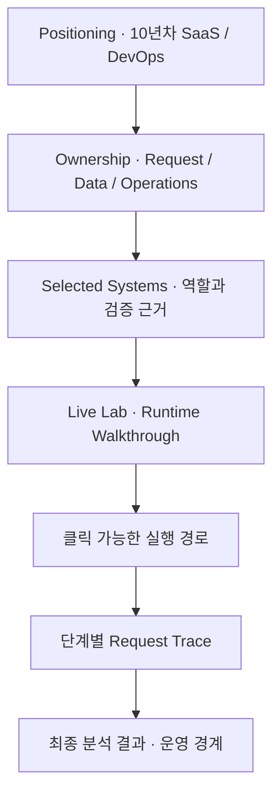
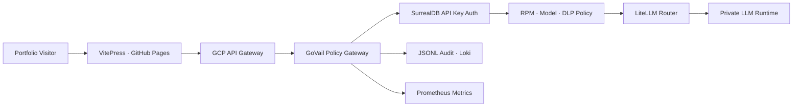
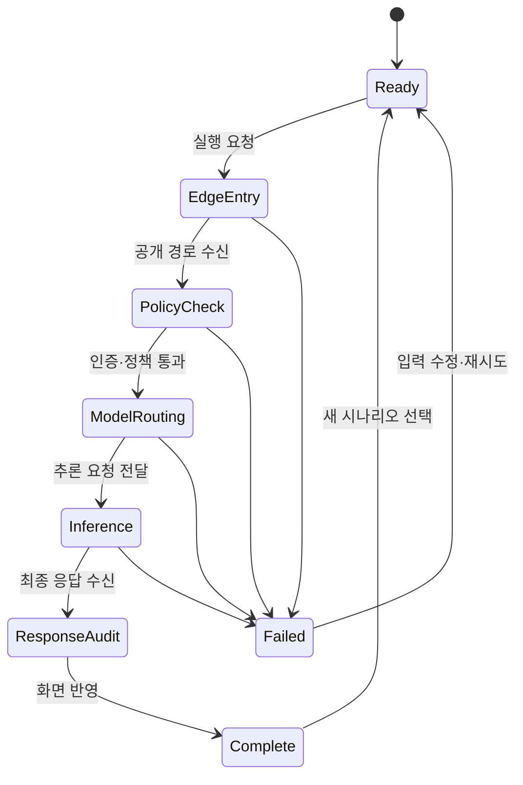
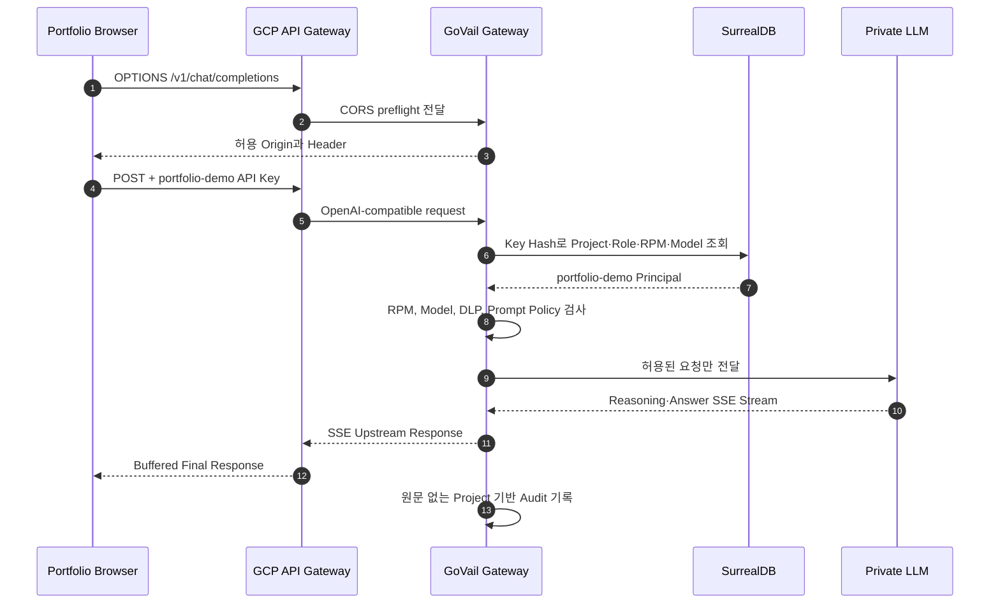

# Portfolio · Live Lab 아키텍처

## 포트폴리오 목표

10년차 SaaS·DevOps 엔지니어의 포트폴리오로서 기술 목록보다 운영 경계, 설계 판단, 검증 근거를 먼저 보여준다. 방문자는 첫 화면에서 다음 세 가지를 짧은 시간 안에 판단할 수 있어야 한다.

1. 어떤 시스템 경계를 설계하고 운영해 왔는가
2. 멀티테넌트 SaaS와 AI 추론을 어떻게 연결했는가
3. 보안·관측·장애 대응을 실제 실행 경로에서 어떻게 검증하는가

Live Lab은 단순한 LLM 질문 폼이 아니라 런타임 아키텍처를 클릭해 살펴보고, 실제 요청이 단계별로 어떤 경계를 통과하는지 확인하는 실행 가능한 포트폴리오 증거다.

## 화면 정보 구조

홈은 이력의 양보다 책임 범위와 대표 시스템의 연결 관계를 우선한다. Live Lab은 실행하지 않아도 아키텍처를 탐색할 수 있고, 실제 호출은 별도의 Trace 영역에서 진행 상태를 설명한다.

## Live Lab UX 원칙

- **Explore before execute:** 모든 런타임 노드는 클릭 가능하며 책임, 입력·출력 계약, 실패 경계와 관측 신호를 즉시 보여준다.
- **Architecture before prompt:** 입력 폼보다 실행 경로를 먼저 배치해 검토자가 시스템 구조를 이해한 뒤 실행하도록 한다.
- **Honest progress:** 단계 표시는 브라우저가 관찰한 요청 상태와 공개 가능한 설계 계약의 해설이며 서버 내부 Trace 또는 정확한 구간 측정치로 표현하지 않는다.
- **Visible waiting:** 최종 추론이 오래 걸려도 현재 단계, 이미 통과한 경계, 다음 단계와 취소 없는 대기 한계를 한 화면에서 확인할 수 있게 한다.
- **Progressive disclosure:** 기본 화면에는 핵심 경로와 대표 시나리오만 노출하고 보안·데이터 경계는 선택한 노드의 상세 패널로 제공한다.
- **Reviewer-first:** 예제 입력은 짧고 구체적이어야 하며, 한 번의 클릭으로 시나리오 선택과 실행 준비가 끝나야 한다.

## 시스템 구성

## 인터랙티브 런타임 노드

| 단계 | 공개 화면의 역할 | 상세 패널에서 보여줄 근거 |
|---|---|---|
| 01 Edge Entry | 공개 요청 수신과 CORS 경계 | 허용 Origin, 요청 크기, 공개 Endpoint |
| 02 Identity & Policy | Demo Key 식별과 정책 검사 | Project Scope, RPM, Model, DLP |
| 03 Model Routing | 공개 별칭을 내부 대상에 매핑 | `auto` 별칭, 라우팅 책임, 내부 Model ID 비공개 |
| 04 Private Runtime | 사설 추론 실행 | 장시간 추론 가능성, 브라우저에 Reasoning 원문 비노출 |
| 05 Audit & Response | 응답 반환과 운영 감사 | Trace ID, 상태, 지연시간, 원문 비저장 |

노드를 선택해도 외부 요청은 발생하지 않는다. 실제 호출은 명시적인 실행 버튼으로만 시작하며, 실행 중에는 동일한 노드가 요청 단계 상태를 표시한다.

## 실행 상태 모델

`EdgeEntry`부터 `ModelRouting`까지의 화면 전환은 공개 설계 계약을 설명하는 클라이언트 워크스루다. `Inference`와 `ResponseAudit`의 완료 여부는 실제 HTTP 응답과 파싱 결과에 의해 결정한다.

## 요청 흐름

## 전용 Key 정책

SurrealDB에 `portfolio-demo` 전용 API Key를 별도 발급한다. 브라우저에 포함되는 값이므로 장기 비밀 자격증명이 아니라 공개 Demo Token으로 취급하고, 권한과 자원 상한으로 보호한다.

| 정책 | 값 | 목적 |
|---|---:|---|
| Project | `portfolio-demo` | 다른 호출과 관측 데이터 분리 |
| Role | `demo` | 관리 기능 접근 차단 |
| Allowed models | `auto` | 내부 Model ID 은닉과 단일 라우팅 |
| 요청 빈도 | Gateway 운영 정책 | 단일 브라우저의 자원 독점 제한 |
| 입력 크기 | Gateway 운영 정책 | Prefill 비용과 DLP 표면 제한 |
| 출력 제어 | Gateway 운영 정책 | 추론 시간과 자원 사용 보호 |

키 원문은 SurrealDB에 저장하지 않는다. Gateway와 DB는 SHA-256 단축 해시로 레코드를 찾고, 감사 로그에도 Key 원문 대신 `key_hash`와 `project`만 기록한다.

## 브라우저 CORS 계약

`Authorization`과 `Content-Type: application/json`은 브라우저 사전 요청을 발생시키므로 GCP API Gateway Swagger에 `OPTIONS /v1/chat/completions`와 `OPTIONS /v1/models`를 명시해야 한다. Backend의 CORS 응답은 포트폴리오 Origin만 허용하는 것을 목표로 하며, 최소 허용 Header는 다음과 같다.

- `Authorization`
- `Content-Type`
- `X-GoVail-Trace-Id`

## 관측성

기존 Gateway 감사 이벤트에서 `project="portfolio-demo"`를 필터링한다. 다음 정보를 확인할 수 있다.

- 호출 수와 고유 Key Hash
- 성공, 정책 차단, 인증 실패, Upstream 오류
- 모델 별칭, Trace ID, 지연시간
- Usage 응답이 제공되는 경우 입력·출력 Token 수

프롬프트, 응답 원문, Authorization Header와 방문자 IP는 포트폴리오 분석용 로그에 저장하지 않는다. 방문자 단위 세션 정보도 공개 화면에 표시하지 않고, 운영 관측에는 개인정보를 수집하지 않는 집계 요청 수만 사용한다.

## 추론과 스트리밍 계약

- `auto` 모델에는 `reasoning_effort="medium"`을 전달해 업무형 검토에 필요한 추론을 활성화한다.
- 모델의 `reasoning_content`는 Gateway까지 SSE 이벤트로 전달될 수 있지만 공개 화면에는 원문을 표시하지 않는다.
- 대기 중에는 모델 원문을 재현하지 않고, 선택한 분석 모드에 맞는 공개용 검토 메모와 현재 런타임 단계만 표시한다.
- 공개용 검토 메모는 확인할 사실, 부족한 근거, 검토 기준처럼 외부 공개가 가능한 범주로 제한한다.
- GCP API Gateway는 Streaming Response를 지원하지 않으므로 현재 공개 경로의 최종 답변은 버퍼링 후 한 번에 전달된다.
- 브라우저는 향후 Streaming 지원 Ingress로 교체할 때를 대비해 SSE를 파싱하지만, 현재 화면에서는 Token Streaming을 기능으로 표방하지 않는다.
- 결과 패널은 Request Trace와 동일한 작업 영역에 배치해 대기와 완료 상태의 문맥이 바뀌지 않게 한다.
- 모바일에서는 아키텍처를 가로 스크롤 가능한 단계 목록으로 유지하고, 분석 시작 시 Trace 패널을 화면 안에 배치한다.

## 브라우저 상태 보관

- 공개용 검토 메모만 `sessionStorage`의 단일 Versioned Record로 보관한다.
- 원문 프롬프트, 최종 응답, `reasoning_content`, 인증정보와 Trace 정보는 브라우저 저장소에 기록하지 않는다.
- 메모는 현재 탭의 새로고침까지만 유지되며 탭을 닫으면 브라우저가 제거한다.
- 쿠키를 사용하지 않으므로 메모가 HTTP 요청과 함께 서버로 전송되지 않는다.

## 위협과 대응

| 위협 | 대응 |
|---|---|
| 공개 Demo Key 재사용 | 전용 Project, 요청 빈도 제어, 단일 Model과 출력 정책 적용 |
| 다른 모델 직접 지정 | SurrealDB `allowed_models`와 Gateway Model Policy로 차단 |
| Prompt Injection·PII | 기존 Gateway DLP와 Prompt Policy를 반드시 통과 |
| 비용·자원 고갈 | 요청 빈도와 크기 제어, 운영 시 Key 즉시 폐기 가능 |
| 로그 정보 유출 | 요청·응답 원문과 인증 Header 비저장 |

## 완료 기준

- 외부 `/health`와 인증된 `/v1/models`가 정상 응답한다.
- 브라우저 `OPTIONS`가 204 또는 200으로 성공하고 허용 Origin을 반환한다.
- 포트폴리오 UI에서 실제 `auto` 모델 응답을 받는다.
- SurrealDB에서 Demo Key가 `portfolio-demo`, `demo`, `auto`와 별도의 운영 정책으로 제한된다.
- 운영 로그에서 `project=portfolio-demo` 호출과 Trace ID를 조회할 수 있다.
- 저장소 문서에는 사설 주소, 운영 Secret과 실제 모델 ID가 없다.
