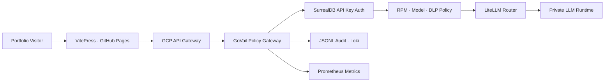
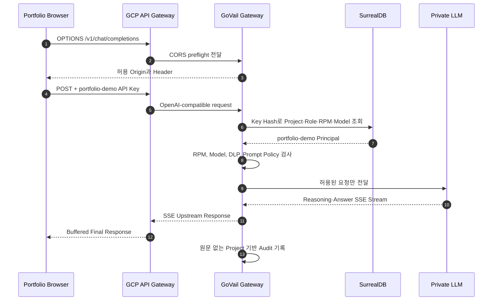

# Portfolio Live LLM Demo 아키텍처

## 목표

포트폴리오 방문자가 GCP API Gateway를 통해 실제 사설 LLM을 호출하게 한다. 별도 애플리케이션 서버는 추가하지 않고, 기존 GoVail Gateway의 SurrealDB API Key 인증, 모델 정책, RPM 제한, DLP와 감사 로그를 그대로 재사용한다.

## 시스템 구성

## 요청 흐름

## 전용 Key 정책

SurrealDB에 `portfolio-demo` 전용 API Key를 별도 발급한다. 브라우저에 포함되는 값이므로 장기 비밀 자격증명이 아니라 공개 Demo Token으로 취급하고, 권한과 자원 상한으로 보호한다.

| 정책 | 값 | 목적 |
|---|---:|---|
| Project | `portfolio-demo` | 다른 호출과 관측 데이터 분리 |
| Role | `demo` | 관리 기능 접근 차단 |
| Allowed models | `auto` | 내부 Model ID 은닉과 단일 라우팅 |
| 요청 빈도 | Gateway 운영 정책 | 단일 브라우저의 자원 독점 제한 |
| 입력 크기 | Gateway 운영 정책 | Prefill 비용과 DLP 표면 제한 |
| 출력 제어 | Gateway 운영 정책 | 추론 시간과 자원 사용 보호 |

키 원문은 SurrealDB에 저장하지 않는다. Gateway와 DB는 SHA-256 단축 해시로 레코드를 찾고, 감사 로그에도 Key 원문 대신 `key_hash`와 `project`만 기록한다.

## 브라우저 CORS 계약

`Authorization`과 `Content-Type: application/json`은 브라우저 사전 요청을 발생시키므로 GCP API Gateway Swagger에 `OPTIONS /v1/chat/completions`와 `OPTIONS /v1/models`를 명시해야 한다. Backend의 CORS 응답은 포트폴리오 Origin만 허용하는 것을 목표로 하며, 최소 허용 Header는 다음과 같다.

- `Authorization`
- `Content-Type`
- `X-GoVail-Trace-Id`

## 관측성

기존 Gateway 감사 이벤트에서 `project="portfolio-demo"`를 필터링한다. 다음 정보를 확인할 수 있다.

- 호출 수와 고유 Key Hash
- 성공, 정책 차단, 인증 실패, Upstream 오류
- 모델 별칭, Trace ID, 지연시간
- Usage 응답이 제공되는 경우 입력·출력 Token 수

프롬프트, 응답 원문, Authorization Header와 방문자 IP는 포트폴리오 분석용 로그에 저장하지 않는다. 방문자 단위 세션 정보도 공개 화면에 표시하지 않고, 운영 관측에는 개인정보를 수집하지 않는 집계 요청 수만 사용한다.

## 추론과 스트리밍 계약

- `auto` 모델에는 `reasoning_effort="medium"`을 전달해 업무형 검토에 필요한 추론을 활성화한다.
- 모델의 `reasoning_content`는 Gateway까지 SSE 이벤트로 전달될 수 있지만 공개 화면에는 원문을 표시하지 않는다.
- GCP API Gateway는 Streaming Response를 지원하지 않으므로 현재 공개 경로의 최종 답변은 버퍼링 후 한 번에 전달된다.
- 브라우저는 향후 Streaming 지원 Ingress로 교체할 때를 대비해 SSE를 파싱하지만, 현재 화면에서는 Token Streaming을 기능으로 표방하지 않는다.
- 결과 패널은 입력 패널 옆에 고정해 응답이 추가되더라도 페이지 전체 높이가 늘어나지 않게 한다.
- 모바일에서는 분석 시작 시 결과 패널을 자동으로 화면 안에 배치한다.

## 위협과 대응

| 위협 | 대응 |
|---|---|
| 공개 Demo Key 재사용 | 전용 Project, 요청 빈도 제어, 단일 Model과 출력 정책 적용 |
| 다른 모델 직접 지정 | SurrealDB `allowed_models`와 Gateway Model Policy로 차단 |
| Prompt Injection·PII | 기존 Gateway DLP와 Prompt Policy를 반드시 통과 |
| 비용·자원 고갈 | 요청 빈도와 크기 제어, 운영 시 Key 즉시 폐기 가능 |
| 로그 정보 유출 | 요청·응답 원문과 인증 Header 비저장 |

## 완료 기준

- 외부 `/health`와 인증된 `/v1/models`가 정상 응답한다.
- 브라우저 `OPTIONS`가 204 또는 200으로 성공하고 허용 Origin을 반환한다.
- 포트폴리오 UI에서 실제 `auto` 모델 응답을 받는다.
- SurrealDB에서 Demo Key가 `portfolio-demo`, `demo`, `auto`와 별도의 운영 정책으로 제한된다.
- 운영 로그에서 `project=portfolio-demo` 호출과 Trace ID를 조회할 수 있다.
- 저장소 문서에는 사설 주소, 운영 Secret과 실제 모델 ID가 없다.
