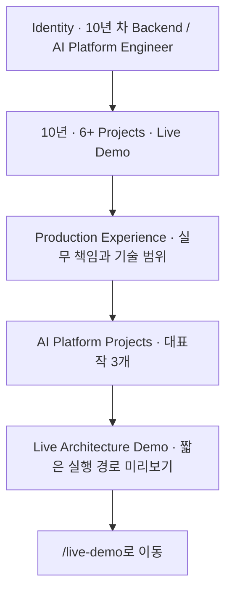
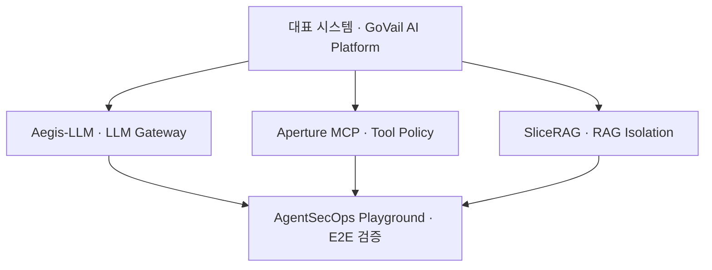
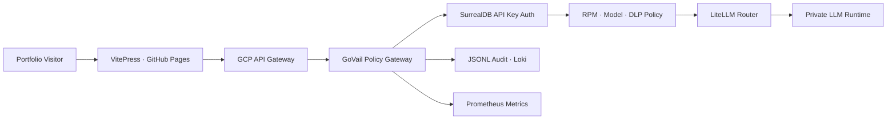
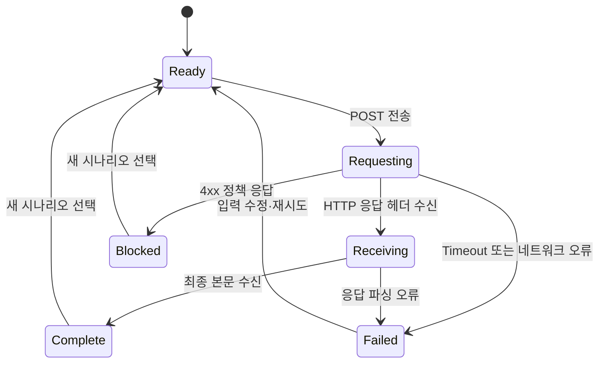
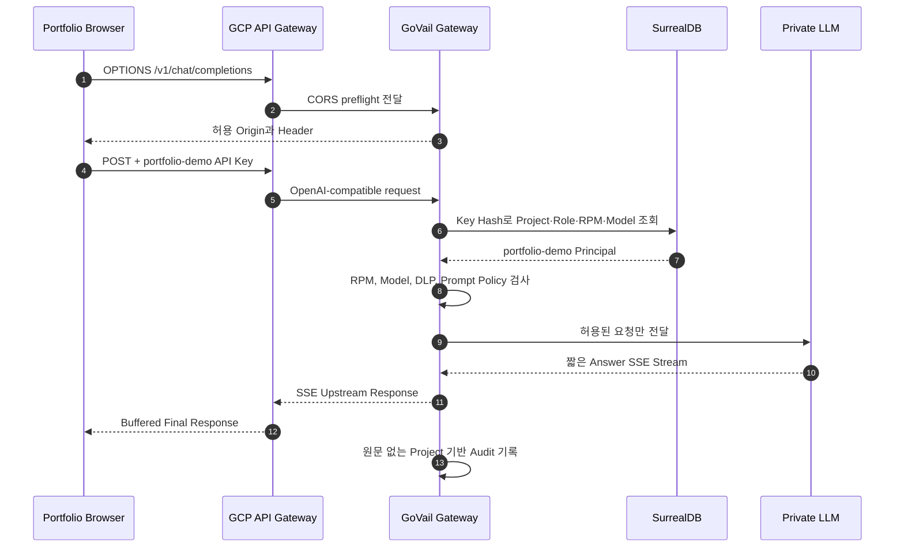

# Portfolio · Live Lab 아키텍처

## 포트폴리오 목표

10년 차 기업용 백엔드·플랫폼 경험을 AI 요청 경계로 확장한 포트폴리오다. 채용 검토자는 첫 30초 안에 제작자의 직무 정체성과 경력의 연결을 이해하고, 이후 공개 코드와 실행 가능한 데모로 주장을 검증할 수 있어야 한다.

1. **직무 정체성:** Backend / AI Platform Engineer
2. **경력 연결:** 인증·권한·감사·CI/CD·클라우드 운영 경험을 AI Gateway 설계로 확장
3. **대표 시스템:** 하나의 GoVail Platform과 이를 검증하는 공개 컴포넌트
4. **실행 증거:** 보안·관측·실패 경계를 실제 요청 경로와 공개 저장소에서 확인

Live Lab은 단순한 LLM 질문 폼이 아니라 정상 요청과 정책 차단을 직접 비교하고, 실제 HTTP 결과로 요청 경계를 검증하는 실행 가능한 포트폴리오 증거다.

## 경로별 역할

홈페이지와 Runtime Demo는 같은 콘텐츠를 반복하지 않는다.

| 경로 | 방문자가 답을 얻어야 하는 질문 | 주요 콘텐츠 |
|---|---|---|
| `/` | 이 사람은 누구이며 어떤 경험과 강점을 가졌는가 | 직무 정체성, 10년 경력, 대표 프로젝트 3개, Demo 미리보기 |
| `/live-demo` | AI 요청 경계를 실제로 어떻게 설계하고 검증했는가 | 실제 요청, 정책 차단, 브라우저 관찰값, 실행 결과 |
| `/experience` | 기존 실무 경험이 현재 AI 플랫폼 설계와 어떻게 이어지는가 | 인증·권한·감사·배포·클라우드·레거시 연동 경험 |
| `/projects/*` | 각 프로젝트에서 무엇을 구현했고 어디까지 보장하는가 | 문제, 범위, 설계 결정, 검증 근거, 한계와 Next Steps |

## 홈페이지 정보 구조

홈은 채용 검토자가 첫 5초 안에 경력 연차, 직무, 강점과 대표 결과물을 이해하도록 구성한다. Runtime의 Interface Contract, Failure Boundary, Observable Signal과 Request Trace는 홈에서 제거하고 `/live-demo`에서만 제공한다. 홈의 Demo 영역은 `Gateway → Policy → Private LLM → Audit` 수준의 미리보기와 이동 버튼만 보여준다.

## 홈페이지 콘텐츠 원칙

- 한국어 설명을 기본으로 하고 영어는 직무명, 기술명과 프로젝트명처럼 필요한 고유 용어에만 사용한다.
- 영어 대문자 UI Label을 연속 배치하지 않는다.
- 첫 화면에는 제품 아키텍처 패널 대신 사람의 경력과 역할을 배치한다.
- 대표 프로젝트는 GoVail, Aegis-LLM, SliceRAG 세 개만 노출한다.
- 상세 운영 증거와 나머지 컴포넌트는 Experience, Operational Evidence와 Project 문서에서 단계적으로 공개한다.

## 프로젝트 정보 계층

- **대표 시스템:** GoVail AI Platform이 전체 문제와 운영 경계를 설명한다.
- **검증 가능한 핵심 컴포넌트:** Aegis-LLM, Aperture MCP, SliceRAG가 공개 구현 근거를 제공한다.
- **실험·지원 도구:** AgentSecOps Playground와 나머지 도구는 통합 검증 또는 개발 지원 역할로 구분한다.

## 경력 연결 원칙

경력 페이지는 회사명이나 확인되지 않은 수치를 과장하지 않고, 다음의 문제 경험이 현재 AI 플랫폼 설계 판단으로 어떻게 이어졌는지 설명한다.

| 기존 실무 경험 | AI 플랫폼에서의 확장 |
|---|---|
| SSO, 인증·권한 체계 | API Key Principal, Project Scope, Model Policy |
| 감사 대응과 Key 관리 | 원문 비저장 Audit, Trace ID, Secret 비노출 |
| CI/CD와 Docker 표준화 | 재현 가능한 통합 환경과 보안 회귀 테스트 |
| AWS 운영과 장애 대응 | Gateway 실패 경계, 관측 신호, 복구 책임 |
| 레거시 데이터·외부 API 연동 | RAG 데이터 격리와 Tool 실행 정책 |

## Live Lab UX 원칙

- **Evidence before explanation:** 첫 화면에는 시나리오, 입력, 실행 버튼과 이번 요청의 실제 HTTP 상태·지연·Trace ID를 우선 배치한다.
- **No simulated trace:** 클라이언트 타이머로 Gateway, Policy, Routing을 통과한 것처럼 표현하지 않는다. 서버 이벤트가 없는 동안에는 `Gateway 응답 대기`라는 단일 관찰 상태만 표시한다.
- **Failure is evidence:** 정상 추론뿐 아니라 Prompt Policy와 Model Policy가 Upstream 호출 전에 요청을 종료하는 시나리오를 동일한 실행 화면에서 검증한다.
- **Honest observability:** 브라우저에서 확인할 수 없는 서버 내부 구간 지연과 Audit 기록 완료는 성공으로 단정하지 않고 `브라우저 비공개`로 표시한다.
- **Bounded waiting:** 공개 데모 요청은 Thinking을 비활성화하고 출력과 Timeout을 제한한다. 대기 중에는 실제 브라우저 경과 시간만 갱신한다.
- **Progressive disclosure:** Interface Contract, Failure Boundary와 Observable Signal은 기본 실행 화면에서 제거하고 접힌 Architecture Details로 이동한다.
- **Reviewer-first:** 검토자는 한 번의 실행으로 정상 경로 또는 차단 경로의 차이를 30초 안에 판단할 수 있어야 한다.

## 시스템 구성

## 런타임 경계 상세

| 단계 | 공개 화면의 역할 | 상세 패널에서 보여줄 근거 |
|---|---|---|
| 01 Edge Entry | 공개 요청 수신과 CORS 경계 | 허용 Origin, 요청 크기, 공개 Endpoint |
| 02 Identity & Policy | Demo Key 식별과 정책 검사 | Project Scope, RPM, Model, DLP |
| 03 Model Routing | 공개 별칭을 내부 대상에 매핑 | `auto` 별칭, 라우팅 책임, 내부 Model ID 비공개 |
| 04 Private Runtime | 사설 추론 실행 | 장시간 추론 가능성, 브라우저에 Reasoning 원문 비노출 |
| 05 Audit & Response | 응답 반환과 운영 감사 | Trace ID, 상태, 지연시간, 원문 비저장 |

런타임 경계 설명은 기본적으로 접힌 상태로 제공한다. 노드를 선택해도 외부 요청은 발생하지 않으며, 실제 호출은 명시적인 실행 버튼으로만 시작한다. 경계 설명은 실행 상태를 가장하지 않고 설계 계약과 공개 구현 근거만 제공한다.

## 실행 상태 모델

상태 전환은 `fetch` 시작, 응답 Header, Response Body와 Timeout처럼 브라우저가 직접 관찰한 이벤트로만 발생한다. 정상 응답이면 Gateway·Policy·Routing·Runtime을 통과한 결과로 해석할 수 있고, 정책 테스트의 4xx 응답이면 해당 경계에서 종료된 결과로 표시한다. 정확한 서버 내부 구간 시간은 표시하지 않는다.

## 공개 시나리오

| 시나리오 | 요청 | 기대 결과 | Runtime 호출 |
|---|---|---|---|
| 정상 요청 | `model=auto`와 짧은 아키텍처 검토 | `2xx`와 제한된 길이의 응답 | 호출 |
| 입력 정책 차단 | 알려진 Prompt Injection 테스트 문구 | `4xx` 정책 응답 | 호출하지 않음 |
| 모델 정책 차단 | Demo Key에 허용되지 않은 공개 별칭 | `4xx` 모델 정책 응답 | 호출하지 않음 |

차단용 입력은 합성 테스트 데이터이며 편집할 수 없게 고정한다. 정상 요청만 방문자가 수정할 수 있다.

## 실행 데이터 계약

| 필드 | 출처 | 공개 방식 |
|---|---|---|
| Request ID | `X-Aegis-Trace-Id` 응답 Header, 미노출 시 Client Trace ID | 단축 표시 |
| Method / Endpoint | 브라우저 요청 | `POST /v1/chat/completions` |
| Route alias | 브라우저 요청 Body | 공개 별칭만 표시 |
| HTTP status | 실제 Response | 상태 코드와 성공·차단·실패 구분 |
| Elapsed / First byte | `performance.now()` | 브라우저 관찰값으로 명시 |
| Transport | Response `content-type` | JSON 또는 SSE |
| Usage | 응답에 Usage가 있는 경우 | 입력·출력 Token 수, 없으면 미제공 |
| Audit | 서버 내부 기록 | 브라우저 비공개로 표시 |

## 요청 흐름

## 전용 Key 정책

SurrealDB에 `portfolio-demo` 전용 API Key를 별도 발급한다. 브라우저에 포함되는 값이므로 장기 비밀 자격증명이 아니라 공개 Demo Token으로 취급하고, 권한과 자원 상한으로 보호한다.

| 정책 | 값 | 목적 |
|---|---:|---|
| Project | `portfolio-demo` | 다른 호출과 관측 데이터 분리 |
| Role | `demo` | 관리 기능 접근 차단 |
| Allowed models | `auto` | 내부 Model ID 은닉과 단일 정상 라우팅 |
| 요청 빈도 | Gateway 운영 정책 | 단일 브라우저의 자원 독점 제한 |
| 입력 크기 | Gateway 운영 정책 | Prefill 부하와 DLP 표면 제한 |
| 출력 제어 | Gateway 운영 정책 | 추론 시간과 자원 사용 보호 |

키 원문은 SurrealDB에 저장하지 않는다. Gateway와 DB는 SHA-256 단축 해시로 레코드를 찾고, 감사 로그에도 Key 원문 대신 `key_hash`와 `project`만 기록한다.

## 브라우저 CORS 계약

`Authorization`과 `Content-Type: application/json`은 브라우저 사전 요청을 발생시키므로 GCP API Gateway Swagger에 `OPTIONS /v1/chat/completions`와 `OPTIONS /v1/models`를 명시해야 한다. Backend의 CORS 응답은 포트폴리오 Origin만 허용하는 것을 목표로 하며, 최소 허용 Header는 다음과 같다.

- `Authorization`
- `Content-Type`
- `X-GoVail-Trace-Id`

## 관측성

기존 Gateway 감사 이벤트에서 `project="portfolio-demo"`를 필터링한다. 다음 정보를 확인할 수 있다.

- 호출 수와 고유 Key Hash
- 성공, 정책 차단, 인증 실패, Upstream 오류
- 모델 별칭, Trace ID, 지연시간
- Usage 응답이 제공되는 경우 입력·출력 Token 수

프롬프트, 응답 원문, Authorization Header와 방문자 IP는 포트폴리오 분석용 로그에 저장하지 않는다. 방문자 단위 세션 정보도 공개 화면에 표시하지 않고, 운영 관측에는 개인정보를 수집하지 않는 집계 요청 수만 사용한다.

## 추론과 스트리밍 계약

- 공개 데모 요청은 `reasoning_effort="none"`과 `chat_template_kwargs.enable_thinking=false`를 함께 전달한다.
- `max_tokens=320`, `temperature=0.2`, 브라우저 Timeout `30초`로 응답 비용과 대기 상한을 제한한다.
- 모델의 `reasoning_content`는 생성하지 않는 것을 기본으로 하며, Upstream이 반환하더라도 공개 화면에는 표시하지 않는다.
- GCP API Gateway는 Streaming Response를 지원하지 않으므로 현재 공개 경로는 최종 답변을 버퍼링할 수 있다.
- 브라우저는 실제 Response `content-type`에 따라 JSON과 SSE를 모두 처리하고, SSE Chunk를 받은 경우에만 `응답 수신 중`과 Chunk 수를 표시한다.
- 대기 중 표시는 프론트 타이머 기반 진행률이 아니라 요청 시작 이후 실제 경과 시간이다.
- 결과와 관찰값을 동일한 작업 영역에 배치해 대기와 완료 상태의 문맥이 바뀌지 않게 한다.

## 브라우저 상태 보관

- 공개용 검토 메모만 `sessionStorage`의 단일 Versioned Record로 보관한다.
- 원문 프롬프트, 최종 응답, `reasoning_content`, 인증정보와 Trace 정보는 브라우저 저장소에 기록하지 않는다.
- 메모는 현재 탭의 새로고침까지만 유지되며 탭을 닫으면 브라우저가 제거한다.
- 쿠키를 사용하지 않으므로 메모가 HTTP 요청과 함께 서버로 전송되지 않는다.

## 위협과 대응

| 위협 | 대응 |
|---|---|
| 공개 Demo Key 재사용 | 전용 Project, 요청 빈도 제어, 단일 Model과 출력 정책 적용 |
| 다른 모델 직접 지정 | SurrealDB `allowed_models`와 Gateway Model Policy로 차단 |
| Prompt Injection·PII | 기존 Gateway DLP와 Prompt Policy를 반드시 통과 |
| 추론 자원 고갈 | 요청 빈도와 크기 제어, 운영 시 Key 즉시 폐기 가능 |
| 로그 정보 유출 | 요청·응답 원문과 인증 Header 비저장 |

## 완료 기준

- 외부 `/health`와 인증된 `/v1/models`가 정상 응답한다.
- 브라우저 `OPTIONS`가 204 또는 200으로 성공하고 허용 Origin을 반환한다.
- 포트폴리오 UI에서 실제 `auto` 모델 응답을 30초 Timeout 안에 받는다.
- Prompt Injection과 허용되지 않은 모델 요청이 4xx로 종료되고 Runtime 응답이 생성되지 않는다.
- 화면에는 실제 HTTP 상태, 브라우저 관찰 지연, 공개 Route Alias와 Trace ID만 표시된다.
- SurrealDB에서 Demo Key가 `portfolio-demo`, `demo`, `auto`와 별도의 운영 정책으로 제한된다.
- 운영 로그에서 `project=portfolio-demo` 호출과 Trace ID를 조회할 수 있다.
- 저장소 문서에는 사설 주소, 운영 Secret과 실제 모델 ID가 없다.
