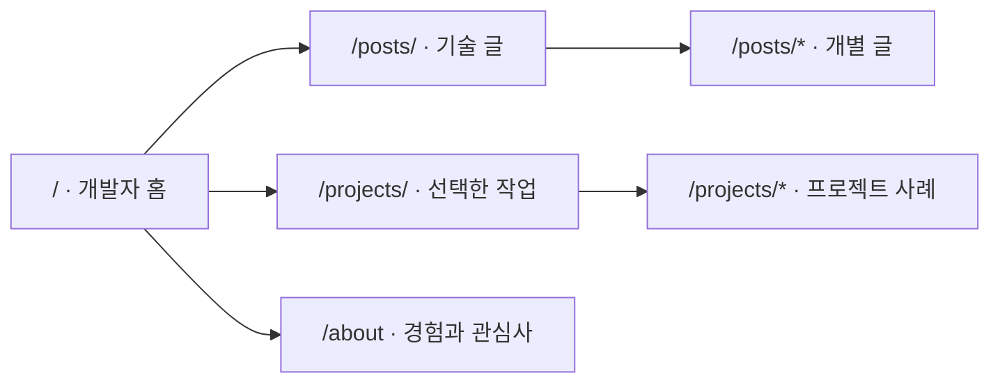

# devcy0922.github.io 아키텍처

## 목표

이 저장소는 `devcy0922.github.io`에 배포되는 개인 기술 블로그다.

제품 문서와 개인 기록을 분리한다. GoVail을 포함한 프로젝트는 글과 프로젝트 사례 중 하나일 뿐이며 사이트의 전역 내비게이션, 번역 체계, 런타임 의존성으로 연결하지 않는다.

## 정보 구조


```mermaid
flowchart LR
    Home["/ · 개발자 홈"] --> Posts["/posts/ · 기술 글"]
    Home --> Projects["/projects/ · 선택한 작업"]
    Home --> About["/about · 경험과 관심사"]
    Posts --> Article["/posts/* · 개별 글"]
    Projects --> Case["/projects/* · 프로젝트 사례"]
```

### `/`

첫 화면에서 다음 세 가지가 보여야 한다.

1. 어떤 개발자인가
2. 최근 무엇을 생각하고 기록했는가
3. 어떤 작업을 공개하고 있는가

### `/posts/`

날짜순 기술 글 아카이브다. `docs/posts.data.js`가 Markdown frontmatter를 읽어 목록을 생성한다.

새 글은 다음 형식을 따른다.

```yaml
---
title: "글 제목"
date: 2026-08-26
description: "목록과 검색 결과에서 사용할 한 문장"
tags:
  - AI Platform
  - Architecture
---
```

### `/projects/`

프로젝트 개수보다 문제, 책임 경계, 보장 범위를 우선한다. 공개 레포가 실험/데모 목적이면 해당 페이지에서 명시한다.

### `/about`

이력서 복제가 아니라 어떤 문제를 다뤄왔고 지금 어디에 집중하는지 설명한다.

## Build

- VitePress 1.6.x
- Markdown source: `docs/`
- Custom theme extension: `docs/.vitepress/theme`
- Mermaid: `vitepress-plugin-mermaid`
- Search: VitePress local search
- Sitemap: VitePress sitemap
- RSS: `buildEnd`에서 `createContentLoader`로 생성
- Deploy: GitHub Actions → GitHub Pages

## 유지 원칙

- 글 작성에 별도 CMS가 필요 없어야 한다.
- 홈 목록은 글을 추가하면 자동 갱신되어야 한다.
- 빌드 시점 외 네트워크나 서버 런타임을 요구하지 않는다.
- 클라이언트에서 번역 JSON이나 데모 API를 로드하지 않는다.
- 사이트 기능보다 콘텐츠 작성 비용을 낮추는 것을 우선한다.
