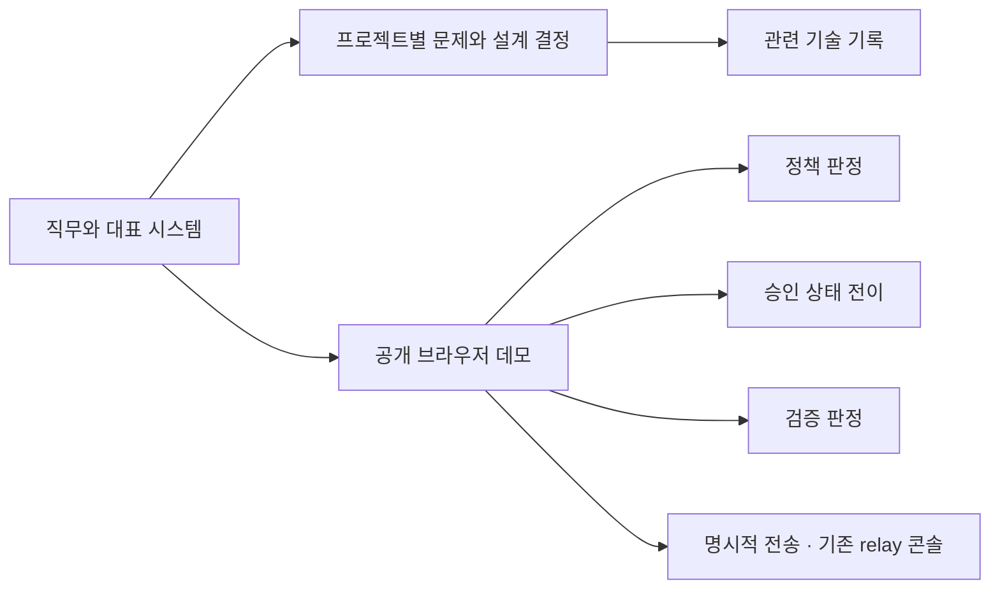
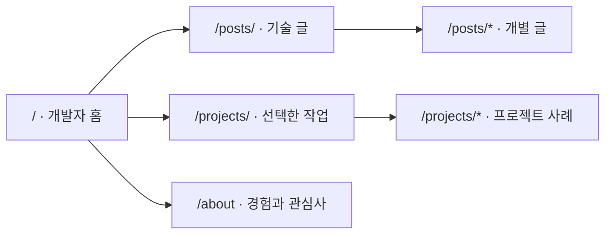

# devcy0922.github.io 아키텍처

## 목표

이 저장소는 `devcy0922.github.io`에 배포되는 Backend & AI Platform Engineer 포트폴리오다. 기술 글은 프로젝트의 판단 근거로 연결한다.

## 포트폴리오 개편 · 2026-09

- 홈: 경력과 직무 → 대표 시스템 → 실행 가능한 데모 → 설계 원칙 → 기록.
- 대표 프로젝트 데이터는 `docs/selected-projects.js`에서 문제, 결정, 확인 경로를 함께 관리한다.
- `/playground`는 공개용 브라우저 시뮬레이터와 별도 relay를 호출하는 라이브 콘솔을 명시적으로 분리한다.
- 브라우저 데모는 정책 허용/거부, 승인/반려, evidence 판정을 실제 JavaScript 상태 전이로 계산한다. 원본 백엔드 실행이나 운영 관측을 주장하지 않는다.
- 라이브 콘솔은 빈 세션으로 시작한다. 네트워크 오류는 오류로 표시하며 초기 운영 수치 fixture를 넣지 않는다.
- 비공개 프로젝트는 로컬 문서의 공개 가능한 책임 경계만 설명한다. 인증정보, 업무 데이터, 내부 주소는 데모에 복제하지 않는다.


```mermaid
flowchart LR
    Home[직무와 대표 시스템] --> Cases[프로젝트별 문제와 설계 결정]
    Home --> Lab[공개 브라우저 데모]
    Lab --> Policy[정책 판정]
    Lab --> Approval[승인 상태 전이]
    Lab --> Evidence[검증 판정]
    Lab --> Live[명시적 전송 · 기존 relay 콘솔]
    Cases --> Notes[관련 기술 기록]
```

제품 문서와 개인 기록을 분리한다. GoVail을 포함한 프로젝트는 글과 프로젝트 사례 중 하나일 뿐이며 사이트의 전역 내비게이션, 번역 체계, 런타임 의존성으로 연결하지 않는다.

## 정보 구조


```mermaid
flowchart LR
    Home["/ · 개발자 홈"] --> Posts["/posts/ · 기술 글"]
    Home --> Projects["/projects/ · 선택한 작업"]
    Home --> About["/about · 경험과 관심사"]
    Posts --> Article["/posts/* · 개별 글"]
    Projects --> Case["/projects/* · 프로젝트 사례"]
```

### `/`

첫 화면에서 다음 세 가지가 보여야 한다.

1. 어떤 개발자인가
2. 어떤 시스템을 설계하고 구현했는가
3. 어디에서 설계와 동작을 확인할 수 있는가

### `/posts/`

날짜순 기술 글 아카이브다. `docs/posts.data.js`가 Markdown frontmatter를 읽어 목록을 생성한다.

새 글은 다음 형식을 따른다.

```yaml
---
title: "글 제목"
date: 2026-08-26
description: "목록과 검색 결과에서 사용할 한 문장"
tags:
  - AI Platform
  - Architecture
---
```

### `/projects/`

프로젝트 개수보다 문제, 책임 경계, 보장 범위를 우선한다. 공개 레포가 실험/데모 목적이면 해당 페이지에서 명시한다.

### `/about`

이력서 복제가 아니라 어떤 문제를 다뤄왔고 지금 어디에 집중하는지 설명한다.

## Build

- VitePress 1.6.x
- Markdown source: `docs/`
- Custom theme extension: `docs/.vitepress/theme`
- Mermaid: `vitepress-plugin-mermaid`
- Search: VitePress local search
- Sitemap: VitePress sitemap
- RSS: `buildEnd`에서 `createContentLoader`로 생성
- Deploy: GitHub Actions → GitHub Pages

## 유지 원칙

- 글 작성에 별도 CMS가 필요 없어야 한다.
- 홈 목록은 글을 추가하면 자동 갱신되어야 한다.
- 빌드 시점 외 네트워크나 서버 런타임을 요구하지 않는다.
- 클라이언트에서 번역 JSON이나 데모 API를 로드하지 않는다.
- 사이트 기능보다 콘텐츠 작성 비용을 낮추는 것을 우선한다.

## 공개 데모와 라이브 콘솔

`/playground`는 `SystemDemos.vue`와 `docs/demo-contracts.js`로 동작한다. 브라우저 상태는 새로고침하면 초기화되며 외부 서비스를 변경하지 않는다. 테스트는 인증 전 실행 차단, 승인 상태 전이, FAIL > PARTIAL > PASS 집계 규칙을 검증한다.

`/live-console`은 기존 `Playground.vue`를 사용한다. 사용자가 전송할 때만 기존 공개 relay의 `/v1/model-routing/stream`을 호출한다. 브라우저 세션 저장과 relay 서버의 처리 범위는 구분한다. 운영 데이터 fixture나 실패 시 성공 응답으로 바꾸는 폴백은 없다.

클라이언트 진행 패널은 관찰 가능한 이벤트를 표시하며 서버 내부 실행 전체나 추론 과정을 나타내지 않는다. relay의 배포·인증·운영 설정은 이 저장소의 변경 범위 밖이다.
