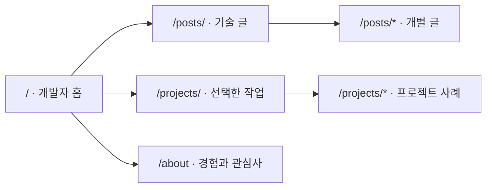
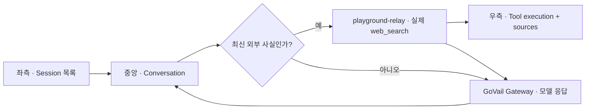

# devcy0922.github.io 아키텍처

## 목표

이 저장소는 `devcy0922.github.io`에 배포되는 개인 기술 블로그다.

제품 문서와 개인 기록을 분리한다. GoVail을 포함한 프로젝트는 글과 프로젝트 사례 중 하나일 뿐이며 사이트의 전역 내비게이션, 번역 체계, 런타임 의존성으로 연결하지 않는다.

## 정보 구조


```mermaid
flowchart LR
    Home["/ · 개발자 홈"] --> Posts["/posts/ · 기술 글"]
    Home --> Projects["/projects/ · 선택한 작업"]
    Home --> About["/about · 경험과 관심사"]
    Posts --> Article["/posts/* · 개별 글"]
    Projects --> Case["/projects/* · 프로젝트 사례"]
```

### `/`

첫 화면에서 다음 세 가지가 보여야 한다.

1. 어떤 개발자인가
2. 최근 무엇을 생각하고 기록했는가
3. 어떤 작업을 공개하고 있는가

### `/posts/`

날짜순 기술 글 아카이브다. `docs/posts.data.js`가 Markdown frontmatter를 읽어 목록을 생성한다.

새 글은 다음 형식을 따른다.

```yaml
---
title: "글 제목"
date: 2026-08-26
description: "목록과 검색 결과에서 사용할 한 문장"
tags:
  - AI Platform
  - Architecture
---
```

### `/projects/`

프로젝트 개수보다 문제, 책임 경계, 보장 범위를 우선한다. 공개 레포가 실험/데모 목적이면 해당 페이지에서 명시한다.

### `/about`

이력서 복제가 아니라 어떤 문제를 다뤄왔고 지금 어디에 집중하는지 설명한다.

## Build

- VitePress 1.6.x
- Markdown source: `docs/`
- Custom theme extension: `docs/.vitepress/theme`
- Mermaid: `vitepress-plugin-mermaid`
- Search: VitePress local search
- Sitemap: VitePress sitemap
- RSS: `buildEnd`에서 `createContentLoader`로 생성
- Deploy: GitHub Actions → GitHub Pages

## 유지 원칙

- 글 작성에 별도 CMS가 필요 없어야 한다.
- 홈 목록은 글을 추가하면 자동 갱신되어야 한다.
- 빌드 시점 외 네트워크나 서버 런타임을 요구하지 않는다.
- 클라이언트에서 번역 JSON이나 데모 API를 로드하지 않는다.
- 사이트 기능보다 콘텐츠 작성 비용을 낮추는 것을 우선한다.

## 예외: Playground · Model Routing 라이브 데모

`/playground`의 Model Routing 랩 중 두 시나리오(`routing-failover`, `routing-timeout`)는
방문자당 1회, 별도 운영 중인 `playground-relay` 서비스(`/srv/products/playground-relay`)를 거쳐
GoVail Gateway(`https://api.govail.cloud`)에 실제 요청을 보낸다. 이는 "빌드 시점 외 네트워크나
서버 런타임을 요구하지 않는다" 원칙에 대한 의도적이고 범위가 제한된 예외다.

- 정적 빌드 자체는 여전히 네트워크/서버 런타임에 의존하지 않는다. 예외는 브라우저가 방문 중
  직접 호출하는 별도 공개 relay API(`POST api.govail.cloud/v1/model-routing/run` 및
  `/stream`)로
  한정되며, 실패/차단 시 페이지는 기존 replay 애니메이션으로 자동 폴백한다.
- relay는 prompt를 길이 제한 후 받으며, 웹 검색이 필요한 요청은 `web_search`를 명시적으로
  선택한다. 기존 고정 시나리오 id도 회귀 호환을 위해 유지한다.
- 전역 동시 실행 1회로 제한(relay의 단일 인스턴스 세마포어), IP당 rate limit 있음.
- 응답은 relay가 필드 화이트리스트로 전달하며, 백엔드 호스트명/모델 식별자/추적 id는 노출하지 않는다.
- `web_search`는 Tavily 또는 DuckDuckGo에서 실제 결과를 수집하고, 검색 실패 시 mock 결과를
  만들지 않고 실패 상태를 전달한다.
- Agent Execution, Serving Lab 랩은 이 예외 대상이 아니며 계속 순수 replay다.
- kill switch: `playground-relay`의 `PLAYGROUND_LIVE_ENABLED=false`로 즉시 비활성화 가능,
  프론트엔드는 이 경우도 replay로 자동 폴백한다.

### `/playground` 실행 콘솔 UI

Playground는 일반 채팅 화면이 아니라 요청의 실행 경로를 읽는 디버거로 구성한다.
대화 가독성을 우선하기 위해 도구 입력·결과·출처는 중앙 답변에서 분리해 우측 실행 패널에
보여준다.


```mermaid
flowchart LR
    Session[좌측 · Session 목록] --> Chat[중앙 · Conversation]
    Chat --> Intent{최신 외부 사실인가?}
    Intent -->|예| Web[playground-relay · 실제 web_search]
    Intent -->|아니오| Model[GoVail Gateway · 모델 응답]
    Web --> Sources[우측 · Tool execution + sources]
    Web --> Model
    Model --> Chat
```

- 중앙은 사용자 질문과 최종 답변, 최소한의 상태만 담당한다.
- 우측은 도구별 호출 상태, query/input, 결과 payload와 웹 출처를 담당한다.
- `우루과이전 결과 분석`처럼 경기·뉴스·최신 결과·현재 상태를 묻는 요청은 `web_search`를
  선택하고, relay는 고정 fixture가 아닌 외부 검색 결과를 사용한다. 검색 실패 시 빈 결과나
  mock을 성공으로 표시하지 않고 실패 상태를 전달한다.
