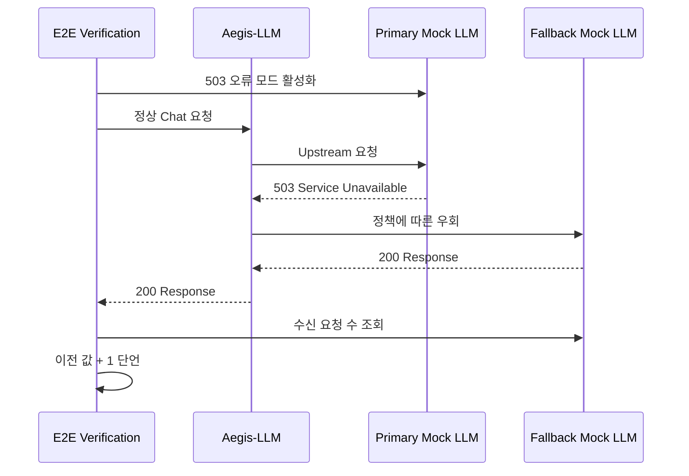

# Operational Evidence

## 정책 차단과 장애 우회를 성공 조건으로 다룹니다

운영 증거는 정상 응답 하나로 끝나지 않습니다. [AgentSecOps Playground](https://github.com/devcy0922/agentsecops-playground)는 Aegis-LLM, SliceRAG와 제어 가능한 Mock LLM을 하나의 Docker Compose 환경에서 연결하고, 정상 경로와 실패 경로를 같은 검증 스크립트로 단언합니다.

- **검증 상태:** `Automated E2E · MVP`
- **실행 진입점:** [`run-demo.sh`](https://github.com/devcy0922/agentsecops-playground/blob/main/run-demo.sh)
- **검증 코드:** [`tests/verify_demo.py`](https://github.com/devcy0922/agentsecops-playground/blob/main/tests/verify_demo.py)
- **데이터 경계:** 실제 고객 데이터가 아닌 Finance/HR 합성 문서

## 현재 자동 검증하는 경계

| 시나리오 | 주입한 조건 | 성공 조건 | 남기는 신호 |
|---|---|---|---|
| Service Readiness | Gateway, RAG, Primary/Fallback Mock 시작 | 제한 시간 안에 모든 Health Check가 `200` | 준비 실패 지점과 서비스 URL |
| Project RAG Isolation | Finance와 HR 문서를 각각 Ingest | HR 검색 결과에 Finance Source가 포함되지 않음 | Project별 Source와 검색 지연 |
| Context Injection | Finance 정책 질문을 정상 Key로 요청 | 검색된 정책 문맥이 Upstream 요청에 포함됨 | Mock LLM 수신 요청과 Trace |
| PII DLP | 합성 이메일과 주민등록번호 형식 입력 | 원문이 Upstream에 없고 Redaction Token으로 대체됨 | DLP 처리 결과와 요청 지연 |
| Prompt Injection | 알려진 지시 무력화 문구 입력 | `400` 차단, Upstream 요청 수 증가 없음 | 차단 상태와 차단 사유 |
| Upstream Failure | Primary Mock LLM이 `503`을 반환하도록 전환 | Client는 `200`, Fallback 요청 수는 정확히 1 증가 | Fallback 응답과 우회 지연 |

## 장애 대응 실험: Primary LLM 503

이 실험은 “Fallback 설정이 존재한다”는 설명에 머물지 않고 다음 세 가지를 함께 확인합니다.

1. Primary 장애를 테스트가 직접 활성화합니다.
2. 최종 사용자 응답이 성공했는지 확인합니다.
3. 실제로 Secondary Upstream이 요청을 한 번 수신했는지 확인합니다.

실행마다 측정되는 RAG 검색, 정상 요청, DLP와 Fallback 지연은 검증 보고서에 출력됩니다. 고정 수치를 포트폴리오 성능으로 주장하지 않고, 실행 환경별 결과로 취급합니다.

## 관측과 감사 경계

- Aegis-LLM은 요청마다 `trace_id`, Project, Model Alias, 차단 여부, 차단 사유와 지연 메타데이터를 JSONL Audit Event로 남깁니다.
- Prompt와 Response 원문, Bearer Key는 공개 포트폴리오의 감사 근거로 저장하지 않습니다.
- Prometheus는 Request, Policy Block과 Upstream Error Counter를 수집할 수 있고 Grafana Provisioning 구성이 포함됩니다.
- E2E 실패는 어떤 Security Invariant가 깨졌는지를 Assertion 메시지로 반환합니다.

## 현재 한계와 다음 검증

현재 증거는 **로컬 Compose 기반 통합 검증**이며 대규모 운영 SLA나 분산 시스템 내결함성의 증거가 아닙니다.

| 아직 증명하지 않은 항목 | 다음 증거 |
|---|---|
| Network Timeout, Database Restart | Failure Drill 시나리오와 복구 시간 기록 |
| 다중 Replica 전역 Rate Limit | Redis 기반 분산 Quota와 경쟁 조건 테스트 |
| 처리량과 Tail Latency | 고정 환경의 부하 테스트 및 p50/p95/p99 보고서 |
| SLO와 Error Budget | Recording Rule, Alert와 복구 Runbook |
| CI에서 비교 가능한 결과 | JUnit·JSON Artifact와 Security Gate |

  <a href="https://github.com/devcy0922/agentsecops-playground/blob/main/tests/verify_demo.py" target="_blank" rel="noopener">검증 코드 확인하기 ↗</a>
  <a href="/projects/agentsecops-playground">프로젝트 설명 보기</a>
  <a href="/live-demo">Live Lab 실행 경로 보기</a>

