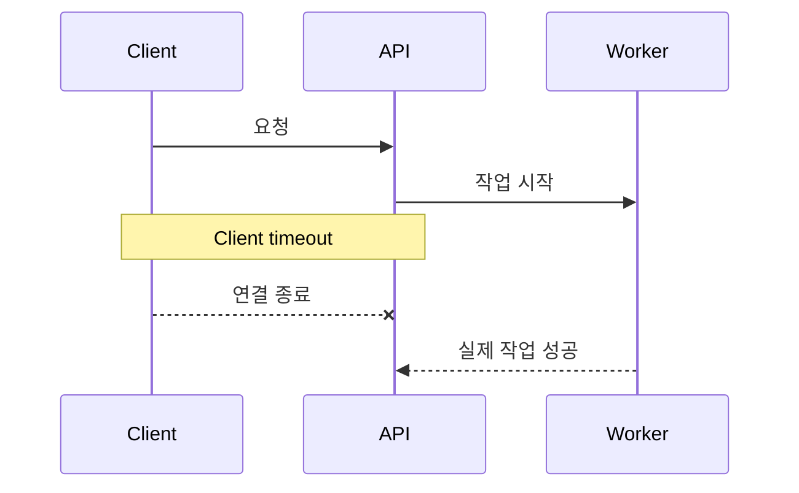

# 에러를 나중에 생각하면 늦는다

API 만들 때 처음에는 보통 정상 흐름부터 본다.

요청 받고, 처리하고, `200 OK` 내려주면 일단 끝난 것처럼 보인다.

문제는 운영에 들어가면 정상 흐름보다 애매한 실패가 더 피곤하다는 것이다.

- Client는 timeout이 났는데 서버 작업은 끝까지 실행됨
- 같은 요청이 다시 들어와서 작업이 두 번 실행됨
- 중간 단계는 성공했는데 마지막 저장에서 실패함
- Gateway도 retry하고 Worker도 retry함
- 사용자는 실패했다고 봤는데 실제 처리는 이미 끝남

이런 걸 몇 번 겪고 나면 API에서 중요한 건 응답 JSON 모양만이 아니라는 걸 알게 된다.

## timeout 하나 넣으면 끝인 줄 알았다

예를 들어 `timeout=30s`를 넣었다고 하자.

처음에는 그냥 30초 넘으면 실패라고 생각하기 쉽다.

그런데 실제로는 Client, Gateway, API, Worker가 전부 다른 timeout을 가질 수 있다.



Client는 실패했다고 생각한다.

그런데 안쪽 Worker는 계속 돌다가 성공한다.

사용자가 다시 버튼을 누르면 같은 작업이 두 번 실행될 수도 있다.

그래서 timeout을 볼 때는 숫자보다 먼저 "연결이 끊겼을 때 작업도 같이 죽는가?"를 확인하게 됐다.

## retry는 생각보다 무섭다

실패하면 다시 시도하면 된다고 생각하기 쉽다.

그런데 여러 계층에서 각자 retry를 켜면 금방 이상해진다.

```text
client 3회 × gateway 2회 × worker 3회 = 최대 18회
```

GET 요청이면 별일 아닐 수도 있다.

결제, 배포, 메시지 발송처럼 부작용이 있는 작업이면 얘기가 달라진다.

그래서 요즘은 retry부터 넣지 않는다.

먼저 본다.

- 같은 요청을 다시 실행해도 괜찮은가
- 중복 요청을 식별할 키가 있는가
- retry는 어느 계층 하나가 책임질 수 있는가
- 최종 실패 상태를 다시 조회할 수 있는가

`idempotency`라는 단어보다 중요한 건 실제로 두 번 실행돼도 사고가 안 나는지다.

## 에러 응답을 대충 만들면 나중에 내가 고생한다

초기에는 이런 응답도 충분해 보인다.

```json
{ "error": "request failed" }
```

운영에서 보면 아무 쓸모가 없다.

로그를 뒤지고 나서야 timeout인지 정책 차단인지 Upstream 오류인지 알 수 있다.

최소한 이 정도는 있어야 했다.

```json
{
  "code": "UPSTREAM_TIMEOUT",
  "retryable": true,
  "trace_id": "..."
}
```

사용자에게 내부 오류를 길게 보여주자는 얘기는 아니다.

시스템이 분기할 코드와 서버 기록을 찾을 Trace 정도는 안정적으로 남겨야 나중에 사람이 덜 고생한다.

## 로그도 많이 남긴다고 좋은 건 아니었다

문제가 생기면 일단 로그를 더 찍고 싶어진다.

그렇게 하다 보면 Request Body, Token, 사용자 원문까지 전부 남기기 쉽다.

관측하려다가 오히려 보안 문제를 만드는 셈이다.

지금은 이런 것부터 남기려고 한다.

```text
언제
누가
어떤 정책을 통과했는지
어디까지 실행됐는지
어떤 trace로 이어지는지
```

원문이 꼭 필요한 경우가 아니면 굳이 저장하지 않는다.

## happy path만 그리지 않는다

새 API를 볼 때 정상 흐름 하나만 그려놓으면 구현은 빨리 시작할 수 있다.

대신 뒤에서 계속 메운다.

```text
request
  ├─ auth denied
  ├─ validation failed
  ├─ accepted
  │    ├─ upstream timeout
  │    ├─ partial failure
  │    └─ success
  └─ duplicate request
```

요즘은 이쪽을 같이 그려놓고 시작하는 편이다.

모든 실패를 처음부터 완벽하게 처리할 수는 없다.

그래도 **어디에서 실패할 수 있는지조차 생각하지 않은 API**와 **실패 지점을 알고 시작한 API**는 운영할 때 차이가 꽤 크다.

정상 응답은 처음부터 눈에 잘 보인다.

진짜 오래 붙잡게 되는 건 대부분 그 사이의 애매한 상태였다.
