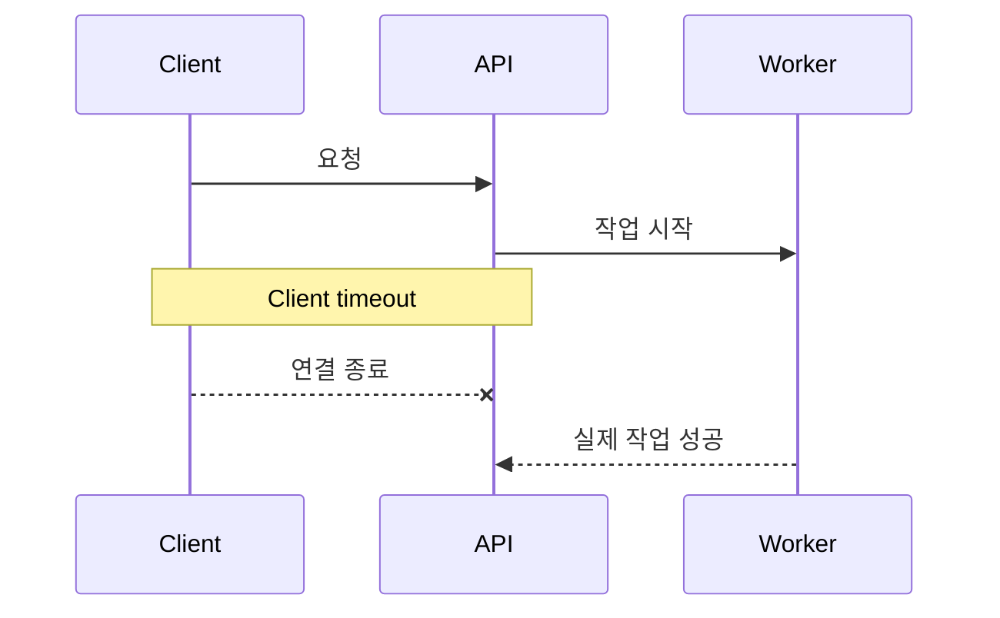

# 실패 경로도 API의 일부다

API를 처음 만들 때 문서는 보통 정상 흐름부터 채워진다.

`200 OK`, 응답 JSON, 필드 타입, 예제.

운영에 들어가면 더 자주 보게 되는 것은 다른 것들이다.

- Upstream이 30초 동안 응답하지 않는다.
- 같은 요청이 두 번 들어온다.
- 일부 작업은 성공했는데 마지막 저장만 실패한다.
- 재시도 때문에 실제 작업이 두 번 실행된다.
- 사용자는 실패했다고 봤는데 서버에서는 이미 처리되었다.

이때부터 API의 품질은 성공 응답보다 **실패를 얼마나 명확하게 끝내는지**에서 갈린다.

## Timeout은 숫자가 아니라 책임 경계다

`timeout=30s` 같은 설정은 단순한 성능 옵션처럼 보인다.

하지만 실제 질문은 이것이다.

> 30초가 지나면 누가 작업을 끝났다고 판단하는가?

Client, Gateway, Application, Worker, Upstream이 서로 다른 timeout을 가지면 바깥 계층이 먼저 연결을 끊었는데 안쪽 작업은 계속 실행될 수 있다.



이 상태에서 사용자가 같은 요청을 다시 보내면 중복 실행이 시작된다.

그래서 timeout을 정할 때는 숫자보다 다음을 먼저 정한다.

- 연결 종료와 작업 취소는 같은가?
- 이미 시작한 작업은 끝까지 수행하는가?
- 다시 요청해도 안전한가?
- 호출자는 완료 여부를 어디에서 다시 확인하는가?

## Retry를 넣기 전에 idempotency를 본다

재시도는 신뢰성을 높이는 기능이 아니라 **같은 작업을 여러 번 실행하는 기능**이 될 수 있다.

GET처럼 부작용이 없는 요청과 결제, 배포, 메시지 발송 같은 요청은 다르게 다뤄야 한다.

내가 먼저 확인하는 순서는 이렇다.

1. 같은 요청을 다시 실행해도 결과가 같은가?
2. 중복을 식별할 키가 있는가?
3. 어느 계층이 retry를 소유하는가?
4. 최대 횟수와 backoff가 보이는가?
5. 최종 실패를 누가 기록하는가?

여러 계층에서 각각 "친절하게" retry를 켜면 실제 횟수는 곱셈이 된다.

```text
client 3회 × gateway 2회 × worker 3회 = 최대 18회
```

하나의 계층이 재시도 책임을 소유하고, 나머지는 실패를 투명하게 전달하는 편이 추적하기 쉽다.

## 오류 코드는 운영자가 읽는 계약이기도 하다

좋은 오류 응답은 사용자에게만 필요한 것이 아니다.

로그, 알람, 대시보드, 재처리 도구도 같은 계약을 사용한다.

예를 들어 아래 둘은 운영에서 완전히 다르다.

```json
{ "error": "request failed" }
```

```json
{
  "code": "UPSTREAM_TIMEOUT",
  "retryable": true,
  "trace_id": "..."
}
```

두 번째 응답은 최소한 세 가지 질문에 답한다.

- 어디에서 끝났는가
- 다시 시도해도 되는가
- 서버 기록과 어떻게 연결하는가

오류 메시지를 자세히 쓰라는 뜻은 아니다. 오히려 내부 정보와 Secret은 덜 노출해야 한다.

**사람에게 필요한 설명과 시스템이 분기할 안정적인 코드를 분리하는 것**이 중요하다.

## Audit은 모든 원문을 저장하는 것이 아니다

문제가 생기면 "로그를 더 남기자"는 결론으로 가기 쉽다.

하지만 인증정보나 사용자 원문까지 전부 저장하면 관측 가능성이 보안 부채가 된다.

운영에서 필요한 것은 대개 이런 메타데이터다.

- 언제
- 어떤 Principal이
- 어떤 정책을 통과하거나 거부되었고
- 어느 실행 경계까지 갔으며
- 어떤 Trace로 연결되는가

원문이 정말 필요한 경우와 그렇지 않은 경우를 나눠야 한다.

## 정상 흐름과 실패 흐름을 같이 그린다

새 API를 볼 때 나는 happy path만 그리지 않으려고 한다.

```text
request
  ├─ auth denied
  ├─ validation failed
  ├─ accepted
  │    ├─ upstream timeout
  │    ├─ partial failure
  │    └─ success
  └─ duplicate request
```

이 트리가 그려지면 필요한 상태와 책임이 더 빨리 보인다.

API 설계는 "성공하면 무엇을 반환할까"보다 넓다.

**실패했을 때 어디에서 멈추고, 무엇을 남기고, 다음 요청이 어떻게 안전하게 이어지는지까지가 API다.**
