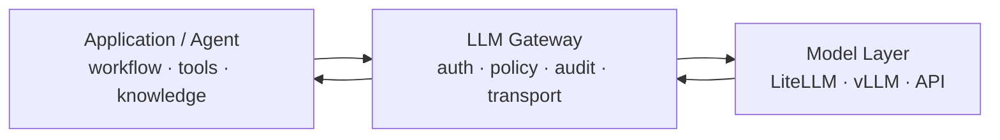

# LLM Gateway는 왜 똑똑해지면 안 될까

LLM 앞에 Gateway를 두면 하고 싶은 일이 빠르게 늘어난다.

인증, 사용량 제한, 감사 로그를 넣고 나면 다음에는 프롬프트를 보정하고 싶어진다. 모델이 반복하면 penalty를 넣고, 답변이 길면 system prompt를 덧붙이고, 코딩 요청처럼 보이면 다른 파라미터를 강제하고 싶어진다.

처음에는 전부 품질 개선처럼 보인다. 하지만 Gateway가 요청의 **의미**를 바꾸기 시작하는 순간 책임 경계가 흐려진다.

내가 지금 잡고 있는 원칙은 단순하다.

> Gateway는 실행을 통제하지만, 사용자의 의도를 다시 작성하지 않는다.

## Gateway가 가져야 할 책임

LLM Gateway가 잘하는 일은 대부분 결정론적이다.

- API Key와 Principal 확인
- 프로젝트와 모델 접근 정책 검사
- Rate limit과 quota
- 요청/응답 크기 제한
- Secret과 민감정보를 고려한 감사 이벤트
- Upstream timeout과 오류 계약
- 모델 공급자 차이를 감추는 transport 계층

이 영역은 요청이 왜 들어왔는지 깊게 추론하지 않아도 된다.

반대로 아래부터는 애플리케이션이나 Agent의 책임에 가깝다.

- 어떤 도구를 호출할지
- RAG가 필요한지
- 어떤 system prompt를 사용할지
- 실패한 도구를 다시 호출할지
- 생성 결과를 다시 검증할지
- 작업을 몇 단계로 나눌지



Gateway는 가운데 있지만 가장 많은 것을 알아야 하는 컴포넌트가 아니다.

오히려 **적게 알아야 오래 버틴다.**

## 생성 파라미터를 대신 고쳐주는 것이 위험한 이유

예를 들어 반복을 줄이기 위해 모든 요청에 `frequency_penalty`를 기본값으로 넣는다고 해보자.

일반 문장에서는 그럴듯하게 동작할 수 있다. 하지만 코드 생성에서는 같은 변수명, 함수명, 타입명이 반복되는 것이 정상이다.

Gateway 입장에서는 모두 "반복"이다. 애플리케이션 입장에서는 문맥상 필요한 동일성이다.

문제는 특정 penalty 값이 좋으냐 나쁘냐가 아니다.

**Gateway가 클라이언트가 요청하지 않은 생성 정책을 조용히 주입한다는 것 자체가 문제다.**

장애가 났을 때도 원인을 찾기 어려워진다.

```text
client request
  ↓
application prompt
  ↓
gateway hidden mutation   ← 호출자는 모름
  ↓
model response
```

모델 문제처럼 보이는 현상이 실제로는 중간 계층의 변경 때문일 수 있다.

## 대신 무엇을 할까

Gateway가 요청을 바꾸는 대신 **관측하고 거부할 수는 있다.**

예를 들어 다음은 Gateway 레벨에서도 의미가 있다.

1. 응답 스트림이 비정상적으로 반복되는지 감지한다.
2. 설정된 최대 시간이나 토큰 범위를 넘으면 종료한다.
3. 실패 이유를 표준화된 오류로 반환한다.
4. Trace에는 "무엇을 바꿨는가"가 아니라 "어디에서 왜 끝났는가"를 남긴다.

중요한 차이는 **복구를 위해 새로운 의도를 발명하지 않는 것**이다.

Gateway가 의미를 추론해 새로운 프롬프트를 만들면 다시 workflow engine이 된다.

## 내가 사용하는 경계 문장

아키텍처가 복잡해질수록 긴 설명보다 한 문장이 유용했다.

```text
Agent owns workflow.
Application owns tools and knowledge.
Gateway owns governed model execution.
```

이 문장을 기준으로 기능을 볼 때 애매한 코드가 꽤 잘 드러난다.

"이 기능을 Gateway에서 빼면 애플리케이션이 더 정확한 문맥으로 처리할 수 있는가?"

그렇다면 대부분 Gateway의 일이 아니다.

## 결론

LLM 시스템에서는 가운데 있는 컴포넌트가 모든 것을 통제하고 싶어지기 쉽다.

하지만 좋은 Gateway의 가치는 똑똑함보다 **예측 가능함**에 있다.

요청이 들어온 그대로 전달되었는지, 어떤 정책 때문에 차단되었는지, 어느 Upstream에서 실패했는지를 호출자가 설명할 수 있어야 한다.

나는 Gateway를 기능이 많은 AI 제품이 아니라 **지루할 정도로 명확한 실행 경계**로 만드는 쪽을 선택하고 있다.
