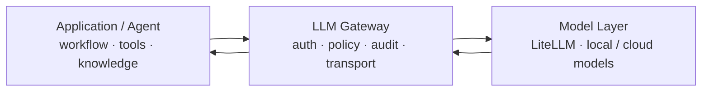

# 게이트웨이에 너무 많은 걸 넣었다

LLM Gateway를 처음 만들 때는 가운데 있으니까 이것저것 다 해도 될 것 같았다.

인증이랑 사용량 제한을 넣고, 로그를 남기고, 모델 라우팅도 붙였다. 여기까지는 괜찮았다.

그 다음부터 슬슬 이상해졌다.

요청을 분류해서 모델을 고르고, 반복 답변을 줄인다고 generation parameter를 넣고, RAG가 필요한지도 판단하고, Tool Loop까지 Gateway 쪽에서 처리하려고 했다.

기능은 계속 늘었는데 문제가 생겼을 때 어디를 봐야 하는지는 오히려 더 어려워졌다.

## 반복 답변 잡겠다고 penalty를 넣었다

한때 모델이 같은 말을 반복하는 문제가 있어서 Gateway에서 `frequency_penalty`와 `presence_penalty`를 기본으로 넣었다.

일반 대화에서는 조금 나아지는 것처럼 보였다.

그런데 코딩 작업에서 이상해졌다. 코드에서는 변수명이나 타입, 함수 호출이 반복되는 게 당연한데 모델 입장에서는 그것도 반복이다.

결국 호출한 쪽에서는 아무 설정도 안 했는데 중간에 있는 Gateway가 결과를 바꾸고 있었다.

```text
client request
  ↓
gateway에서 parameter 추가
  ↓
model
  ↓
"왜 코드가 이상하지?"
```

처음에는 모델 문제라고 생각하기 쉽다.

이걸 겪고 나서 generation parameter를 Gateway에서 임의로 넣는 로직은 뺐다.

## Tool Loop도 가운데 넣어봤다

Agent가 Tool을 계속 호출하거나 실패할 때 Gateway가 어느 정도 제어해주면 편하지 않을까 생각한 적도 있다.

실제로 Tool Loop, 검색, 결과 검증 같은 기능을 가운데로 모으는 방향을 꽤 오래 만졌다.

문제는 Gateway가 그 작업이 왜 필요한지를 모른다는 것이다.

예를 들어 Tool 호출이 실패했을 때 다시 호출해야 하는지, 다른 Tool로 바꿔야 하는지, 그냥 사용자에게 실패를 알려야 하는지는 작업 문맥을 가진 Agent가 제일 잘 안다.

Gateway는 요청과 응답은 보지만 그 작업의 전체 목적까지 알지는 못한다.

그래서 지금은 이렇게 나눴다.

```text
Agent       → workflow
Application → tools, knowledge
Gateway     → auth, policy, audit, model execution
```

처음부터 이렇게 깔끔했던 건 아니다. 기능을 넣었다가 실제로 불편해서 다시 뺀 결과다.

## Gateway에는 뭘 남겼나

지금은 비교적 단순하다.

- API Key와 Principal 확인
- 프로젝트별 모델 접근 정책
- Rate limit
- 요청 크기 같은 실행 제한
- Audit metadata와 Trace ID
- OpenAI-compatible API
- Upstream timeout과 오류 전달

반대로 Prompt를 고치거나, RAG를 붙이거나, Tool 호출 순서를 정하는 일은 하지 않는다.



가운데 있다고 해서 제일 똑똑할 필요는 없었다.

## 그렇다고 아무것도 안 보는 건 아니다

스트리밍 응답이 비정상적으로 무한 반복된다거나, Upstream이 정해진 시간 안에 응답하지 않는 건 Gateway에서도 끊을 수 있다.

다만 여기서도 답변을 "고쳐서 성공시키는 것"보다는 실패를 명확하게 끝내는 쪽으로 잡고 있다.

예를 들면 반복 응답을 감지했으면 새로운 Prompt를 만들어 재생성하는 게 아니라 요청을 종료하고 왜 종료했는지 남긴다.

이게 디버깅하기도 훨씬 쉽다.

## 지금 기준

요즘 Gateway에 기능을 추가할 때는 하나를 먼저 본다.

**이 기능이 작업 문맥을 알아야 제대로 동작하는가?**

그렇다면 대부분 Gateway 밖에 두는 게 맞았다.

처음에는 Gateway를 똑똑하게 만들수록 플랫폼이 좋아진다고 생각했다.

지금은 반대다.

Gateway는 좀 지루해도 된다. 대신 요청이 왜 막혔는지, 어디로 갔는지, 어디서 실패했는지는 확실하게 알 수 있어야 한다.
