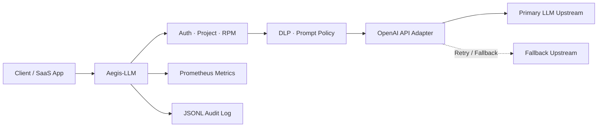
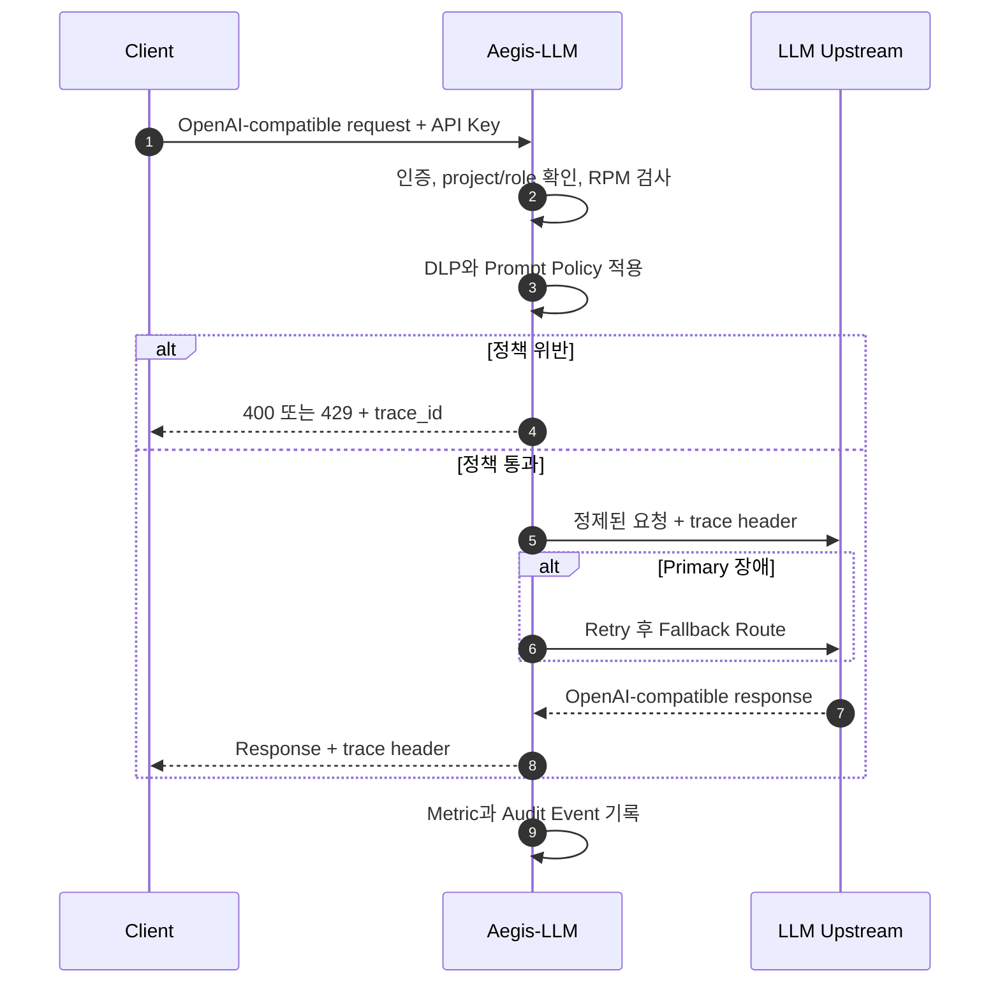

# Aegis-LLM

API 인증, 프로젝트별 사용량 제한, DLP와 감사 추적을 LLM 요청 경계에서 검증하는 Rust 기반 AI Gateway MVP입니다.

## 📌 Status & Repository
- **상태**: `MVP`
- **저장소 주소**: [GitHub (devcy0922/aegis-llm)](https://github.com/devcy0922/aegis-llm)
- **라이선스**: MIT
- **주요 언어**: Rust

---

## 1. Problem
클라이언트가 LLM Provider를 직접 호출하면 API Key별 정책, 개인정보 유출 방지, Prompt Injection 차단, 사용량 제한과 장애 추적을 각 애플리케이션에서 반복 구현해야 합니다. 이 구조에서는 보안 정책이 분산되고 요청이 차단된 이유와 Upstream 장애 경로를 일관되게 감사하기 어렵습니다.

## 2. Why I Built It
Aegis-LLM은 OpenAI-compatible API 앞단에 공통 Control Plane을 두고 인증, Rate Limit, 요청 보안, 모델 정책, Retry/Fallback과 Audit을 하나의 경계에서 처리할 수 있는지 검증하기 위해 만들었습니다.

## 3. Scope
- Static Config, SurrealDB, JWT를 순차 적용하는 3-Tier 인증
- API Key의 `project`, `role`, RPM 기준 Sliding Window 제한
- 이메일, 주민등록번호, 평문 Secret 탐지와 마스킹
- Prompt Injection 및 추가 Deny Pattern 조기 차단
- Chat Completions, Responses, Embeddings, Models API 중계
- Primary Upstream Retry와 Fallback Route
- Prometheus Metric과 JSONL Audit Log

---

## 4. Architecture



## 5. Request Flow



## 6. Key Design Decisions
- **API Key를 SaaS 경계로 사용**: Key별 `project`, `role`, RPM 정보를 인증 결과에 결합해 요청 정책과 사용량 제한을 같은 Principal 기준으로 처리합니다.
- **Fail-closed 보안 필터**: 차단 대상 Payload는 Upstream으로 전송하기 전에 종료해 정보 유출과 정책 우회를 막습니다.
- **Provider 장애 격리**: 네트워크 오류와 5xx 응답에 Retry를 적용하고 설정된 Fallback Upstream으로 전환합니다.

## 7. Security Considerations
- 평문 API Key는 설정 예시와 로그에 기록하지 않습니다.
- 보안 차단과 인증 실패도 `trace_id`, 프로젝트, 차단 사유를 포함한 Audit Event로 남깁니다.
- 현재 Prompt Injection 탐지는 Keyword와 Deny Pattern 중심이므로 의미론적 우회까지 완전하게 방어한다고 주장하지 않습니다.

## 8. Observability
- `/metrics`에서 요청, 차단, 오류, Fallback 관련 Prometheus Metric을 제공합니다.
- 모든 요청 경로에 `trace_id`를 부여하고 `logs/audit.jsonl`에 비동기로 기록합니다.
- 응답에도 Trace Header를 전달해 Client 오류와 Gateway Audit을 연결할 수 있습니다.

## 9. Technology Stack
- **Gateway**: Rust, Axum, Tower HTTP
- **Authentication**: Static Config, SurrealDB, JWT
- **Observability**: Prometheus, Structured JSONL Audit
- **Packaging**: Docker

## 10. Running Locally

```bash
docker build -t aegis-llm:local .
docker run --rm -p 8080:8080 \
  -v ./configs/gateway.example.toml:/app/configs/gateway.toml:ro \
  aegis-llm:local
```

실제 Secret과 Upstream 주소는 이미지나 저장소에 포함하지 않고 실행 환경에서 주입합니다.

## 11. Current Limitations
- 현재 Rate Limit 상태는 단일 프로세스 메모리에 유지되므로 다중 Replica의 전역 Quota로 사용할 수 없습니다.
- Keyword 기반 Prompt Injection 탐지는 의미론적 우회에 취약할 수 있습니다.
- 공개 버전은 운영 SLA를 보장하는 제품이 아니라 Control Plane 설계를 검증하는 MVP입니다.

## 12. Next Steps
- Tenant별 Daily/Monthly Quota와 Usage Event 저장
- API Key 발급, 폐기, Rotation 관리 경계 추가
- 분산 Rate Limit 저장소와 재현 가능한 Failure Drill 추가
