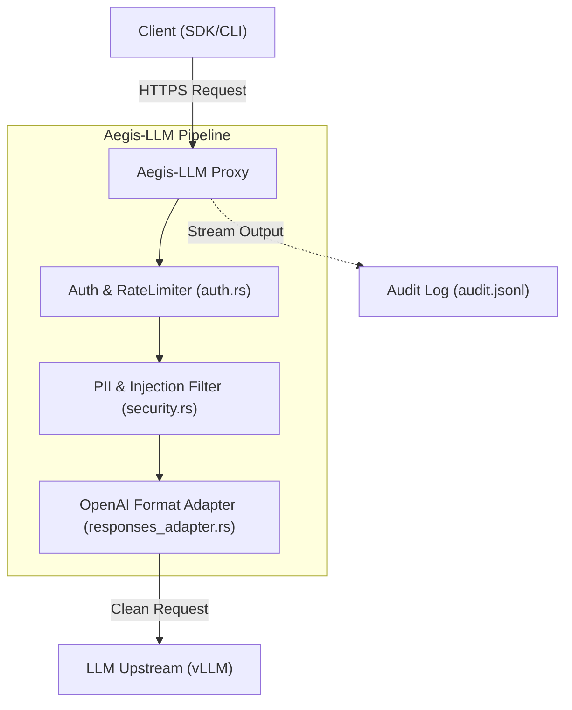
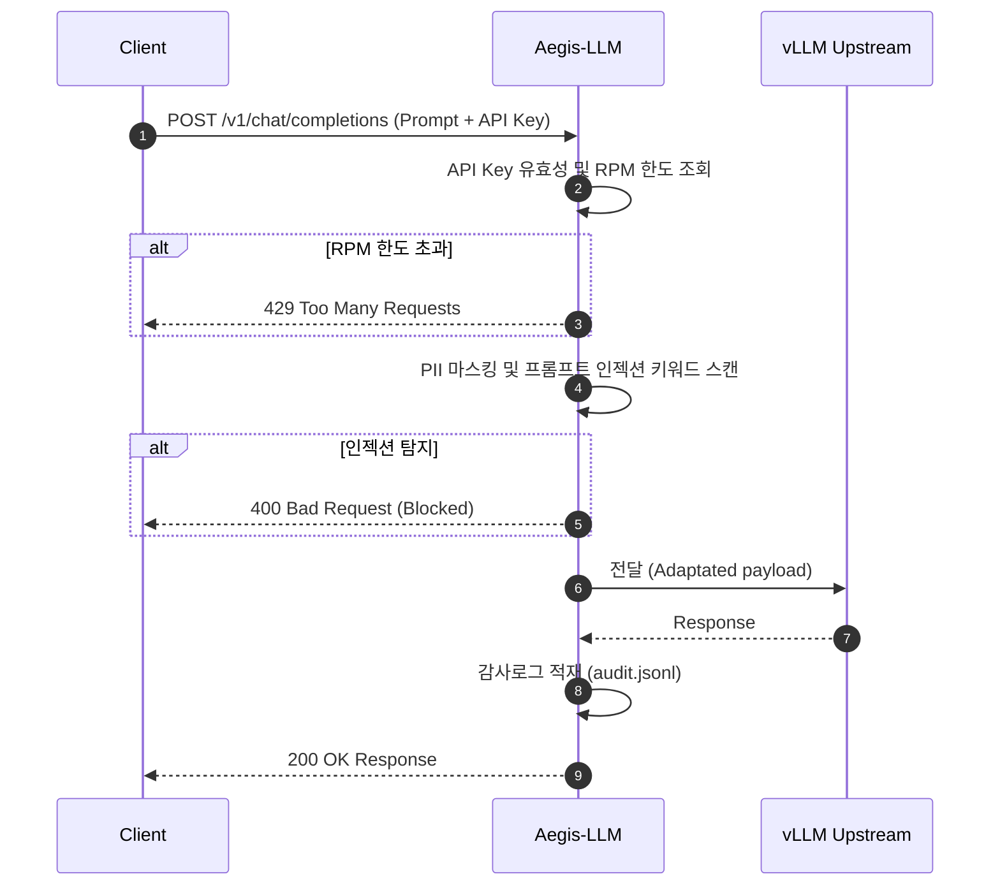

# Aegis-LLM

비용 절감과 인젝션 방어를 위한 엔터프라이즈 레벨의 LLM 보안 가드레일 프록시 엔진입니다.

## 📌 Status & Repository
- **상태**: `Stable`
- **저장소 주소**: [GitHub (devcy0922/aegis-llm)](https://github.com/devcy0922/aegis-llm)
- **라이선스**: MIT
- **주요 언어**: Rust

---

## 1. Problem
외부 LLM 공급자(OpenAI 등)를 직접 연동할 경우, 내부 직원의 실수나 외부 공격자의 프롬프트 인젝션(Prompt Injection) 시도로 인해 시스템 명령어 권한이 탈취되거나, 이메일/주민등록번호 등의 개인정보(PII)가 외부로 유출될 위험이 상존합니다. 또한 무제한적인 API 호출로 인한 오남용 비용 리스크가 큽니다.

## 2. Why I Built It
성능 오버헤드가 적은 Rust 언어를 사용해 API 경계면(Edge)에서 초고속으로 트래픽을 중계하며, 요청 전달 전에 인젝션 위협을 실시간 필터링하고 데이터 유출(DLP) 방지 및 API Key 기반 사용량 제한(Rate Limiting)을 단일 바이너리 내에서 효율적으로 수행하기 위해 구축했습니다.

## 3. Scope
- 프롬프트 인젝션 탐지 및 400 Bad Request 조기 차단
- 주민등록번호, 이메일, 평문 API Key 등의 PII 정보 감지 및 마스킹
- API Key별 분당 요청 수(RPM) 제한 (Sliding Window 방식)
- OpenAI Responses API 규격을 Chat Completions 규격으로 자동Adaptation 중계

---

## 4. Architecture



---

## 5. Request Flow



---

## 6. Key Design Decisions
- **정규식 배제 고속 스캔**: 프롬프트 인젝션 1차 스캔 시 정규식(Regex)을 배제하고 `contains` 키워드 매칭(O(n·m))을 통해 지연율(latency) 증가를 2ms 이하로 극도로 제한했습니다.
- **3-Tier 인증 아키텍처**: static config, SurrealDB, JWT 토큰 방식을 단계별로 시도하여 대규모 실시간 요청 처리와 정적 로컬 시연 모두 안정적으로 지원합니다.

## 7. Security Considerations
- 외부 위협 탐지 시 Upstream LLM으로 페이로드를 전달하지 않고 에지 단에서 즉시 커넥션을 차단하여 불필요한 LLM 추론 비용 소모와 프롬프트 전파를 원천 봉쇄합니다.

## 8. Observability
- 실시간 Prometheus 텔레메트리 `/metrics` 엔드포인트를 제공하여 RPM 소비량, 차단 횟수, 레이턴시 분포를 관측 가능하게 제공합니다.
- 매 요청마다 UUID 기반의 `trace_id`를 부여해 `logs/audit.jsonl` 감사 로그에 비동기 플러시합니다.

## 9. Technology Stack
- **Framework**: Rust (Axum, Tower-HTTP)
- **Database**: SurrealDB (Config caching & API key store)
- **Metrics**: Prometheus

---

## 10. Running Locally
설정 파일 경로를 환경변수로 지정한 후 바이너리를 실행합니다.

```bash
# 가상 설정 파일 생성 및 실행
export GOVAIL_CONFIG="configs/gateway.toml"
cargo run --release -- --config $GOVAIL_CONFIG
```

## 11. Current Limitations
- 정밀한 의미 기반 인젝션(Semantic Injection) 탐지를 위한 임베딩 분석 레이어가 아직 포함되지 않아, 키워드 우회 기법에 취약할 수 있습니다.

## 12. Next Steps
- 벡터 데이터베이스를 활용한 의미론적 유사도 기반 프롬프트 인젝션 방어 기법 도입.
