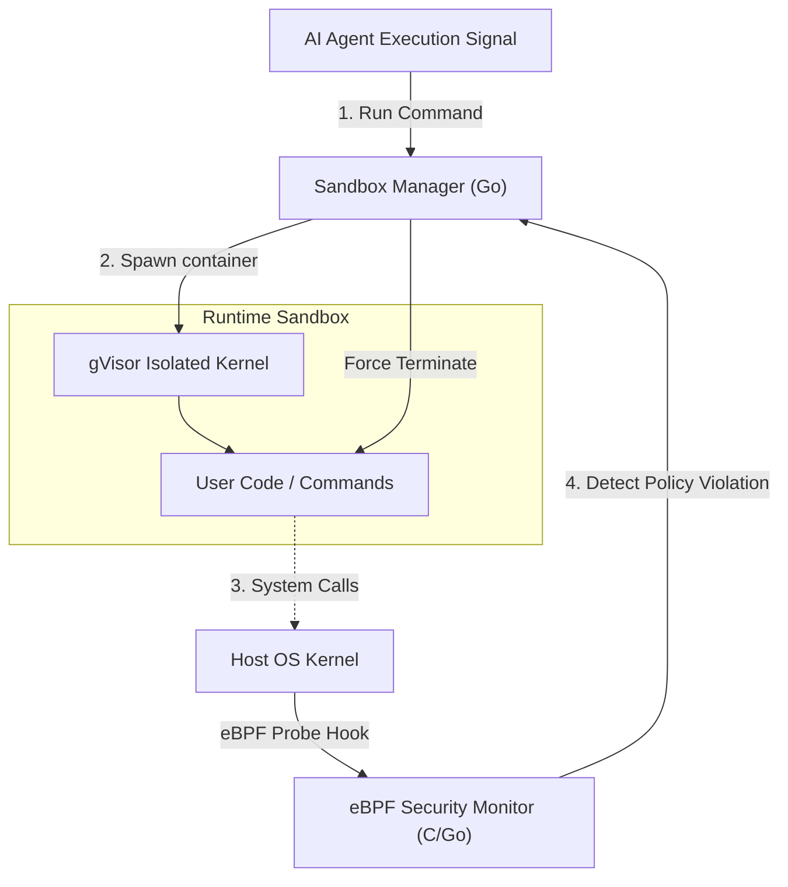
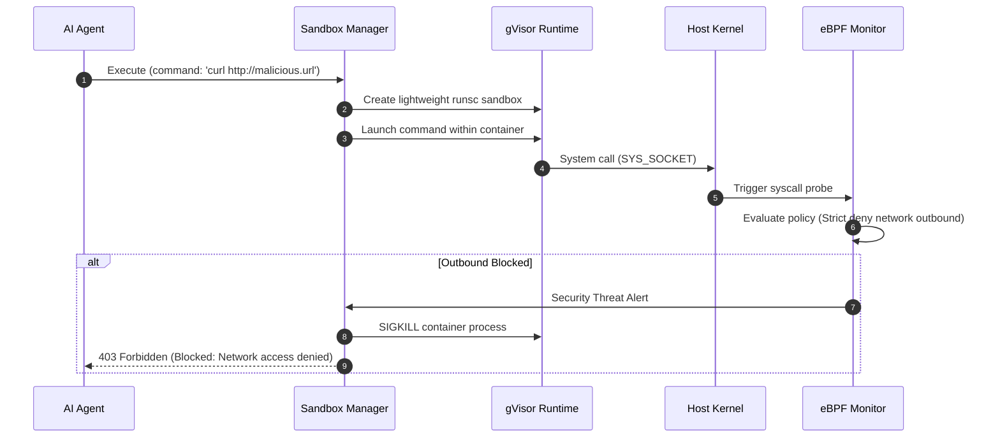

# AgentSecOps Playground

AI 에이전트가 자율적으로 생성한 코드를 안전하게 격리 구동하고, 실행 시 발생하는 비인가 시스템 호출 및 파일 변경 등의 보안 위협 행위를 실시간 모니터링하기 위한 가상 샌드박스입니다.

## 📌 Status & Repository
- **상태**: `Experimental`
- **저장소 주소**: [GitHub (devcy0922/agentsecops-playground)](https://github.com/devcy0922/agentsecops-playground)
- **라이선스**: MIT
- **주요 언어**: Go, Python

---

## 1. Problem
AI 코딩 어시스턴트나 자율 에이전트(Autonomous Agent)가 코드를 수정하고 터미널에서 직접 실행할 때, 악성 패키지가 다운로드되거나 중요 시스템 설정 파일(`/etc/passwd` 등)을 탈취하려 하거나, 로컬 저장소 전체를 지우는 명령어를 임의 생성할 위험이 존재합니다. 호스트 시스템의 안전을 보장하기 어려운 상태에서 자율 에이전트의 코드 실행 권한을 줄 수 없습니다.

## 2. Why I Built It
에이전트가 임의의 쉘 명령 및 프로그램 코드를 실행할 수 있는 독립된 Docker/gVisor 샌드박스를 제공하고, 커널 수준의 이벤트 모니터링(eBPF)을 결합해 비인가 시스템 호출을 감지하여 실시간으로 실행을 제어하고 감사 로그를 남기기 위해 구축했습니다.

## 3. Scope
- gVisor 커널 격리 기반의 임시 일회성(Disposable) 컨테이너 생성 및 파괴
- 에이전트 코드 실행 시 eBPF 프로브를 통한 파일 쓰기, 네트워크 소켓 오픈 감시
- 보안 가이드라인 위반 호출 감지 시 실시간 프로세스 강제 킬(Kill) 및 차단 정책 적용
- 보안 위협 행위 로그를 관제 대시보드 형식으로 수집

---

## 4. Architecture



---

## 5. Data Flow



---

## 6. Key Design Decisions
- **gVisor(runsc) 도입**: 표준 Docker(runc)가 공유 커널 취약점에 노출되는 것에 대비해, 커널 시스템 호출을 유저 스페이스에서 한 단계 필터링하여 에뮬레이션해주는 gVisor를 샌드박스 기반으로 선정했습니다.
- **eBPF 기반 무중단 수집**: 컨테이너 내부 런타임을 수정하지 않고, 호스트 레벨에서 투명하게 비인가 시스템 콜을 낚아채 오버헤드를 최소화하고 에이전트의 우회 시도를 완전히 원천 차단했습니다.

## 7. Security Considerations
- 제로 트러스트 기조에 따라 샌드박스 내부의 아웃바운드 인터넷 연결을 기본적으로 차단(`default-deny`)하며, 사전 승인된 도메인(예: GitHub API, PyPI 미러)만 화이트리스트 접근을 허용합니다.

## 8. Observability
- 실시간으로 비인가 파일 접근 차단 건수 및 네트워크 탈취 시도 이벤트를 JSONL 형식으로 비동기 영속화하여 감사용 로그로 기록합니다.

## 9. Technology Stack
- **Sandbox**: gVisor (runsc), Docker
- **Monitoring**: eBPF, Cilium/ebpf library, Go
- **Control Interface**: Python, FastAPI

---

## 10. Running Locally
gVisor 환경이 구성된 로컬 장비에서 샌드박스 관리 서버를 구동합니다.

```bash
# gVisor(runsc) 런타임 활성화 상태에서 샌드박스 모니터 가동
go build -o sandbox-mgr ./cmd/main.go
sudo ./sandbox-mgr --config configs/policy.json
```

## 11. Current Limitations
- eBPF 커널 레벨의 모니터링은 호스트 리눅스 환경에서만 완벽히 지원되며, macOS 가상화 레이어 아래에서는 정상적인 eBPF 시스템콜 프로브 수집에 제약이 있습니다.

## 12. Next Steps
- 샌드박스 환경 내부에서 모니터링한 데이터를 시각화해주는 실시간 웹 터미널 보안 대시보드 추가.
