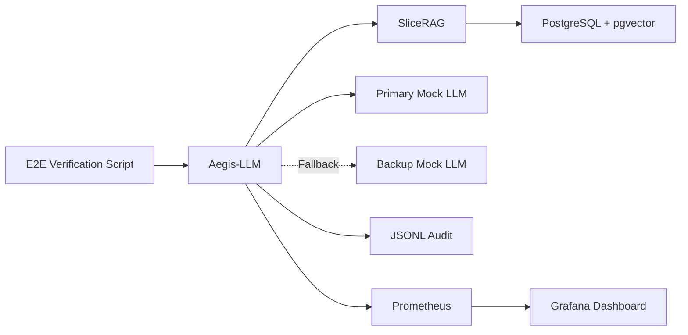
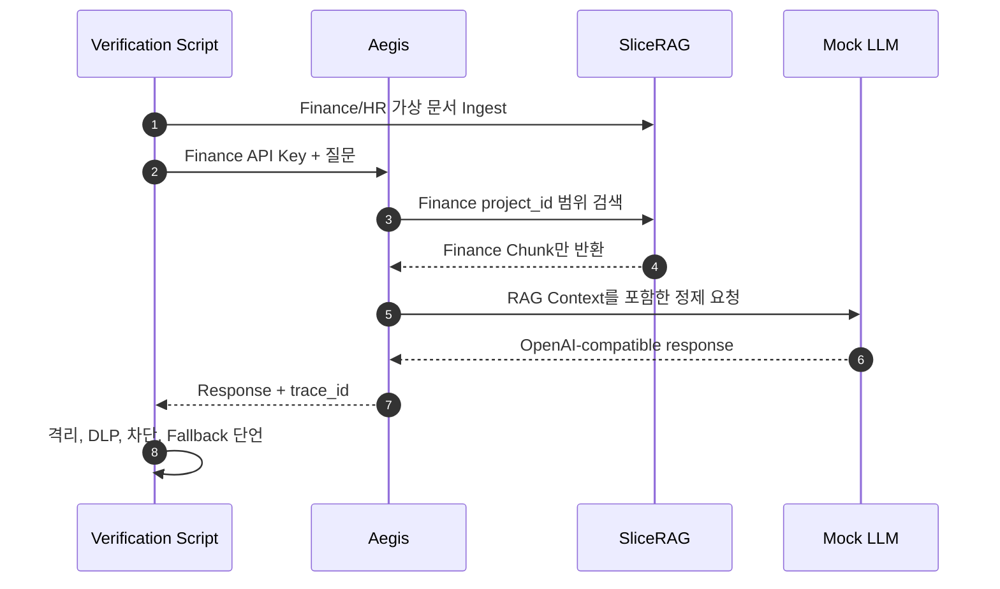

# AgentSecOps Playground

Aegis-LLM, SliceRAG와 Mock LLM을 결합해 AI Governance의 보안 불변식을 자동 검증하는 Docker Compose 기반 E2E Harness입니다.

## 📌 Status & Repository
- **상태**: `MVP`
- **저장소 주소**: [GitHub (devcy0922/agentsecops-playground)](https://github.com/devcy0922/agentsecops-playground)
- **라이선스**: MIT
- **주요 언어**: Python, Shell, Docker Compose

---

## 1. Problem
Gateway, RAG와 LLM Upstream이 각각 정상 동작해도 통합 경계에서 인증 누락, 교차 테넌트 검색, PII 전달, Prompt Injection 우회 또는 Fallback 실패가 발생할 수 있습니다. 실제 API Key와 고객 데이터 없이 이 경계를 반복 검증할 수 있는 안전한 Test Harness가 필요합니다.

## 2. Why I Built It
가상 Finance/HR 문서와 Mock LLM을 사용해 Aegis-LLM과 SliceRAG를 실제 Compose Network에서 연결하고, 정상 요청과 보안 실패 경로를 하나의 실행 절차로 검증하기 위해 만들었습니다.

## 3. Scope
- Aegis-LLM, SliceRAG, Mock LLM Compose 통합
- Static Bearer API Key 인증과 정상 Model Request 검증
- Finance/HR Project 간 RAG 격리 검증
- PII 마스킹과 Prompt Injection 조기 차단 검증
- Primary Upstream 실패 후 Fallback 검증
- Audit Log와 Prometheus/Grafana 연결 구성

---

## 4. Architecture



## 5. Data Flow



## 6. Key Design Decisions
- **실제 모델 대신 Mock Upstream 사용**: 테스트 결과가 외부 Provider 상태나 GPU 자원에 의존하지 않도록 요청 수신과 오류를 제어합니다.
- **가상 데이터만 사용**: Finance와 HR 경계를 표현하는 합성 문서를 사용해 고객 정보나 운영 Credential 없이 보안 시나리오를 재현합니다.
- **실패 경로를 성공 조건에 포함**: 단순 200 응답뿐 아니라 차단 요청이 Upstream에 도달하지 않는지와 Fallback이 사용되는지를 검증합니다.

## 7. Security Considerations
- 모든 서비스는 기본적으로 Loopback 또는 Compose 내부 Network에 노출합니다.
- 실제 API Key, 고객 문서, 사내 Endpoint를 테스트 Dataset과 Config에 포함하지 않습니다.
- gVisor/eBPF Runtime Sandbox는 현재 저장소의 구현 범위가 아니며 현재 기능으로 주장하지 않습니다.

## 8. Observability
- Aegis Audit Log에서 `trace_id`, Project, 차단 사유와 Memory 결과를 확인합니다.
- Prometheus와 Grafana Provisioning 설정을 통해 Request와 Block Metric을 시각화할 수 있습니다.
- Test 실패는 어떤 Security Invariant가 깨졌는지 명시적으로 출력합니다.

## 9. Technology Stack
- **Orchestration**: Docker Compose, Shell
- **Verification**: Python
- **Services**: Aegis-LLM, SliceRAG, FastAPI Mock LLM
- **Observability**: Prometheus, Grafana, JSONL Audit

## 10. Running Locally

세 저장소를 같은 상위 디렉터리에 준비한 뒤 실행합니다.

```bash
./run-demo.sh
```

실행 스크립트는 Compose를 시작하고 가상 문서를 Ingest한 뒤 보안·격리·Fallback 단언을 수행합니다.

## 11. Current Limitations
- 개발용 Compose는 형제 디렉터리의 Aegis-LLM과 SliceRAG Source Build에 의존합니다.
- 공개 Release Image의 고정 Tag를 사용하는 독립 실행 구성이 아직 없습니다.
- MCP 고위험 `tools/call` 차단은 별도 Aperture-MCP 테스트에서 검증하며 현재 Compose에는 포함되지 않습니다.

## 12. Next Steps
- 고정 OCI Image Tag를 이용한 독립 실행 Compose 제공
- E2E 결과를 JUnit·JSON Artifact로 출력해 CI Security Gate로 사용
- Network Timeout, Database Restart와 LLM 장애를 포함한 Failure Drill 확대
