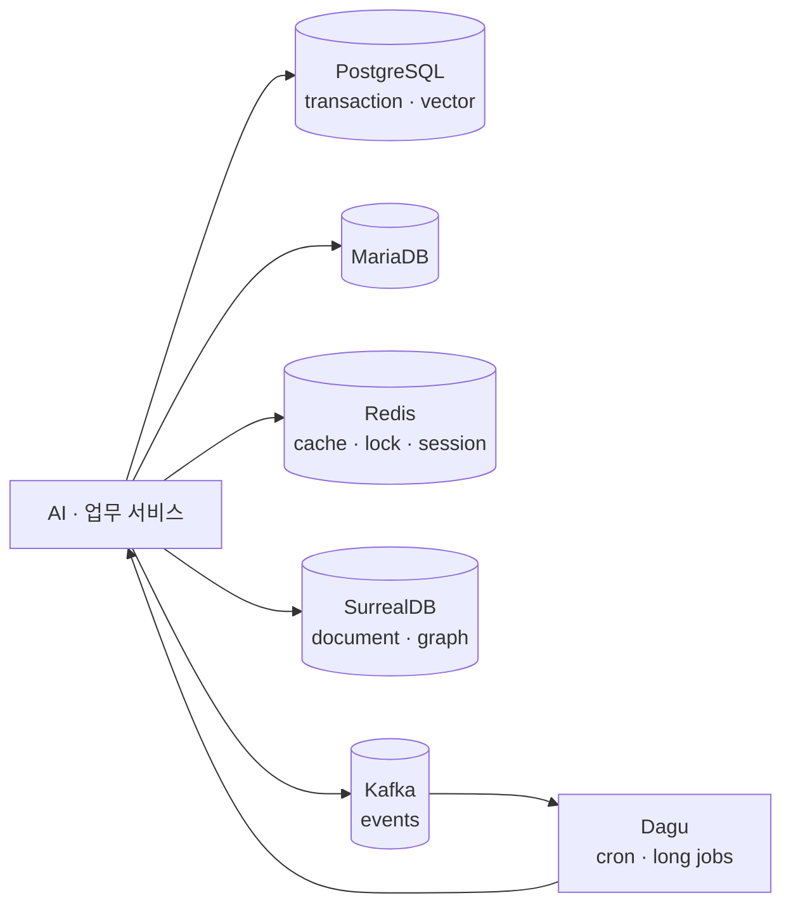

# AI Data Infra

AI 서비스들이 공통으로 사용하는 데이터베이스, 캐시, 이벤트 버스와 장기 작업 스케줄러를 운영하는 데이터 기반입니다.

## 한눈에 보기

- [GitHub 저장소](https://github.com/devcy0922/ai-data-infra)
- PostgreSQL 16 + pgvector/PostGIS
- MariaDB 11.4, Redis 7, SurrealDB 2.2
- Kafka 3.8 KRaft, Dagu 2.7
- cy-server의 소스 SSOT에서 원격 데이터 노드로 배포

## 역할을 좁힌 이유

이 저장소는 웹 애플리케이션이나 Gateway를 소유하지 않습니다. 데이터 서비스와 중앙 scheduler만 관리하고, 서비스는 명시된 접속 계약을 사용합니다. 운영 데이터 디렉터리와 초기화 bootstrap을 구분하고, schema 변경은 versioned migration으로 다룹니다.

## 운영 기준

이벤트는 중복 전달을 전제로 멱등 처리하고, 실패 메시지는 DLQ로 보냅니다. Dagu 작업에는 소유 서비스, 실행 위치, timeout, retry, overlap과 복구 방법을 함께 기록합니다. 공용 인프라를 단순히 “DB를 띄우는 Compose”로 보지 않고, 서비스 간 데이터 소유권과 변경 경계를 유지하는 기반으로 다룹니다.
