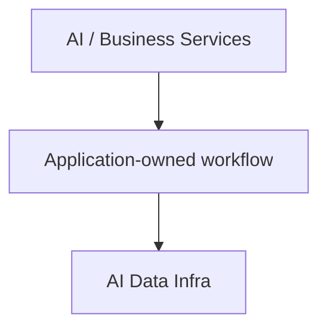
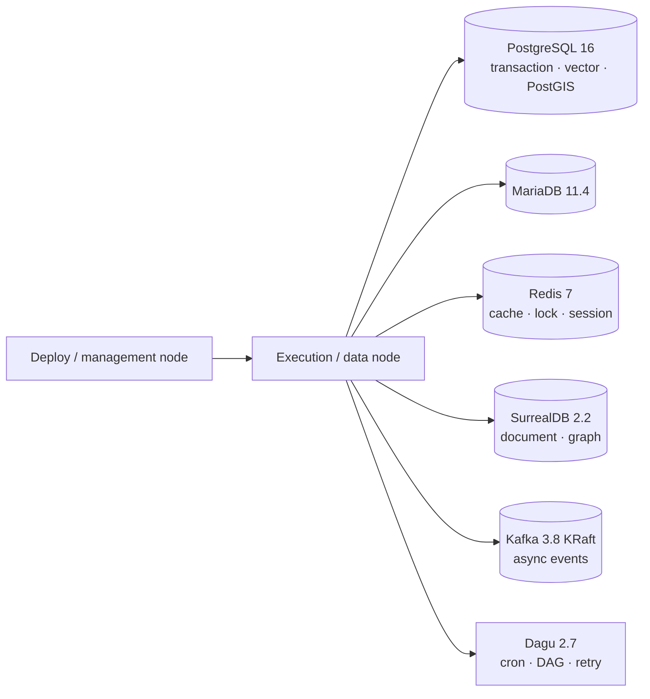
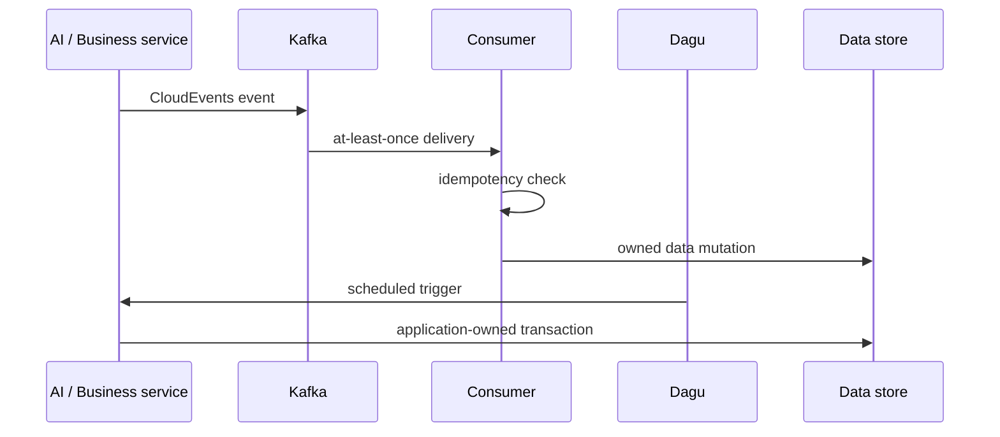

# AI Data Infra

여러 AI·업무 서비스가 공통으로 사용하는 데이터 저장소, 이벤트 버스와 저빈도 스케줄러를 운영하는 공용 데이터 계층입니다. 애플리케이션 서버를 하나로 합치는 프로젝트가 아니라, 서비스가 공유할 데이터 소유권과 운영 계약을 분리하는 기반입니다.

## 한눈에 보기

- **성격**: Data Platform / Infrastructure
- **핵심 기술**: PostgreSQL 16, Redis 7, Kafka KRaft, Dagu 2.7
- **Source**: [github.com/devcy0922/ai-data-infra ↗](https://github.com/devcy0922/ai-data-infra)
- **현재 범위**: 공용 DB·cache·event·저빈도 scheduled job의 배포와 운영 경계

## Context

상위 AI·업무 서비스가 있고, AI Data Infra는 그 서비스의 내부 workflow를 대신 실행하지 않습니다. 서비스가 정한 접속·이벤트 계약을 데이터 계층이 제공하는 구조입니다.

<DiagramFrame caption="상위 서비스 계층과 공용 데이터 계층을 분리합니다.">

</DiagramFrame>

## 문제

서비스마다 데이터베이스, cache, event broker와 scheduled job을 따로 띄우면 데이터 소유권과 변경 경계가 분산됩니다. 반대로 공용 계층이 애플리케이션 workflow까지 가져가면 장애 영향 범위와 복구 책임이 커집니다.

이 프로젝트는 공용 데이터 서비스와 저빈도 scheduler까지만 관리하고, application-owned transaction과 고빈도 event processing은 상위 서비스의 책임으로 남깁니다.

## Architecture

<DiagramFrame caption="배포·관리 노드와 실행·데이터 노드의 경계를 포함한 공용 계층입니다.">

</DiagramFrame>

PostgreSQL은 transaction과 `pgvector`, PostGIS를 함께 제공하고, Redis는 cache·lock·session을 맡습니다. Kafka는 비동기 이벤트를 전달하고 Dagu는 저빈도 scheduled job을 실행합니다. 운영 데이터 디렉터리와 초기화 bootstrap은 분리하며, schema 변경은 versioned migration으로 다룹니다.

## 책임 경계

### Owns

- PostgreSQL, MariaDB, Redis, SurrealDB의 배포 경계와 초기화
- Kafka KRaft 기반 event bus와 consumer가 지켜야 할 전달 가정
- Dagu의 cron·저빈도 DAG, retry와 overlap control
- deploy/management node에서 execution/data node로 이어지는 운영 구성

### Does not own

- AI·업무 서비스의 application workflow
- 서비스별 transaction의 business rule
- 고빈도 event consumer의 처리 로직
- API Gateway나 모델 provider routing

## Data Ownership

| Store | 이 계층이 맡는 책임 |
| --- | --- |
| PostgreSQL 16 | transaction, vector(`pgvector`), spatial(PostGIS) |
| MariaDB 11.4 | 서비스가 명시한 관계형 데이터 영역 |
| Redis 7 | cache, lock, session |
| Kafka 3.8 KRaft | replay를 고려하는 비동기 event 전달 |
| Dagu 2.7 | cron과 저빈도 scheduled job, DAG 실행 |
| SurrealDB 2.2 | document, graph 데이터 |

공용 저장소라는 이유로 모든 데이터의 소유자가 되지는 않습니다. 서비스별 schema와 transaction의 의미는 소비 서비스가 갖고, 인프라는 접속·보존·복구에 필요한 기반을 제공합니다.

## Event Contract

Kafka consumer는 메시지가 한 번만 도착한다고 가정하지 않습니다.

- event envelope는 CloudEvents contract를 기준으로 맞춥니다.
- 전달은 at-least-once로 가정하고 consumer idempotency를 요구합니다.
- 처리할 수 없는 메시지는 DLQ로 보내 원본 event와 실패 원인을 보존합니다.
- 현재 토픽 정책은 일반 event 72시간, audit와 DLQ 168시간 보존을 기준으로 합니다.
- 보존 기간 안에서 replay할 수 있지만, consumer idempotency와 schema 호환성이 함께 맞아야 합니다.

즉 Kafka를 사용한다는 사실보다 중복 전달과 재처리를 감당할 consumer 계약을 함께 정의하는 것이 중요합니다. 현재 Kafka는 단일 broker·replication factor 1이므로 고가용성은 보장하지 않습니다.

## Scheduler Boundary

Dagu는 cron, 저빈도 scheduled job, DAG, retry와 overlap control을 맡습니다. 실행 위치, 소유 서비스, timeout, retry, overlap과 복구 방법을 job 정의에 남기는 것을 운영 기준으로 둡니다.

고빈도 event processing이나 application-owned transaction은 Dagu가 소유하지 않습니다. 그런 작업은 해당 서비스의 runtime과 transaction 경계에서 처리하고, Dagu는 정해진 주기의 orchestration만 담당합니다.

## 핵심 흐름

서비스가 event와 transaction의 의미를 소유하고, 공용 계층은 전달·저장·스케줄 실행의 실패 경계를 제공합니다.

## AI Service Layer와의 경계

LiteLLM, Temporal, Langfuse는 이름이 널리 알려졌다는 이유로 이 프로젝트의 내부 component가 되지 않습니다. 실제로 model access, durable workflow, trace contract를 운영하는 상위 AI Service Layer가 있을 때만 그 계층의 책임으로 설명합니다.

따라서 이 페이지의 핵심 기술 목록과 Architecture에는 해당 서비스를 넣지 않았습니다. AI Data Infra와 연결되는 경우에도 `AI Service Layer → Shared Data Infrastructure`라는 외부 계층 관계로만 표현합니다.

## 검증된 범위 / Evidence

- PostgreSQL·MariaDB·Redis·SurrealDB·Kafka KRaft·Dagu를 포함한 공용 데이터 계층 구성이 공개되어 있습니다.
- 운영 데이터 디렉터리와 bootstrap을 구분하고, schema 변경을 versioned migration으로 다룹니다.
- 중복 전달을 전제로 한 idempotent consumer와 DLQ 운영 기준을 명시합니다.
- Dagu의 cron, 저빈도 DAG, retry와 overlap control을 application workflow와 분리합니다.
- 자세한 배포 구성은 [소스 저장소](https://github.com/devcy0922/ai-data-infra)에서 확인할 수 있습니다.

## 현재 한계

- 이 프로젝트는 애플리케이션 서버나 모델 실행 계층을 제공하지 않습니다.
- scheduler는 저빈도 작업의 경계이며, 고빈도 event processing과 application transaction을 대신하지 않습니다.
- 공개 페이지에서 확인 가능한 구성만 설명하며, HA·자동 failover·모든 consumer의 replay 검증을 완료했다고 주장하지 않습니다.
