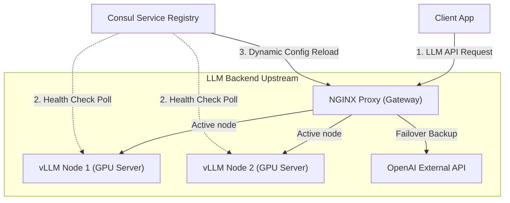
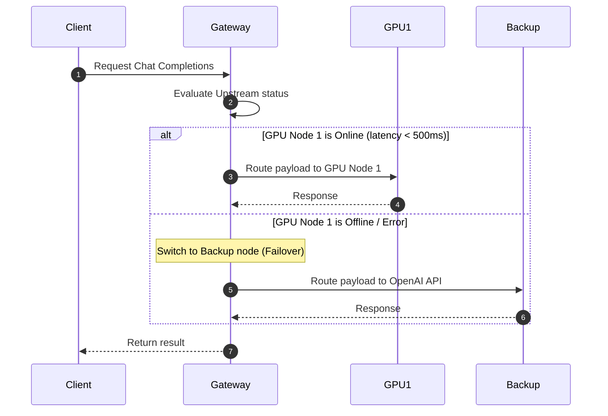

# AI Gateway Infra Demo

다중 LLM 추론 서버 백엔드 간의 지연율 기반 부하 분산(Load Balancing) 및 자동 장애 장애 조치(Failover)를 제공하는 AI 관제 인프라 아키텍처 데모입니다.

## 📌 Status & Repository
- **상태**: `Stable`
- **저장소 주소**: [GitHub (devcy0922/ai-gateway-infra-demo)](https://github.com/devcy0922/ai-gateway-infra-demo)
- **라이선스**: MIT
- **주요 언어**: Docker Compose, Shell Script, Nginx Config

---

## 1. Problem
다양한 LLM 서비스(OpenAI, vLLM 로컬 추론 노드 등)를 대규모 상용 환경에 배포할 때, 특정 노드가 불통이 되거나(GPU 메모리 초과 등), 응답 지연(Time to First Token)이 치솟는 장애가 발생하면 전체 서비스 장애로 확산됩니다. 특정 공급업체의 API 상태에 단일 실패 지점(SPOF)을 노출하지 않는 이중화 게이트웨이 인프라가 필수적입니다.

## 2. Why I Built It
NGINX와 Consul을 조합하여 실시간으로 다중 Upstream LLM 노드의 응답성과 liveness 헬스 체크를 모니터링하고, 응답 속도가 비정상적으로 느리거나 에러율이 급증하는 노드를 업스트림 풀에서 자동 축출 및 백업 노드로 장애 조치(Failover)해주는 고가용성 프록시 게이트웨이 인프라를 프로토타입화하기 위해 설계했습니다.

## 3. Scope
- NGINX 로드 밸런싱을 통한 다중 vLLM 노드 라우팅
- 백엔드 헬스 체크 스크립트를 통한 실시간 Liveness 감시 및 Consul 서비스 등록
- 특정 vLLM 노드 오프라인 시 다른 로컬 노드 또는 외부 OpenAI API 백업 노드로의 Failover 시나리오 구현
- Grafana/Prometheus 연동용 모니터링 수집 스택 셋업

---

## 4. Architecture



---

## 5. Request Flow



---

## 6. Key Design Decisions
- **동적 가중치 최소 연결 방식 (Least Connections with Dynamic Weight)**: 정적인 라운드 로빈 방식 대신, 처리 중인 활성 커넥션 수가 가장 적은 노드에 우선적으로 가중치를 배분하여 GPU 병목으로 인한 병렬 추론 레이턴시 튀는 현상을 최소화했습니다.
- **Consul을 통한 동적 백엔드 리로드**: 서버 추가 시 NGINX를 재부팅하지 않고도 Upstream 리스트를 실시간으로 리로드할 수 있도록 서비스 디스커버리를 결합했습니다.

## 7. Security Considerations
- 외부로 노출되지 않고 사내 내부망 안에서 가동되는 사설 망 게이트웨이 프레임워크를 기반으로 하며, Upstream 백업으로 API Key를 전달할 때 NGINX Variable을 암호화하여 기록 보관하는 설정을 수록했습니다.

## 8. Observability
- NGINX Prometheus Exporter를 연동하여 요청 성공률, 활성 커넥션 수, 5xx 에러 비율을 실시간 스크랩하여 모니터링하도록 구성했습니다.

## 9. Technology Stack
- **Gateway**: NGINX (with OpenResty)
- **Service Discovery**: HashiCorp Consul
- **Metrics**: Prometheus, Grafana

---

## 10. Running Locally
Docker Compose를 통해 로컬에 다중 모사 LLM 백엔드 풀을 띄우고 게이트웨이를 구동해볼 수 있습니다.

```bash
# NGINX + Mock LLM Node 이중화 클러스터 구동
docker-compose up -d --build
# 게이트웨이 정상 동작 체크 (Port 9091)
curl http://localhost:9091/health
```

## 11. Current Limitations
- 세션 스티키니스(Session Stickiness) 설정이 포함되지 않아, 다중 턴 대화 시 캐시 공유가 되지 않아 레이턴시 낭비가 발생할 수 있습니다.

## 12. Next Steps
- Prefix Caching 공유 기능이 켜진 vLLM 업스트림의 컨텍스트 분배 친화적 로드 밸런싱 알고리즘 추가 도입.
