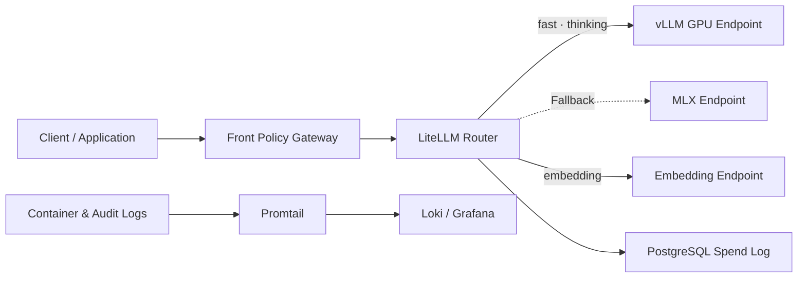
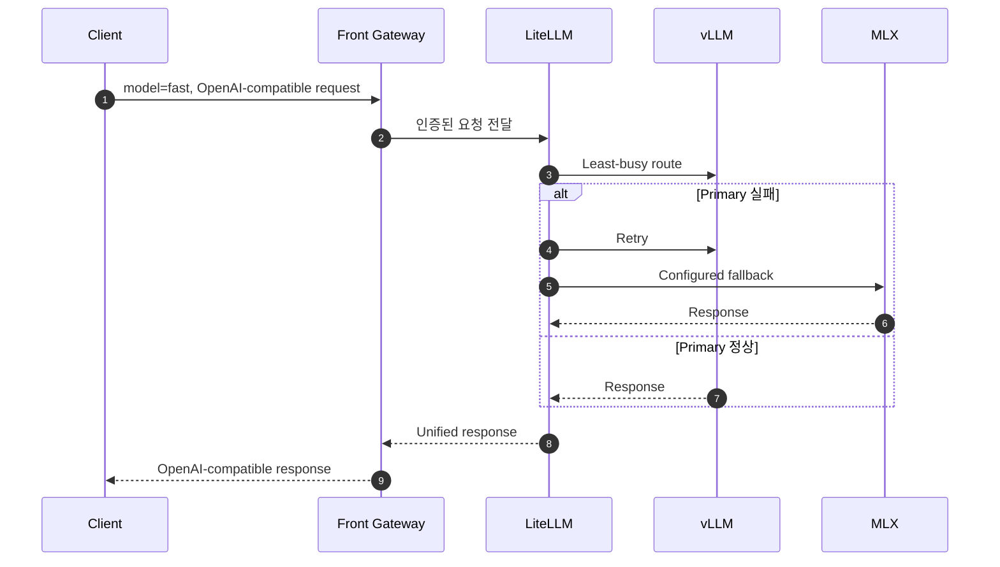

# AI Gateway Infra Demo

LiteLLM을 중심으로 vLLM과 MLX 추론 Endpoint를 하나의 OpenAI-compatible API로 통합하는 Multi-node Inference Routing 템플릿입니다.

## 📌 Status & Repository
- **상태**: `Prototype`
- **저장소 주소**: [GitHub (devcy0922/ai-gateway-infra-demo)](https://github.com/devcy0922/ai-gateway-infra-demo)
- **라이선스**: MIT
- **주요 구성**: Docker Compose, LiteLLM, Promtail

---

## 1. Problem
GPU 추론 노드와 로컬 추론 노드가 서로 다른 Model ID와 Endpoint를 제공하면 Client가 Provider별 연결 정보와 장애 처리 로직을 알아야 합니다. 특정 노드의 지연이나 장애가 전체 애플리케이션으로 전파되지 않도록 공통 Routing과 Fallback 경계가 필요합니다.

## 2. Why I Built It
LiteLLM의 Provider Adapter와 Router를 이용해 `auto`, `fast`, `thinking`, `embedding` 같은 안정적인 Model Alias를 제공하고, vLLM과 MLX의 차이를 Client에서 숨기는 구성을 검증하기 위해 만들었습니다.

## 3. Scope
- vLLM과 MLX를 OpenAI-compatible Endpoint로 통합
- Model Alias별 Timeout과 Token 상한 설정
- Least-busy Routing, Retry, Fast/Thinking Fallback 선언
- PostgreSQL 기반 LiteLLM Spend Log 연결 설정
- Promtail을 이용한 Container/Audit Log의 Loki 전송
- Optional Prompt Enricher와 Workflow Component 연결점

---

## 4. Architecture



## 5. Request Flow



## 6. Key Design Decisions
- **Client와 Provider 분리**: Client는 실제 Model ID나 Node 주소가 아니라 `fast`, `thinking` 같은 안정적인 Alias를 사용합니다.
- **설정 기반 복구 경로**: Retry 횟수, Timeout과 Fallback Mapping을 LiteLLM Config에 선언해 애플리케이션 코드에서 분리합니다.
- **로그 수집 분리**: Promtail이 Runtime Log를 Loki로 전달하고 추론 서비스는 로그 Backend의 구현을 알지 않도록 구성합니다.

## 7. Security Considerations
- 실제 API Key, Database URL과 Node 주소는 `.env`에만 두고 저장소에는 `.env.example`만 제공합니다.
- LiteLLM은 내부 Master Key를 요구하고 외부 Client 인증과 세부 정책은 Front Gateway 책임으로 분리합니다.
- Prompt Enricher의 Soft Check를 보안 경계로 과장하지 않으며 최종 차단 정책은 별도 Gateway에서 수행해야 합니다.

## 8. Observability
- LiteLLM Request/Spend Log를 PostgreSQL에 저장할 수 있도록 구성합니다.
- Promtail은 Docker stdout과 Mount된 Audit Log를 Loki로 전송합니다.
- 이 저장소는 관측 Backend 자체보다 수집과 Routing 연결 설정을 제공하는 Template입니다.

## 9. Technology Stack
- **Router**: LiteLLM Proxy
- **Inference**: vLLM, MLX, OpenAI-compatible Endpoints
- **Logs**: Promtail, Loki, Grafana
- **Runtime Definition**: Docker Compose

## 10. Running Locally

```bash
cp .env.example .env
docker compose config
```

구성 검증 후 실제 환경의 vLLM, MLX, PostgreSQL, Loki Endpoint를 연결합니다. 공개 저장소에 포함되지 않은 Optional Build Context는 해당 Profile 또는 Service를 제외하고 검증해야 합니다.

## 11. Current Limitations
- 현재 저장소는 운영 Cluster 전체가 아니라 Routing과 Log Collection 구성을 보여주는 Prototype입니다.
- 일부 Optional Component의 Source/Build Context는 공개 저장소에 포함되지 않습니다.
- Immutable Image Tag, 자동 장애 주입 Test와 SLO는 아직 제공하지 않습니다.

## 12. Next Steps
- Mock Upstream 기반 Routing/Fallback CI 추가
- Image Version 고정과 SBOM·Vulnerability Scan 추가
- Failover Time, Error Rate와 p95 Latency를 측정하는 재현 가능한 Failure Drill 추가
