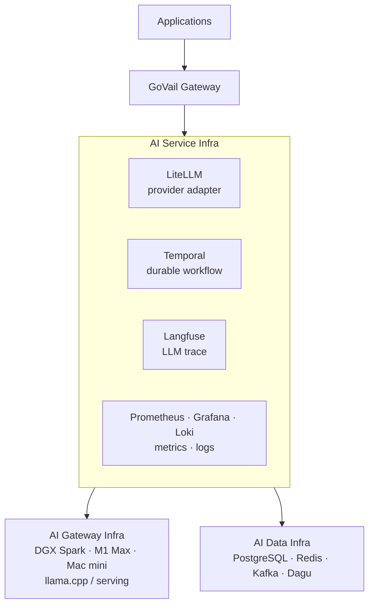
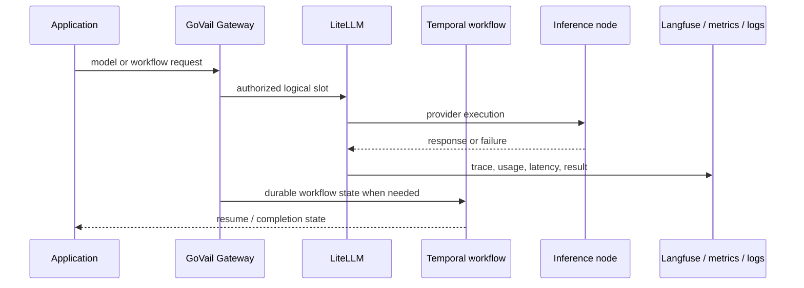

# AI Service Infra

AI 서비스를 운영하면서 model access, durable workflow, observability를 묶어 관리하는 서비스 계층입니다. 이 프로젝트를 “AI 개발 환경”이나 Docker Compose 모음으로 소개하기보다, 모델 실행·워크플로우·관측·추론 런타임·데이터 인프라의 수명과 책임을 분리한 운영 경계로 설명합니다.

## 한눈에 보기

- **성격**: AI Service Platform
- **핵심 기술**: LiteLLM, Temporal, Langfuse, Prometheus·Grafana·Loki
- **Source**: [github.com/devcy0922/ai-service-infra ↗](https://github.com/devcy0922/ai-service-infra)
- **현재 상태**: cy-server의 서비스 허브와 통합 관측성 운영 구성

## 문제

애플리케이션이 모델 endpoint에 직접 접근하고, 긴 workflow를 process lifetime에 묶고, 로그와 LLM trace를 서비스마다 따로 남기면 장애 원인과 책임 범위를 나중에 맞추기 어렵습니다. 특히 모델이 살아 있다는 사실과 특정 요청을 감당할 수 있다는 사실은 같지 않습니다.

그래서 애플리케이션 요청은 GoVail Gateway를 거쳐 service layer로 들어오고, 이 계층은 model access·workflow·observability를 담당합니다. 실제 model weight와 inference runtime, 공용 데이터 저장소는 각각 별도 레이어가 소유합니다.

## Architecture

<DiagramFrame caption="AI Service Infra는 model access·workflow·observability를 소유하고, inference와 data는 독립 계층으로 둡니다.">

</DiagramFrame>

Applications와 GoVail Gateway는 이 저장소의 내부 component가 아닙니다. Gateway는 요청·정책 경계이고, AI Service Infra는 Gateway가 선택한 논리 model slot과 durable workflow, trace·metric·log의 운영 계약을 제공합니다.

## 책임 경계

### Owns

- **LiteLLM**: model provider adapter, 논리 model slot과 물리 inference node의 연결
- **Temporal**: process lifetime보다 긴 durable workflow의 실행 기반
- **Langfuse**: LLM request의 trace와 usage·failure 관측 연동
- **Prometheus / Grafana / Loki / Promtail**: service·host·log observability
- runtime version, health/readiness와 운영 runbook

### Does not own

- DGX Spark·M1 Max·Mac mini의 model weight와 llama.cpp/vLLM inference runtime
- PostgreSQL·Redis·Kafka·Dagu의 데이터 및 scheduler 소유권
- 애플리케이션의 business workflow와 GoVail Gateway의 외부 요청 정책
- provider 장애를 숨기기 위한 무제한 retry/fallback

## 핵심 흐름

요청의 실행 결과, workflow state와 관측 event를 같은 수명으로 취급하지 않습니다. LiteLLM은 provider execution boundary이고, Temporal은 장기 상태를 보존하며, Langfuse와 metrics/logs는 원인을 나중에 연결할 수 있게 합니다.

## 설계 결정

- **논리 slot과 물리 node 분리**: 애플리케이션이 `govail/worker` 같은 논리 이름을 사용하고, 실제 endpoint와 capability는 `litellm/config.yaml`에서 관리합니다.
- **readiness와 routing 분리**: endpoint가 살아 있다는 health 응답과 요청의 timeout·concurrency·context를 감당할 수 있는지는 별도 조건으로 봅니다.
- **fallback 제한**: 현재 설정은 `max_fallbacks: 0`입니다. 다른 모델로 오류를 은폐하기보다 원인 보존형 오류를 호출자에게 돌려줍니다.
- **workflow lifetime 분리**: process가 내려가도 이어져야 하는 업무 상태는 Temporal에 맡기고, provider 호출 자체의 timeout과 protocol normalization은 LiteLLM 경계에 둡니다.
- **관측 계약 통일**: service와 host metric은 Prometheus, log는 Loki, 시각화는 Grafana, LLM request 단위 trace는 Langfuse로 역할을 나눕니다.

## 현재 모델·운영 범위

모델 slot과 provider 주소의 SSOT는 실제 `litellm/config.yaml`입니다. 현재 확인한 slot은 다음과 같습니다.

| 논리 slot | provider 위치 | 책임 |
| --- | --- | --- |
| `govail/worker`, `worker-main`, `fast` | M1 Max | Gemma4 worker, Qwen fast worker와 thinking 정책 |
| `govail/thinker*` | DGX Spark | Qwen Flash와 reasoning profile |
| `govail/embedding`, `reranker`, `classify` | Mac mini | embedding, reranking, intent classification |

provider readiness와 실제 serving은 AI Gateway Infra가 관리합니다. AI Service Infra는 slot의 timeout, concurrency, capability, context contract와 routing 정책을 관리합니다.

## 검증된 범위 / Evidence

- `docker-compose.yml`에서 Temporal, Langfuse, LiteLLM, Prometheus, Grafana, Loki/Promtail의 현재 서비스 구성을 확인할 수 있습니다.
- `litellm/config.yaml`에 논리 model slot, provider endpoint, timeout, context와 `max_fallbacks: 0`가 모여 있습니다.
- `guide/runbook.md`와 `config/observability-targets.json`이 모델·관측 운영 절차의 기준입니다.
- historical edge/SSO 구성은 `platform-edge-infra`, data/scheduler는 `ai-data-infra`, inference runtime은 `ai-gateway-infra`로 현재 ownership이 분리되어 있습니다.
- 운영 명령과 최신 구성은 [소스 저장소](https://github.com/devcy0922/ai-service-infra)에서 확인할 수 있습니다.

## Current vs Historical

과거에는 Edge, SSO와 데이터 서비스가 같은 Compose 경계에 있었지만 현재는 별도 레포로 이전되었습니다. 이 페이지의 Architecture와 책임 목록에는 현재 `ai-service-infra`가 실제로 관리하는 서비스만 남기고, 이전 결정과 연결 문맥은 이 절에 분리했습니다.

## 현재 한계

- 단일 cy-server 서비스 허브와 외부 inference/data 노드에 의존합니다. AI Service Infra만으로 model serving이나 shared data recovery를 수행하지 않습니다.
- `max_fallbacks: 0` 정책은 오류를 빠르게 드러내지만, provider 장애를 자동 우회하지 않습니다.
- 모든 workflow가 Temporal을 사용한다거나, 모든 서비스 요청에 Langfuse trace가 연결된다고 주장하지 않습니다. 실제 연결된 application과 설정 범위만 검증 대상입니다.
