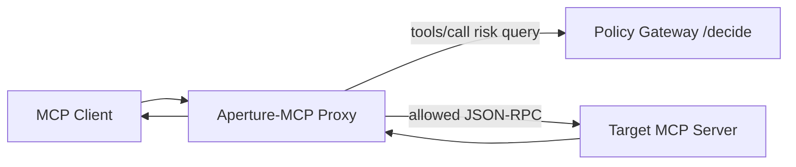
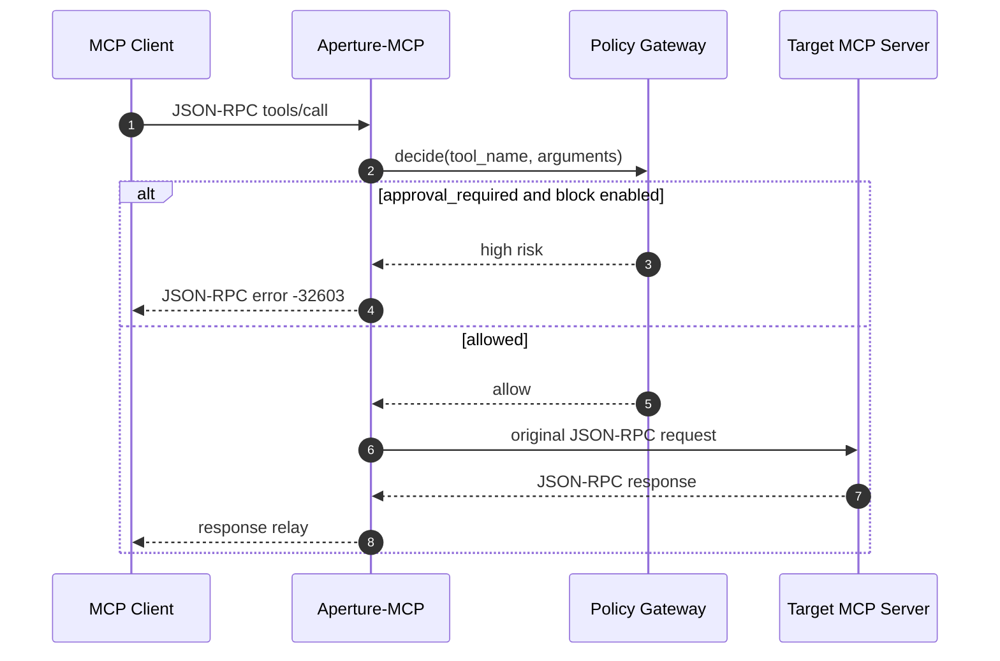

# Aperture-MCP

MCP Client와 Target MCP Server 사이에서 `tools/call`을 정책으로 통제하는 Rust 기반 Zero-trust Policy Proxy MVP입니다.

## 📌 Status & Repository
- **상태**: `MVP`
- **저장소 주소**: [GitHub (devcy0922/aperture-mcp)](https://github.com/devcy0922/aperture-mcp)
- **라이선스**: MIT
- **주요 언어**: Rust

---

## 1. Problem
MCP Client가 Target Server의 Tool을 직접 호출하면 실제 실행 직전에 조직 정책이나 사용자 승인 필요 여부를 일관되게 판단할 경계가 없습니다. 각 MCP Server에 정책 코드를 중복 구현하면 Enforcement 결과와 오류 형식도 달라집니다.

## 2. Why I Built It
기존 MCP Server를 수정하지 않고 앞단 Wrapper가 JSON-RPC Stream을 중계하면서 `tools/call`만 Policy Gateway에 질의하고, 고위험 요청을 Child Process에 전달하기 전에 차단하는 구조를 검증하기 위해 만들었습니다.

## 3. Scope
- Target MCP Server를 Child Process로 실행
- stdin/stdout JSON-RPC Line 중계
- `tools/call` Method와 Tool Name 식별
- Policy Gateway `/decide` 연동
- `approval_required` 요청의 선택적 차단
- 차단 시 JSON-RPC Error Payload 반환
- Child Process 종료와 Stream 정리

---

## 4. Architecture



## 5. Request Flow



## 6. Key Design Decisions
- **Wrapper 방식**: Target MCP Server의 구현을 변경하지 않고 실행 명령 앞에 Proxy를 배치합니다.
- **Method 단위 최소 개입**: `tools/call`만 정책 판단 대상으로 삼고 Initialize, List와 일반 응답은 그대로 중계합니다.
- **환경 기반 Enforcement**: `GOVAIL_ROUTER_DECIDE_URL`과 `GOVAIL_BLOCK_ON_RISK`로 정책 Endpoint와 차단 동작을 분리합니다.

## 7. Security Considerations
- 차단이 활성화된 고위험 요청은 Target Child Process로 전달하지 않습니다.
- 정책 응답과 JSON-RPC Parsing 실패 시 허용 여부를 명확히 정의해야 하며 운영 적용 전 fail-closed 정책을 강화해야 합니다.
- 이 프로젝트는 Database Schema나 Local File을 직접 제공하는 MCP Server가 아닙니다.

## 8. Observability
- Intercept한 Tool Name과 차단 여부를 stderr에 기록해 Host Logging Pipeline에서 수집할 수 있습니다.
- Client에는 표준 JSON-RPC Error 형태로 차단 결과를 반환합니다.
- 공개 MVP는 중앙 Metric Backend보다 Policy Decision과 Relay 동작 검증에 초점을 둡니다.

## 9. Technology Stack
- **Runtime**: Rust, Tokio
- **Protocol**: JSON-RPC over stdin/stdout
- **Policy Integration**: HTTP `/decide`
- **Verification**: Mock Policy Gateway, Mock MCP Server

## 10. Running Locally

Target MCP Server 실행 명령 앞에 Proxy를 배치합니다.

```bash
aperture-mcp -- /path/to/target-mcp-server --arg value
```

실제 Policy Endpoint와 차단 모드는 실행 환경 변수로 주입합니다.

## 11. Current Limitations
- 현재는 Line-delimited stdin/stdout Transport를 대상으로 하며 Network MCP Transport는 지원하지 않습니다.
- Policy Gateway 장애와 Timeout에 대한 운영 수준의 Circuit Breaker가 없습니다.
- 사용자 승인 UI와 Approval Resume Flow는 범위에 포함하지 않습니다.

## 12. Next Steps
- Policy Timeout과 장애 시 fail-closed 동작 강화
- Decision Audit Schema와 Prometheus Metric 추가
- MCP 고위험 Tool 시나리오를 AgentSecOps E2E에 통합
