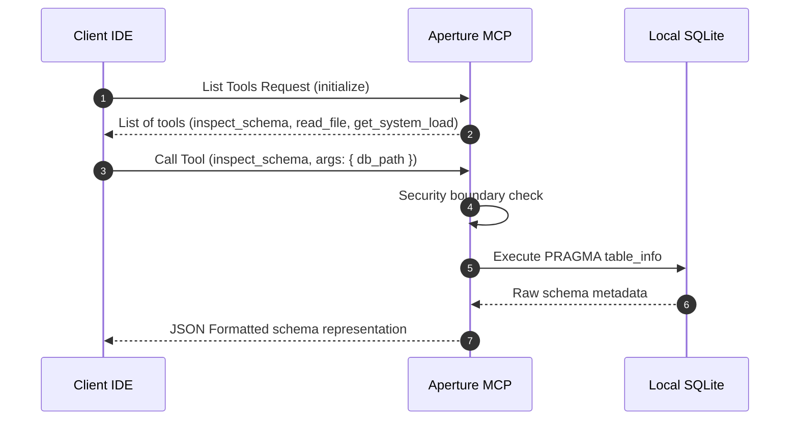

# Aperture MCP Server

AI 에디터(Cursor 등) 및 개발 툴체인이 호스트 시스템의 데이터베이스와 도메인 자원에 안전하게 접근하여 상호작용할 수 있도록 규격을 표준화한 Model Context Protocol(MCP) 서버 브리지입니다.

## 📌 Status & Repository
- **상태**: `Experimental`
- **저장소 주소**: [GitHub (devcy0922/aperture-mcp)](https://github.com/devcy0922/aperture-mcp)
- **라이선스**: MIT
- **주요 언어**: TypeScript, Node.js

---

## 1. Problem
최근 Claude 3.5 Sonnet 등 강력한 LLM이 에디터(Cursor)나 Agent를 통해 로컬 파일 및 DB 자원을 직접 파악해야 하는 니즈가 늘고 있습니다. 하지만 각 툴마다 로컬 데이터베이스를 읽거나 쿼리하는 커넥터 규격이 통일되어 있지 않아, 에이전트 개발 시마다 호스트 자원 연동 코드를 커스텀 개발해야 하는 비효율이 존재합니다.

## 2. Why I Built It
Anthropic이 정의한 표준 MCP(Model Context Protocol) 규격을 구현하여, AI 클라이언트가 표준 API JSON-RPC 인터페이스를 경유해 로컬 데이터베이스 스키마 검색, 파일 메타데이터 스캔, 그리고 제한된 보안 가이드 검사 도구를 일관되게 호출할 수 있는 공통 리소스 허브로 삼기 위해 개발했습니다.

## 3. Scope
- Model Context Protocol(MCP) JSON-RPC 2.0 스펙 기반 통신 인터페이스 구현
- 로컬 DB 스키마 검색용 전용 도구(Tool) 및 리소스(Resource) 제공
- 악성 파일 덮어쓰기 방지를 위한 제한적 쓰기(Write) 샌드박스 정책 필터
- 호스트 상태 메트릭 조회 기능

---

## 4. Architecture

```mermaid
graph TD
    Client["AI IDE Client (Cursor/Claude Desktop)"] -->|JSON-RPC via Stdio/SSE| MCP["Aperture MCP Server"]
    subgraph Host_Resources ["Authorized Resources"]
        MCP -->|Inspect Database| DB["SQLite / Postgres (Schema info)"]
        MCP -->|Read restricted folder| FS["Local Filesystem (Static Assets)"]
    </div>
    MCP -->|Evaluate system load| Metric["System Metric Collector"]
```

---

## 5. Request Flow



---

## 6. Key Design Decisions
- **표준 JSON-RPC Over Stdio 채널 채택**: 복잡한 네트워크 소켓 연결이나 인증 키 노출 없이, 에디터 프로세스가 Aperture 바이너리를 서브 프로세스로 직접 실행하고 Stdio(표준 입출력) 파이프라인으로 안전하게 연동되도록 설계했습니다.
- **최소 권한의 도구 설계 (Principle of Least Privilege)**: 임의의 SQL execution 도구를 일절 차단하고, 스키마 목록 및 컬럼 정보만 가져올 수 있는 읽기 전용 `inspect_schema` 도구만 제공하여 데이터 변조 리스크를 제거했습니다.

## 7. Security Considerations
- 파일 접근 리소스 요청 시, 프로젝트 외부 디렉토리로 우회하려는 상위 디렉토리 탐색 기법(`../..` 경로 트래버설 공격)을 정규 경로(canonical path) 변환을 거쳐 사전에 엄격히 거부합니다.

## 8. Observability
- AI 클라이언트의 도구 호출 빈도 및 호출 실패 이벤트를 표준 에러 출력(stderr) 감사 스트림을 통해 호스트 로깅 툴로 전달합니다.

## 9. Technology Stack
- **Runtime**: Node.js (TypeScript)
- **Protocol**: @modelcontextprotocol/sdk

---

## 10. Running Locally
Claude Desktop 또는 Cursor 설정 파일에 Aperture MCP를 서브프로세스로 추가합니다.

```json
// Cursor / Claude Desktop mcpServers 설정 예시
{
  "mcpServers": {
    "aperture-mcp": {
      "command": "node",
      "args": ["<your-project-path>/aperture-mcp/dist/index.js"]
    }
  }
}
```

## 11. Current Limitations
- Stdio 파이프 방식으로 작동하여 에디터 툴체인과 1:1 결합되어 있으므로, 다중 에이전트 협업 환경에서 동시 접근 가능한 네트워크 소켓 기반(SSE) 다중 커넥션 기능은 제한적입니다.

## 12. Next Steps
- HTTP 서버 기능을 탑재하여 다수의 분산 에이전트가 동시에 인증을 통해 접근할 수 있는 SSE(Server-Sent Events) MCP 모드 추가 개발.
