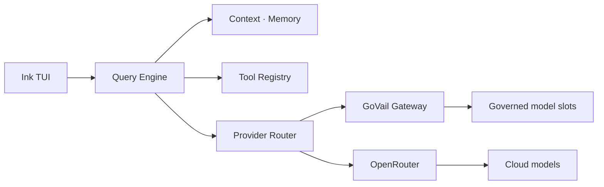

# Engine CLI

대화형 TUI와 자율 작업 루프를 결합하고, GoVail과 OpenRouter를 선택적으로 연결하는 코딩 에이전트 CLI입니다.

## 한눈에 보기

- [GitHub 저장소](https://github.com/devcy0922/engine-cli)
- TypeScript, Node.js, Ink 기반 TUI 방향
- `Plan → Search → Edit → Test → Verify` 작업 루프
- Bash, Grep, Glob, FileEdit와 subagent coordinator
- Anthropic Messages와 OpenAI Chat Completions 사이의 protocol adapter

## 핵심 판단

CLI는 모델 제공자에 종속된 얇은 호출기가 아니라, 긴 작업을 유지하는 context manager와 권한이 보이는 실행 UI를 가져야 합니다. 다만 모델 호출과 정책은 CLI에 복제하지 않고 Gateway adapter를 통해 분리합니다.

Anthropic 형식의 system·tool·tool result를 OpenAI 형식으로 변환하고, 스트리밍 응답은 다시 TUI가 이해하는 이벤트로 복원합니다. 이 경계가 있어야 모델을 바꿔도 작업 루프와 승인 화면을 유지할 수 있습니다.
