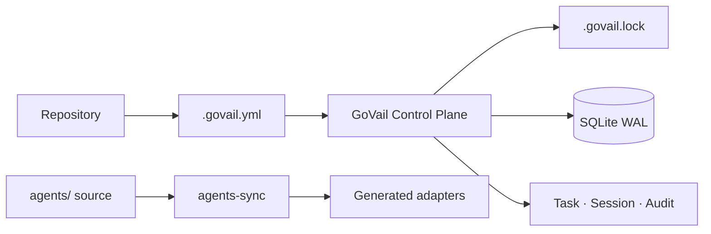
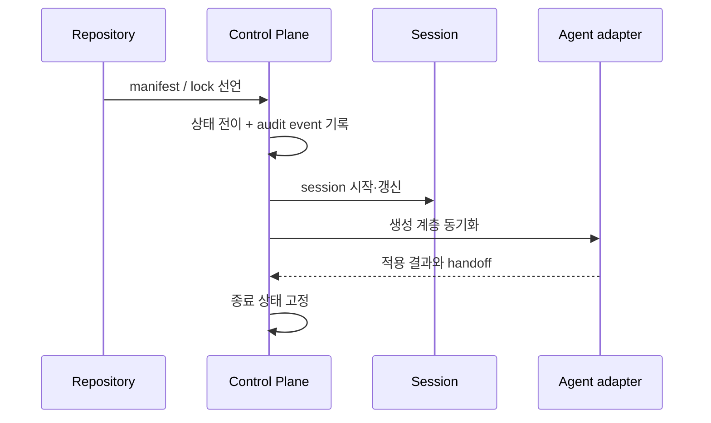

# GoVail Control

여러 저장소와 코딩 에이전트가 같은 규칙, 상태, 스킬 배포 계약을 따르도록 만드는 중앙 Control Plane입니다. 저장소를 대신 실행하는 시스템이 아니라, 저장소와 에이전트 사이의 운영 상태와 증적을 관리하는 경계입니다.

## 한눈에 보기

- **성격**: Platform / Control Plane
- **핵심 기술**: Go, SQLite WAL, YAML manifest, lockfile
- **Source**: [github.com/devcy0922/govail-control ↗](https://github.com/devcy0922/govail-control)
- **현재 범위**: 저장소 초기화, 작업 상태 전이, 세션·감사 이벤트, 에이전트 자산 동기화

## 문제

저장소마다 에이전트 규칙과 작업 상태를 따로 관리하면 업데이트가 늦고, 생성된 설정을 사람이 직접 고치기 쉽습니다. 규칙의 원본과 배포된 결과가 달라지면 같은 작업을 다시 실행해도 어떤 계약을 따랐는지 설명하기 어렵습니다.

그래서 원본 자산, 선언된 저장소 설정, 생성 결과와 작업 상태를 서로 다른 책임으로 나눴습니다.

## Architecture

<DiagramFrame caption="manifest와 lock은 계약을 선언하고, Control Plane은 상태와 audit만 소유합니다.">

</DiagramFrame>

저장소는 manifest로 수신할 계약을 선언하고, `agents/`는 원본을 보관합니다. Control Plane은 lock과 상태를 기록하며, 생성 계층은 Codex·OpenCode·Claude 같은 소비자 형식으로 변환됩니다.

## 책임 경계

### Owns

- `.govail.yml`과 `.govail.lock`을 기준으로 한 저장소 계약
- 작업 상태 전이, 세션 수명주기와 audit event
- `agents/` 원본과 생성 계층의 동기화 상태
- 상태 변경과 이벤트 기록의 원자성

### Does not own

- 모델 추론과 provider routing
- 저장소 안의 실제 코드 실행
- 외부 업무 시스템에 대한 mutation

## 핵심 흐름

세션과 이벤트는 같은 상태 변경 경로에서 기록합니다. 작업이 취소된 뒤 다시 살아나지 않도록 종료 상태는 FSM의 terminal state로 남깁니다.

## 설계 결정

- **원본과 생성물을 분리**: 생성된 `.govail/generated`를 직접 수정하지 않고 `agents/`를 다시 동기화하도록 했습니다.
- **lock을 상태의 기준으로 사용**: 현재 적용된 자산 버전을 lockfile로 남겨, “무슨 규칙을 적용했는가”를 나중에 확인할 수 있게 했습니다.
- **추론과 제어를 분리**: Control Plane은 모델 실행을 똑똑하게 만들기보다, 모델 실행 전후의 계약과 상태를 보존하는 데 집중합니다.
- **상태와 이벤트를 함께 기록**: 상태만 바뀌고 audit가 빠지는 경우를 줄이기 위해 하나의 트랜잭션 경로로 묶었습니다.

## 검증된 범위 / Evidence

- 공개 구현에서 manifest, lock, `agents/`와 생성 계층이 분리되어 있습니다.
- 작업 상태·버전·이벤트를 원자적으로 기록하고 SQLite WAL을 사용합니다.
- 취소된 작업을 terminal state에서 다시 실행하지 않도록 FSM 종료 상태를 둡니다.
- 자세한 구현과 실행 방법은 [소스 저장소](https://github.com/devcy0922/govail-control)에서 확인할 수 있습니다.

## 현재 한계

- 이 프로젝트의 책임 범위는 제어·상태·증적이며, 모델 실행이나 저장소 코드 실행의 성공을 보장하지 않습니다.
- 생성된 adapter가 실제 작업을 수행했는지에 대한 실행 증거는 소비자와 runner의 책임으로 남습니다.
- 공개 문서에서 확인 가능한 범위만 이 페이지에 적었으며, 별도 HA 구성이나 실행 backend를 이 프로젝트의 기능으로 주장하지 않습니다.
