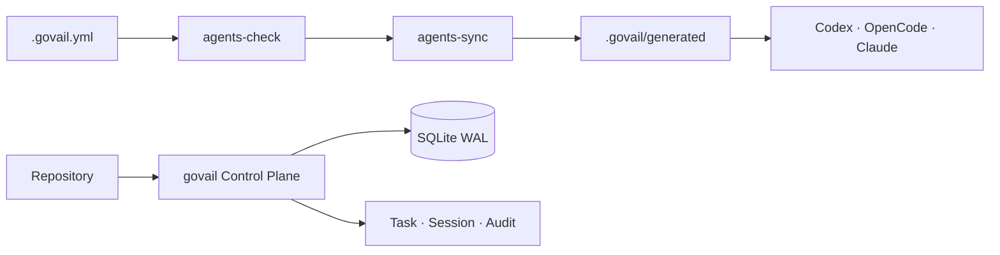

# GoVail Control

여러 저장소와 코딩 에이전트가 같은 규칙, 상태, 스킬 배포 계약을 따르도록 만드는 중앙 Control Plane입니다.

## 한눈에 보기

- [GitHub 저장소](https://github.com/devcy0922/govail-control)
- Go 단일 네이티브 바이너리
- `.govail.yml` 선언, `.govail.lock` 재현 상태, `agents/` 원본과 생성 계층 분리
- 저장소 초기화, 작업 상태 전이, 세션·감사 이벤트, 에이전트 동기화

## 왜 만들었나

저장소마다 에이전트 규칙과 작업 상태를 따로 관리하면 업데이트가 늦고, 생성된 설정을 사람이 직접 고치기 시작합니다. 그래서 원본은 `agents/`에 남기고, 수신을 선언한 저장소에만 생성 계층을 주입하는 구조를 택했습니다.

핵심은 기능 수가 아니라 상태의 출처를 분리하는 것입니다.

- 규칙과 스킬의 원본은 `agents/`
- 배포 가능한 상태는 lockfile로 고정
- 작업 상태와 이벤트는 같은 트랜잭션으로 기록
- 취소된 작업은 다시 살아나지 않도록 FSM에서 종료

## 검증 포인트

작업 상태·버전·이벤트 기록을 원자적으로 묶고, 낙관적 락과 SQLite WAL을 사용합니다. Control은 모델 추론을 소유하지 않고, 모델 실행은 Gateway 계층에 남겨 둡니다.

이 프로젝트의 질문은 “에이전트를 얼마나 자율적으로 만들까?”보다 “자율성이 어디까지 허용됐는지 어떻게 재현할까?”에 가깝습니다.
