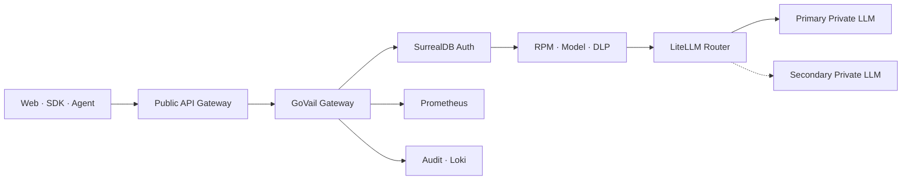
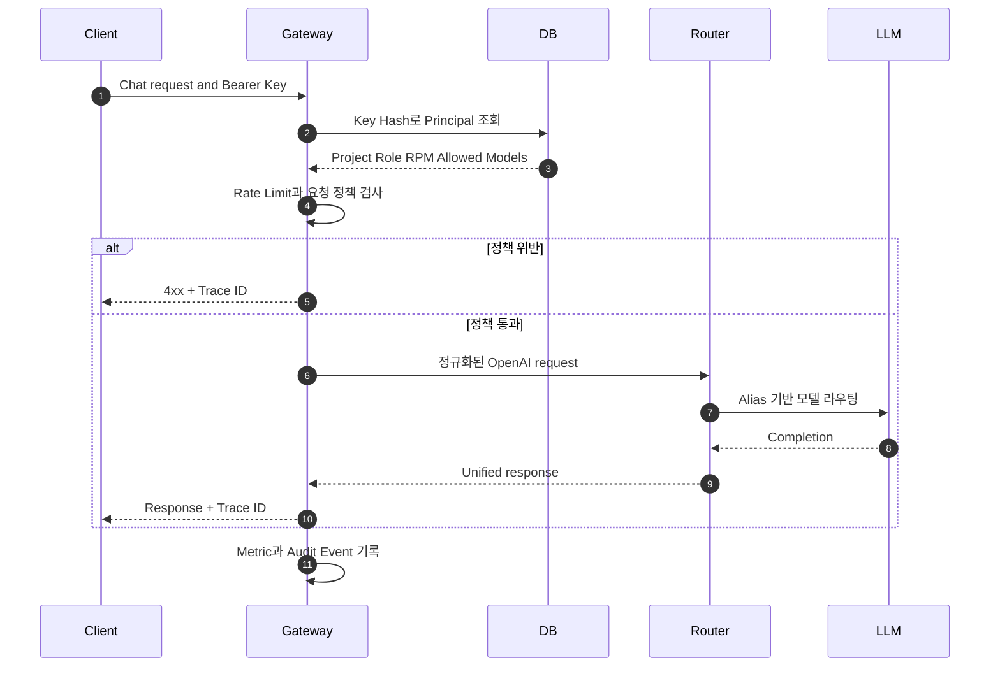

# GoVail Gateway

외부 AI 요청을 인증·정책·감사 경계에서 통제하고 사설 LLM 라우터로 전달하는 Rust 기반 OpenAI-compatible Gateway입니다.

## 📌 Status & Repository

- **상태**: `MVP · Live Demo`
- **저장소 공개 범위**: 비공개 구현 저장소
- **직접 체험**: [Portfolio Live LLM](/live-demo)
- **주요 언어**: Rust

---

## 1. Problem

LLM Client가 추론 Backend를 직접 호출하면 API Key 인증, 프로젝트별 모델 권한, 사용량 제한, DLP, Prompt Injection 차단과 감사 추적이 각 애플리케이션에 흩어집니다. 이 구조는 정책 일관성을 깨뜨리고, 사고가 발생했을 때 어떤 요청이 어느 모델 경로로 전달됐는지 재현하기 어렵게 만듭니다.

## 2. Why I Built It

Provider와 모델이 바뀌어도 Client 계약을 유지하면서, AI 요청에 필요한 보안과 운영 정책을 하나의 Policy Enforcement Point에서 적용할 수 있는지 검증하기 위해 만들었습니다. 포트폴리오의 Live Demo도 별도 우회 경로가 아니라 이 Gateway의 실제 인증·감사 경계를 통과합니다.

## 3. Scope

- OpenAI-compatible Models, Chat Completions, Responses, Embeddings API
- SurrealDB API Key Hash 조회와 프로젝트별 Principal 구성
- JWT 서명·만료·블랙리스트 검증
- 프로젝트·Key별 Sliding Window RPM 제한
- 허용 모델, 기능 Capability와 요청 Parameter 정책
- PII·Secret·Prompt Injection 탐지 및 차단
- LiteLLM Upstream Retry와 Fallback 연결
- Prometheus Metric, 구조화 Audit, Trace ID 전파

## 4. Architecture



## 5. Request Flow



## 6. Key Design Decisions

<div class="decision-callout">
<strong>Gateway는 정책, LiteLLM은 Provider Routing</strong><br />
인증·인가·DLP·감사는 GoVail이 소유하고 Provider Adapter, Retry와 모델 Fallback은 LiteLLM에 맡겨 책임 중복을 피했습니다.
</div>

- API Key 원문 대신 SHA-256 단축 Hash로 SurrealDB 레코드를 조회합니다.
- `project`, `role`, `rpm`, `allowed_models`를 인증 결과인 Principal에 묶어 이후 정책의 단일 기준으로 사용합니다.
- Client는 실제 Model ID 대신 `auto` 같은 안정적인 Alias를 사용합니다.
- 요청마다 Trace ID를 부여해 Client 오류, Gateway Audit과 Upstream 장애를 연결합니다.

## 7. Security Considerations

<div class="security-notice">
Live Demo Key는 공개 브라우저에서 보이는 전용 Token입니다. 운영 자격증명과 분리하고, <code>portfolio-demo</code> 프로젝트·<code>auto</code> 모델·낮은 RPM으로 권한을 제한합니다.
</div>

- 인증 실패, 모델 권한 위반과 DLP 차단은 Upstream 전송 전에 종료합니다.
- JWT는 만료와 `jti` 블랙리스트를 확인하며 프로젝트 Secret을 분리합니다.
- 감사 수집 단계에서 Key, Prompt와 Response를 제거하고 프로젝트·상태·지연 메타데이터만 Loki로 전달합니다.
- 현재 공개 Edge와 온프레미스 사이의 TLS Tunnel은 운영 전 필수 보완 항목입니다.

## 8. Observability

- `/metrics`에서 전체 요청, 정책 차단과 Upstream 오류 Counter를 제공합니다.
- Prometheus가 Gateway를 직접 Scrape하고 Target Health를 감시합니다.
- Promtail이 Audit JSONL에서 안전한 운영 필드만 추출해 Loki로 전달합니다.
- Grafana `Portfolio Live LLM` 대시보드에서 체험 호출 수, 상태, 평균 지연과 최근 Trace를 확인합니다.
- `project=portfolio-demo` 필터로 다른 내부 Client와 공개 체험 트래픽을 분리합니다.

## 9. Technology Stack

- **Gateway**: Rust, Axum, Tower HTTP
- **Authentication**: SurrealDB, JWT, SHA-256 Key Lookup
- **Routing**: LiteLLM, OpenAI-compatible API
- **Observability**: Prometheus, Promtail, Loki, Grafana
- **Edge**: GCP API Gateway
- **Runtime**: Docker Compose

## 10. Running Locally

```bash
cp .env.example .env
docker compose config
docker compose up -d gateway
```

실제 Secret, Database URL과 Upstream 주소는 실행 환경에서 주입합니다. 공개 저장소의 예시 값은 운영 환경에 사용하지 않습니다.

## 11. Current Limitations

- Rate Limit 상태는 단일 프로세스 메모리에 있으므로 다중 Replica의 전역 Quota가 아닙니다.
- Prompt Injection 방어는 Pattern과 정책 중심이며 의미론적 우회를 완전히 차단한다고 주장하지 않습니다.
- 현재 공개 Edge에서 온프레미스까지 안정적인 HTTPS Tunnel이 완료돼야 외부 Live Demo를 상시 제공할 수 있습니다.
- 공개 Demo는 운영 SLA를 제공하는 제품 API가 아니라 제한된 아키텍처 검증 환경입니다.

## 12. Next Steps

- Cloudflare Tunnel 또는 동등한 Outbound-only HTTPS Ingress 적용
- Redis 기반 분산 Rate Limit과 일일 Project Budget 추가
- Project별 요청·Token·오류 SLO Recording Rule 구성
- 자동 Key Rotation과 긴급 폐기 Runbook 검증
