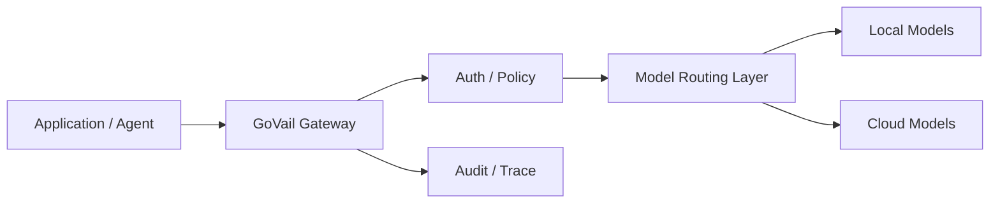
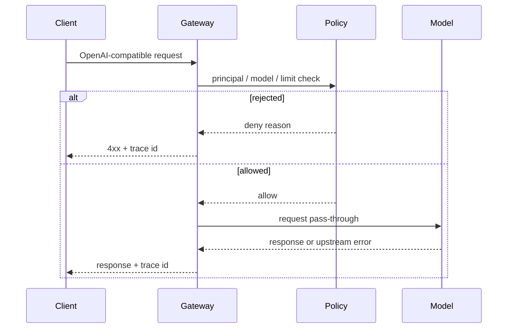

# GoVail Gateway

AI 요청 앞단에서 인증, 정책, 감사와 모델 전달 책임을 분리하기 위해 만든 OpenAI-compatible Gateway 프로젝트입니다.

## Status & Scope

- **상태**: 개인 프로젝트 · 지속 개선 중
- **공개 범위**: 이 페이지에서는 설계 판단과 검증 범위만 설명합니다.
- **주요 언어**: Rust

이 블로그는 GoVail의 제품 문서가 아닙니다. GoVail은 제가 AI 실행 경계를 고민하며 만든 여러 프로젝트 중 하나로만 다룹니다.

---

## 1. Problem

LLM Client가 추론 Backend를 직접 호출하면 인증, 프로젝트별 모델 권한, 사용량 제한, 감사 추적과 Upstream 오류 처리가 각 애플리케이션에 흩어지기 쉽습니다.

반대로 Gateway가 요청 의미까지 해석하고 Prompt, Tool, Knowledge와 Workflow를 소유하기 시작하면 또 다른 문제가 생깁니다. 가운데 있는 컴포넌트가 너무 많은 문맥을 알아야 하고, 호출자가 보내지 않은 정책이 조용히 개입할 수 있습니다.

그래서 현재의 핵심 질문은 하나입니다.

> 모델 실행을 통제하되, 애플리케이션의 의도를 대신 소유하지 않는 경계는 어디인가?

## 2. Boundary

현재는 다음 원칙을 기준으로 책임을 나눕니다.

```text
Agent owns workflow.
Application owns tools and knowledge.
Gateway owns governed model execution.
```

Gateway가 집중하는 범위는 다음과 같습니다.

- Credential과 Principal 확인
- 프로젝트·모델 접근 정책
- Rate limit과 요청 크기 같은 실행 제한
- 안전한 Audit metadata와 Trace ID
- OpenAI-compatible transport
- Upstream timeout과 오류 계약

반대로 다음은 Gateway 밖에 둡니다.

- Tool loop와 재시도 전략
- RAG와 Memory 조립
- Prompt orchestration
- Task planning
- 결과 평가를 위한 별도 Agent workflow

## 3. Architecture


```mermaid
flowchart LR
    Client["Application / Agent"] --> Gateway["GoVail Gateway"]
    Gateway --> Auth["Auth / Policy"]
    Auth --> Upstream["Model Routing Layer"]
    Upstream --> Local["Local Models"]
    Upstream --> Cloud["Cloud Models"]
    Gateway --> Audit["Audit / Trace"]
```

Gateway는 요청 경계의 중심에 있지만 가장 많은 도메인 지식을 가진 서비스가 되지 않도록 제한합니다.

## 4. Key Design Decisions

### Transparent pass-through

호출자가 명시하지 않은 generation parameter를 Gateway가 임의로 주입하지 않는 방향을 택했습니다.

예를 들어 반복 억제를 위해 모든 요청에 `frequency_penalty`를 넣으면 일반 문장에서는 도움이 될 수 있지만 코드 생성에서는 정상적인 변수명·함수명 재사용까지 방해할 수 있습니다.

문제는 특정 값이 좋고 나쁜 것이 아니라, **중간 계층이 호출자의 요청을 몰래 바꾸는가**입니다.

### Policy와 workflow를 분리

정책 위반은 Gateway에서 결정적으로 종료할 수 있지만, 어떤 Tool을 다시 호출할지나 어떤 Knowledge를 붙일지는 더 많은 문맥을 가진 Application/Agent가 결정합니다.

### 실패를 숨기지 않는다

Gateway가 모델 응답을 의미적으로 고쳐 성공처럼 보이게 하기보다 timeout, upstream failure, policy rejection을 호출자가 구분할 수 있는 형태로 반환하는 것을 우선합니다.

## 5. Request Flow


```mermaid
sequenceDiagram
    participant Client
    participant Gateway
    participant Policy
    participant Model

    Client->>Gateway: OpenAI-compatible request
    Gateway->>Policy: principal / model / limit check
    alt rejected
        Policy-->>Gateway: deny reason
        Gateway-->>Client: 4xx + trace id
    else allowed
        Policy-->>Gateway: allow
        Gateway->>Model: request pass-through
        Model-->>Gateway: response or upstream error
        Gateway-->>Client: response + trace id
    end
```

이 흐름의 목표는 복잡한 AI workflow를 Gateway 안으로 가져오는 것이 아니라, **모델 실행 경계를 예측 가능하게 만드는 것**입니다.

## 6. Observability

운영 신호는 원문을 최대한 적게 보관하는 방향으로 설계합니다.

- 요청 단위 Trace ID
- 인증·정책 통과/거부 결과
- 대상 model alias와 upstream 상태
- 지연 시간과 오류 분류
- Secret과 민감한 원문을 제외한 Audit metadata

관측 가능성을 높인다는 이유로 Prompt와 Response 전체를 무조건 저장하는 구조는 피합니다.

## 7. What Changed

프로젝트를 진행하면서 Gateway에 넣었던 역할을 여러 번 다시 걷어냈습니다.

초기에는 분류, 검색, Tool loop, Memory/RAG 조립 같은 기능까지 중앙에 모으는 방향을 실험했습니다. 하지만 실제 사용에서는 애플리케이션 문맥을 잃은 중앙 계층이 오히려 복잡성과 디버깅 비용을 키웠습니다.

그래서 현재는 **Gateway는 얇게, workflow는 호출자 쪽으로**라는 방향으로 정리하고 있습니다.

이 판단의 배경은 [LLM Gateway는 왜 똑똑해지면 안 될까](/posts/llm-gateway-should-stay-boring)에도 따로 기록했습니다.

## 8. Current Limitations

- 이 페이지는 공개 제품 문서나 SLA 명세가 아니라 개인 프로젝트의 설계 기록입니다.
- 모델별 최적 generation parameter나 Agent workflow 품질을 Gateway가 보장하지 않습니다.
- 분산 rate limit, budget, failover 정책은 실제 배포 구성에 따라 별도의 운영 검증이 필요합니다.
- 공개하지 않은 내부 구성이나 운영 수치를 구현 근거처럼 과장하지 않습니다.

## 9. Next

새 기능을 계속 Gateway에 넣기보다 다음 질문을 기준으로 유지합니다.

1. 이 책임은 모델 실행 경계에 정말 필요한가?
2. Application이 더 많은 문맥으로 처리하는 편이 정확한가?
3. 실패했을 때 호출자가 원인을 설명할 수 있는가?
4. 정책과 workflow가 서로 독립적으로 바뀔 수 있는가?

GoVail은 이 질문을 실제 코드와 운영 흐름으로 검증하기 위한 프로젝트로 계속 다듬고 있습니다.
