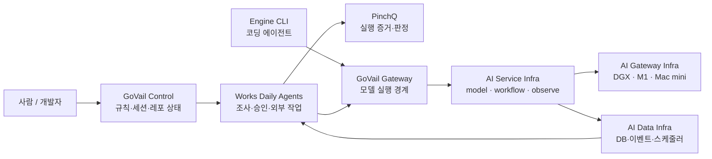

# 프로젝트

  

    프로젝트 개수보다 <strong>어떤 책임을 맡겼고, 어디서 경계를 그었는지</strong>를 먼저 보여줍니다.
    지금은 AI를 둘러싼 Control, 실행, 검증, 데이터 계층을 하나의 시스템으로 연결해보고 있습니다.
  

## 시스템을 나누는 기준

<DiagramFrame caption="상태, 업무 흐름, 실행 증거와 공용 데이터의 책임을 분리한 지도입니다.">

</DiagramFrame>

위 그래프는 제품 간 의존성을 모두 그린 것이 아니라, 시스템을 나누는 기준을 보여주는 지도입니다.
Control은 상태와 규칙을, Works는 업무 흐름을, PinchQ는 실행 증거를, AI Data Infra는 공용 데이터를 맡습니다.

## Selected Projects

<SelectedProjects />

## Other Work / Experiments

대표 프로젝트와 책임 범위가 다르거나, 실험으로 공개한 작업입니다.

  <a class="other-project" href="/projects/itgc-control">
    
ControlOpsActive

    <h3>ITGC ControlOps</h3>
    
RCM 기준 모집단과 소스 함수 증적을 읽기 전용으로 수집합니다.

  </a>
  <a class="other-project" href="/projects/ai-service-infra">
    
AI PlatformActive

    <h3>AI Service Infra</h3>
    
model access, durable workflow와 observability를 소유하는 서비스 계층입니다.

  </a>
  <a class="other-project" href="/projects/engine-cli">
    
Developer ToolActive

    <h3>Engine CLI</h3>
    
GoVail과 OpenRouter를 연결하는 자율 코딩 CLI입니다.

  </a>
  <a class="other-project" href="/projects/govail-gateway">
    
GatewayActive

    <h3>GoVail Gateway</h3>
    
모델 실행 앞단의 인증·정책·감사 경계를 둔 OpenAI-compatible Gateway입니다.

  </a>
  <a class="other-project" href="/projects/lingo-agent">
    
AutomationActive

    <h3>LingoAgent</h3>
    
번역, ICU 검증, QA와 커밋을 묶은 i18n 배포 게이트입니다.

  </a>
  <a class="other-project" href="/projects/aegis-llm">
    
SecurityExperiment

    <h3>Aegis-LLM</h3>
    
요청 경계의 인증, DLP와 fallback을 검증한 Rust 기반 Gateway MVP입니다.

  </a>
  <a class="other-project" href="/projects/aperture-mcp">
    
SecurityExperiment

    <h3>Aperture MCP</h3>
    
Tool 실행 전에 policy를 검사하는 Zero-trust 보안 프록시입니다.

  </a>
  <a class="other-project" href="/projects/slicerag">
    
RAGExperiment

    <h3>SliceRAG</h3>
    
프로젝트 단위로 RAG 데이터를 격리하는 Data Plane MVP입니다.

  </a>
  <a class="other-project" href="/projects/agentsecops-playground">
    
SecurityExperiment

    <h3>AgentSecOps Playground</h3>
    
Agent 보안 실패 케이스를 재현하는 E2E harness입니다.

  </a>
  <a class="other-project" href="/projects/ai-gateway-infra-demo">
    
InferenceExperiment

    <h3>AI Gateway Infra Demo</h3>
    
다중 추론 노드 라우팅과 provider fallback을 검증한 구성 실험입니다.

  </a>
  <a class="other-project" href="/projects/coexistgate">
    
Release SafetyExperiment

    <h3>coexistgate</h3>
    
변경을 안전하게 릴리스하고 롤백할 수 있는지 판단하는 엔진입니다.

  </a>
  <a class="other-project" href="/projects/works-agent-demo">
    
Agent WorkflowExperiment

    <h3>works-agent-demo</h3>
    
증거 기반 Agent workflow를 직접 확인하는 데모입니다.

  </a>
  <a class="other-project" href="/projects/infra-security">
    
InfrastructureArchived

    <h3>Infra Security</h3>
    
호스트와 컨테이너 네트워크 보안을 자동화한 구성입니다.

  </a>

## All public repositories

GitHub의 공개 레포 목록은 빌드 시점에 동기화합니다. 설명이 없는 레포는 이 목록에서도 제외하고, 저장소 자체는 GitHub에서 확인할 수 있습니다.

<AutoProjects />

## 기록할 때 지키는 것

회사에서 만든 코드나 업무 데이터는 개인 프로젝트처럼 다루지 않습니다.

각 작업도 README의 목표보다 실제 구현과 검증 범위를 기준으로 적습니다. 만들 예정인 기능은 만들어진 것처럼 쓰지 않습니다.

[GitHub에서 공개 레포 보기 ↗](https://github.com/devcy0922)
