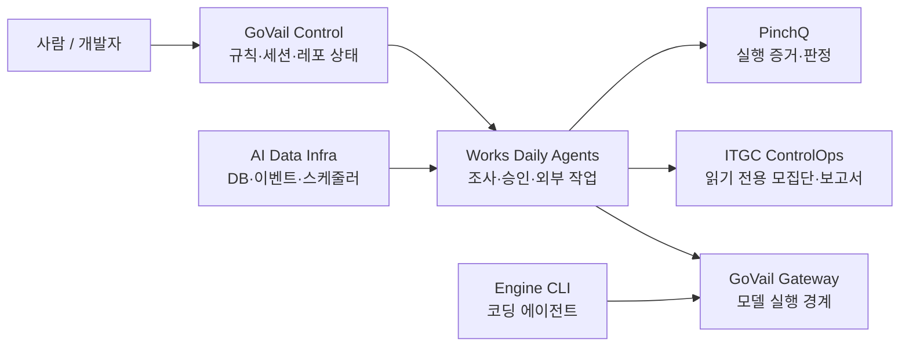

# 프로젝트

  

    프로젝트 개수보다 <strong>어떤 책임을 맡겼고, 어디서 경계를 그었는지</strong>를 먼저 보여줍니다.
    지금은 AI를 둘러싼 Control, 실행, 검증, 데이터 계층을 하나의 시스템으로 연결해보고 있습니다.
  

## 지금 만들고 있는 시스템

위 그래프는 제품 간 의존성을 모두 그린 것이 아니라, 제가 시스템을 나누는 기준을 보여주는 지도입니다.
Control은 상태와 규칙을, Works는 업무 흐름을, PinchQ는 실행 증거를, AI Data Infra는 공용 데이터를 맡습니다.

## 먼저 볼 것

  <a href="/projects/govail-control">
    CONTROL PLANE
    

      <h3>GoVail Control</h3>
      
Manifest, lockfile, 세션과 에이전트 자산을 묶어 여러 저장소에 같은 운영 계약을 적용하는 Control Plane.

    

    ↗
  </a>

  <a href="/projects/pinchq">
    VERIFICATION
    

      <h3>PinchQ</h3>
      
계획과 실행을 분리하고, 실제 runner가 남긴 evidence만으로 PASS·FAIL·PARTIAL을 계산하는 검증 러너.

    

    ↗
  </a>

  <a href="/projects/works-daily-agents">
    WORK OS
    

      <h3>Works Daily Agents</h3>
      
업무 인입부터 조사, 보고서, 사람 승인, 외부 변경까지를 분리한 Local-first 업무 운영 도구.

    

    ↗
  </a>

  <a href="/projects/ai-data-infra">
    DATA PLATFORM
    

      <h3>AI Data Infra</h3>
      
트랜잭션·벡터 데이터, 캐시, 이벤트와 장기 작업을 서비스에서 공유하는 데이터 인프라.

    

    ↗
  </a>

## 연결된 작업

대표작을 받치는 도구와 도메인 작업입니다.

- [ITGC ControlOps](/projects/itgc-control) — RCM 기준 모집단과 소스 함수 증적을 읽기 전용으로 수집
- [Engine CLI](/projects/engine-cli) — GoVail과 OpenRouter를 연결하는 자율 코딩 CLI
- [GoVail Gateway](/projects/govail-gateway) — 모델 실행 앞단의 인증·정책·감사 경계
- [LingoAgent](/projects/lingo-agent) — 번역·ICU 검증·QA·커밋을 묶은 배포 게이트
- [Aegis-LLM](/projects/aegis-llm) — 요청 경계의 인증, DLP와 fallback 실험
- [Aperture MCP](/projects/aperture-mcp) — Tool 실행 전 policy 검사
- [SliceRAG](/projects/slicerag) — 프로젝트 단위 RAG 데이터 격리
- [AgentSecOps Playground](/projects/agentsecops-playground) — Agent 보안 실패 케이스 재현
- [AI Gateway Infra Demo](/projects/ai-gateway-infra-demo) — 다중 추론 노드 라우팅 구성 실험
- [Infra Security](/projects/infra-security) — 호스트·컨테이너 네트워크 보안 자동화
- [Mock LLM Server](/projects/mock-llm) — CI에서 LLM 오류 응답을 재현하기 위한 테스트 서버

## 기록할 때 지키는 것

회사에서 만든 코드나 업무 데이터는 개인 프로젝트처럼 다루지 않습니다.

각 작업도 README의 목표보다 실제 구현과 검증 범위를 기준으로 적습니다. 만들 예정인 기능은 만들어진 것처럼 쓰지 않습니다.

[GitHub에서 공개 레포 보기 ↗](https://github.com/devcy0922)
