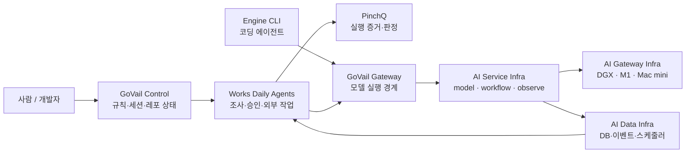

# 프로젝트

  

    프로젝트 개수보다 <strong>어떤 책임을 맡겼고, 어디서 경계를 그었는지</strong>를 먼저 보여줍니다.
    지금은 AI를 둘러싼 Control, 실행, 검증, 데이터 계층을 하나의 시스템으로 연결해보고 있습니다.
  

## 시스템을 나누는 기준

<DiagramFrame caption="상태, 업무 흐름, 실행 증거와 공용 데이터의 책임을 분리한 지도입니다.">

```mermaid
flowchart LR
    User[사람 / 개발자] --> Control[GoVail Control\n규칙·세션·레포 상태]
    Control --> Work[Works Daily Agents\n조사·승인·외부 작업]
    Work --> Verify[PinchQ\n실행 증거·판정]
    Data[AI Data Infra\nDB·이벤트·스케줄러] --> Work
    CLI[Engine CLI\n코딩 에이전트] --> Gateway[GoVail Gateway\n모델 실행 경계]
    Gateway --> Service[AI Service Infra\nmodel · workflow · observe]
    Service --> Inference[AI Gateway Infra\nDGX · M1 · Mac mini]
    Service --> Data
    Work --> Gateway
```

</DiagramFrame>

위 그래프는 제품 간 의존성을 모두 그린 것이 아니라, 시스템을 나누는 기준을 보여주는 지도입니다.
Control은 상태와 규칙을, Works는 업무 흐름을, PinchQ는 실행 증거를, AI Data Infra는 공용 데이터를 맡습니다.

## Selected Projects

<SelectedProjects />

## Other Work

대표 프로젝트와 책임 범위가 다르거나, 실험으로 공개한 작업입니다. 설명이 없는 GitHub 레포는 제외하고, 나머지 공개 레포는 빌드 시점에 동기화되어 이 목록 아래에 이어집니다.

<OtherProjects />
<AutoProjects />

## 기록할 때 지키는 것

회사에서 만든 코드나 업무 데이터는 개인 프로젝트처럼 다루지 않습니다.

각 작업도 README의 목표보다 실제 구현과 검증 범위를 기준으로 적습니다. 만들 예정인 기능은 만들어진 것처럼 쓰지 않습니다.

[GitHub에서 공개 레포 보기 ↗](https://github.com/devcy0922)
