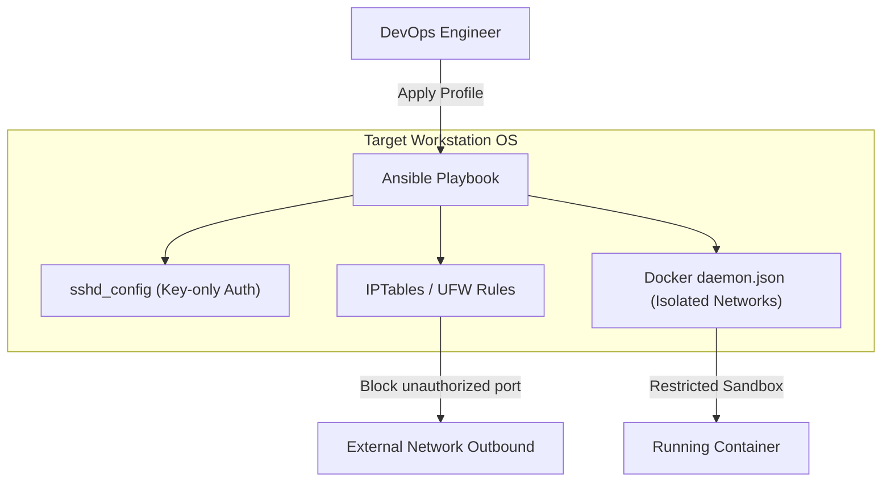
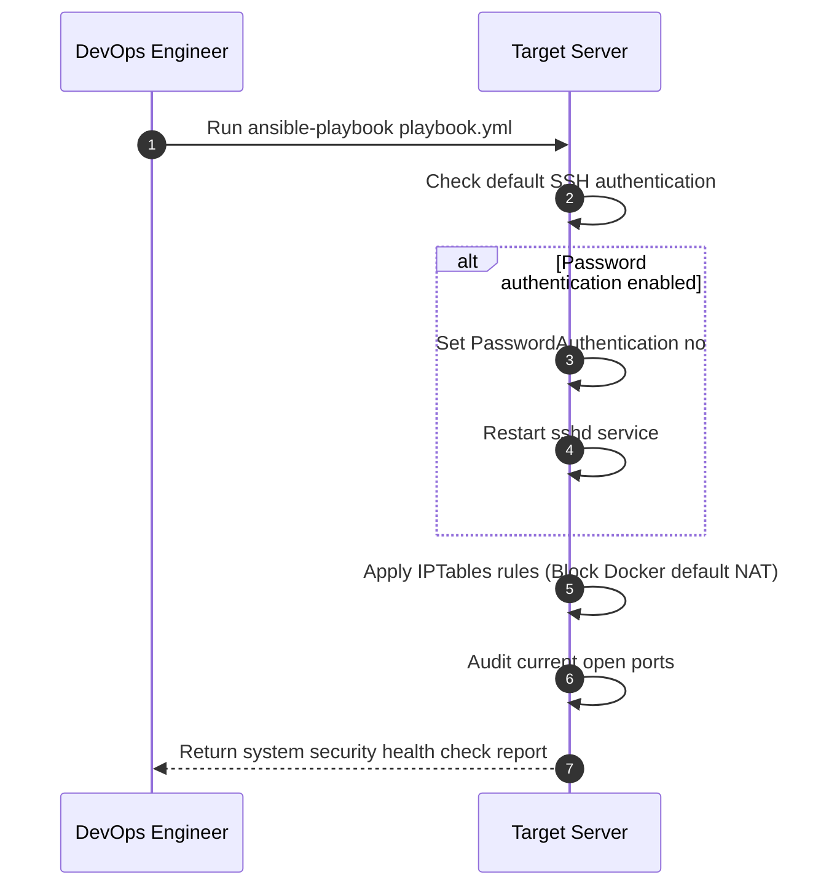

# Infra Security

로컬 개발 워크스테이션 및 사설 네트워크 환경의 제로 트러스트(Zero-Trust) 접근 제어와 취약점 완화를 위한 DevOps 방화벽 및 시스템 보안 자동화 프로파일 세트입니다.

## 📌 Status & Repository
- **상태**: `Archived`
- **저장소 주소**: [GitHub (devcy0922/infra-security)](https://github.com/devcy0922/infra-security)
- **라이선스**: GPL v3
- **주요 언어**: Ansible, Shell Script

---

## 1. Problem
개발용 워크스테이션이 사내 사설망 내부에서 가동될 때, 포트 제어가 되지 않아 임의로 가동한 Docker 컨테이너가 외부 공용망(Internet)으로 비인가 바인딩되거나, SSH 기본 설정 취약점으로 인해 무차별 대입 공격(Brute Force)이나 로컬 권한 상승 취약점에 무방비로 노출될 위험이 큽니다.

## 2. Why I Built It
사설망 내 개발 장비들의 SSH 자격증명 설정을 자동 비활성화(Key 기반 강제)하고, Docker Daemon의 기본 네트워크 브리지를 인터넷 아웃바운드가 차단된 격리 사설 네트워크로 강제 재바인딩하며, 불필요한 로컬 리스닝 포트를 추적 및 제어하는 인프라 프로비저닝 프로파일을 한데 묶어 관리하기 위해 구축했습니다.

## 3. Scope
- Ansible 플레이북 기반의 리눅스/macOS 대상 보안 설정 프로비저닝
- SSH Password 인증 전면 비활성화 및 공개키 인증 강제 정책 배포
- Docker Bridge 네트워크의 인터넷 게이트웨이(NAT) 강제 삭제 및 격리 자동화 스크립트
- Fail2Ban 및 IPTables/UFW 로컬 방화벽 차단 정책 구성

---

## 4. Architecture



---

## 5. Security Validation Flow



---

## 6. Key Design Decisions
- **Docker NAT 기본 비활성화**: Docker 컨테이너가 생성될 때 디폴트로 호스트의 공용 IP를 타고 나가는 인터넷 NAT 연결을 끊어버리고, 인프라 보안 정책을 강제하기 위해 별도 구축한 프록시 노드만을 통해서 통신하도록 유도하는 네트워크 샌드박싱 설정을 강제했습니다.
- **선언적 멱등성 유지**: 쉘 스크립트 대신 Ansible을 사용하여 여러 개발 노드에 중복 실행하더라도 동일한 보안 설정 상태(Idempotence)를 보존하도록 설계했습니다.

## 7. Security Considerations
- 비식별화 규정에 의거하여, 배포 프로파일 내부에는 어떠한 실제 사용자 SSH 퍼블릭 키, 사설 IP 주소, 내부 라우팅 서브넷 정보를 하드코딩하지 않고 환경 변수 및 외부 템플릿 바인딩으로 완전히 격리했습니다.

## 8. Observability
- Fail2Ban 로그 수집기 및 UFW 방화벽 차단 이벤트 로그를 표준 `/var/log/syslog`에 실시간 포맷화해 기록하며, 비인가 포트 스캔 감지 시 보안 채널로 즉각 경보를 쏩니다.

## 9. Technology Stack
- **Provisioning**: Ansible (v2.15+)
- **Security Control**: Fail2Ban, UFW, IPTables

---

## 10. Running Locally
로컬 개발 장비에 Ansible 플레이북을 드라이런(dry-run)하여 취약점을 먼저 체크해볼 수 있습니다.

```bash
# 로컬 보안 강화 플레이북 드라이런 검증
ansible-playbook -i "localhost," -c local site.yml --check
```

## 11. Current Limitations
- 본 보안 프로파일은 주로 Linux(Ubuntu/Debian) 시스템 콜 및 네트워크 구조에 특화되어 있어, macOS(Darwin Kernel)의 내장 방화벽(PF) 제어 기능은 완전하지 못합니다.

## 12. Next Steps
- macOS PF 방화벽 및 시스템 정책 제어를 위한 Ansible 커스텀 모듈 보강 개발.
