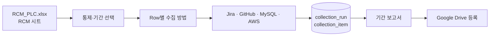

# ITGC ControlOps

RCM 기준으로 선택한 통제의 해당 기간 전체 모집단과 소스 함수 증적을 read-only로 수집하는 경량 수집기입니다.

## 한눈에 보기

- [GitHub 저장소](https://github.com/devcy0922/itgc-control)
- React/Vite 화면과 Python/FastAPI collector
- Jira, GitHub PR·소스 함수, MySQL, AWS IAM read-only 수집
- PostgreSQL `itgc` schema에 collection run과 결과 저장
- 기간 보고서와 Google Drive 등록 지원

## 하지 않는 것

감사 결론, PASS/FAIL 판정, 샘플 추출과 Finding 확정은 범위 밖입니다. 수집 방법이 없거나 연결이 없을 때도 추정 데이터를 만들지 않고 `NEEDS_CONNECTION` 또는 `WORKFLOW_REQUIRED`로 남깁니다.

## 설계 기준

RCM의 모집단 범위, workflow 정의 완성도, 실제 연결 가능 상태를 분리합니다. 같은 공용 template과 기간은 원천에서 한 번만 조회하고 각 통제 결과에 연결합니다. 원본 행 번호와 조회 조건을 함께 보존해 보고서가 다시 원천과 대조될 수 있도록 했습니다.
