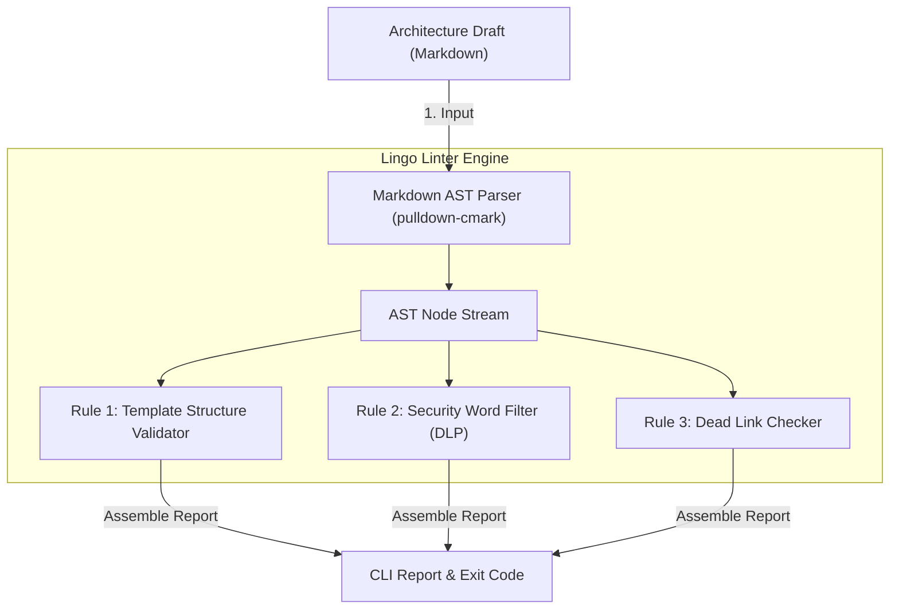
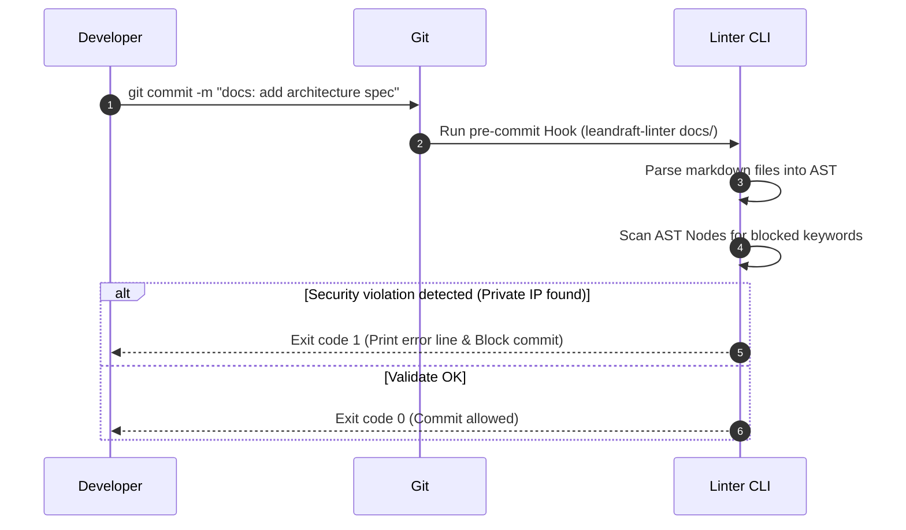

# Leandraft Linter

개발 초안(Draft) 및 기술 설계 문서의 서식 불일치, 가이드라인 미준수 사항을 코드 빌드 이전에 자동 검출해주는 텍스트 기반 정적 분석 린터(Linter)입니다.

## 📌 Status & Repository
- **상태**: `Stable`
- **저장소 주소**: [GitHub (devcy0922/leandraft-linter)](https://github.com/devcy0922/leandraft-linter)
- **라이선스**: MIT
- **주요 언어**: Rust

---

## 1. Problem
소프트웨어 설계를 코드로 옮기기 전 단계에서 기술 설계서(RFC, 아키텍처 초안 마크다운)를 작성하게 됩니다. 이때 각 파트너 엔지니어마다 문서 구조(제목 레벨, 테이블 포맷, 필수 섹션 존재 유무)가 뒤죽박죽이 되거나, 예전 사설 IP 주소나 내부 시스템명 등 민감 정보가 설계서 내에 무방비로 적재되어 깃허브에 푸시되는 휴먼 에러가 빈번하게 발생합니다.

## 2. Why I Built It
마크다운 추상 구문 트리(AST) 파서 엔진을 내장한 고속 린터를 구현하여, 로컬 커밋 이전에 개발 초안 설계 문서 내 필수 뼈대 준수 여부를 검사하고, 보안 가이드라인(PII, 사설 주소 대역 노출 금지 등)을 위반하는 단어가 문서에 하드코딩되어 있는지 검증하는 도구로 개발했습니다.

## 3. Scope
- Markdown AST(Abstract Syntax Tree) 파싱을 통한 문서 구조 검사
- PII(개인정보) 및 보안 위험 키워드 정적 블랙리스트 필터링
- 필수 RFC 문서 템플릿 색인 준수 여부 자동 채점
- Git pre-commit Hook 연동을 위한 초고속 CLI 바이너리 제공

---

## 4. Architecture



---

## 5. Request Flow



---

## 6. Key Design Decisions
- **AST 기반 구문 스캔**: 텍스트 파일 전체에 대해 무식하게 전체 정규식 스캔을 돌리는 대신, 마크다운 요소를 파싱하여 "코드 블록 안의 내용", "본문 제목", "링크 주소" 등으로 완벽하게 격리 노드화하여 탐지 오류(False Positive)를 혁신적으로 최소화했습니다.
- **pre-commit 친화적 속도**: Rust의 `pulldown-cmark` 파서를 사용해 개별 문서 분석 속도를 1ms 미만으로 극도로 줄여, 대용량 개발 문서가 담긴 저장소에서도 git commit 대기 지연을 유발하지 않도록 했습니다.

## 7. Security Considerations
- 외부 네트워크 통신을 절대 수행하지 않고 로컬 CLI 오프라인 환경에서 모든 파일 내용 스캔 및 위반 사항 분석이 완결되어, 로컬 설계문서 내용이 외부 API를 타고 유출되는 것을 차단합니다.

## 8. Observability
- 기계 분석이 용이하도록 표준 에러 및 표준 출력을 통해 `JSON` 형식의 검사 리포트를 출력하여 CI/CD 파이프라인에서 오류 로그를 한눈에 파집할 수 있도록 지원합니다.

## 9. Technology Stack
- **Engine**: Rust
- **Parser Library**: pulldown-cmark

---

## 10. Running Locally
로컬에서 임의의 문서 폴더를 지정해 린팅을 구동합니다.

```bash
# docs 디렉토리 내의 설계 초안 문서 검사
leandraft-linter --dir ./docs
```

## 11. Current Limitations
- 이미지 파일 내부의 텍스트나 PDF 포맷 설계서에 대한 바이너리 스캔은 지원하지 않으며, 오직 텍스트 파일(Markdown, AsciiDoc)만 분석이 가능합니다.

## 12. Next Steps
- 기술 설계서 내부의 Mermaid 다이어그램 구문이 문법에 부합하는지 실시간 유효성을 체크해주는 Mermaid Linter 룰셋 탑재.
