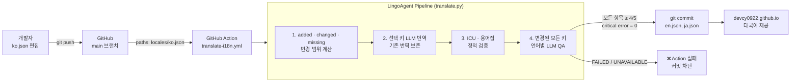
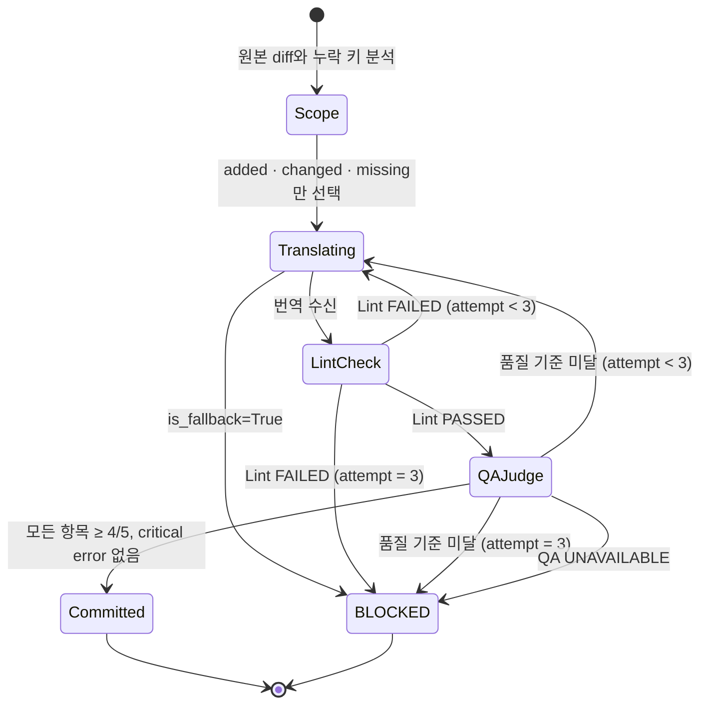

# LingoAgent

한국어(`ko.json`)를 원본으로 LLM 번역 → ICU 검증 → QA → GitHub Action 자동 커밋까지 연결하는 **i18n 번역 배포 게이트**입니다.

> 이 포트폴리오 사이트의 영문(en)·일문(ja) UI 텍스트는 LingoAgent가 번역했습니다.
> `ko.json` 변경 → GitHub Action → 검증 통과 시 `en.json` / `ja.json` 자동 커밋.

## 📌 Status & Repository

- **상태**: `MVP` — 이 사이트의 자동 번역 파이프라인에 실제 적용 중
- **저장소**: [devcy0922/lingo-agent](https://github.com/devcy0922/lingo-agent)
- **번역 소스**: [docs/public/locales/ko.json](https://github.com/devcy0922/devcy0922.github.io/blob/main/docs/public/locales/ko.json)
- **라이선스**: MIT

---

## 1. Problem

글로벌 서비스의 다국어 리소스 JSON 관리는 반복 작업이 많습니다. 사람이 번역 사이트를 거쳐 복붙하는 과정에서 `{username}` 같은 ICU 메시지 변수가 깨지거나 누락되어 화면 오류가 발생합니다. 그리고 **LLM 번역이 아무리 자연스러워도 정적 검증 없이는 신뢰할 수 없습니다.**

## 2. Architecture



## 3. 신뢰 게이트 — 무엇이 커밋을 막는가

| 조건 | 결과 |
|---|---|
| LLM 장애 → Fallback 번역 감지 (`is_fallback=True`) | `exit(1)` — 커밋 차단 |
| ICU 변수 누락 / 키 불일치 (lint 실패) | 재시도 → 3회 초과 시 `exit(2)` |
| 보존 용어 누락 / 금지 표현 사용 | 재시도 → 3회 초과 시 `exit(2)` |
| QA 항목별 점수 < 4/5 또는 critical error | 재시도 → 3회 초과 시 `exit(2)` |
| QA API 자체 장애 | `exit(2)` — 기본 통과 점수 부여 금지 |
| 모든 검증 통과 | `en.json`, `ja.json` 커밋 + 사이트 배포 |

## 4. 상태 전이 (단일 언어 기준)



## 5. GitHub Action 흐름

```yaml
on:
  push:
    paths:
      - "docs/public/locales/ko.json"

steps:
  - Checkout portfolio + lingo-agent@검증된-SHA (sparse)
  - 이전 ko.json 준비 및 변경 범위 계산
  - pip install httpx
  - python translate.py --source ko.json --base-source ko.previous.json \
      --langs en-US ja-JP --output locales/ --glossary glossary.json \
      --report report.json
  - QA report artifact 업로드
  - 실제 QA 상태와 검수 키 수를 포함해 git commit
```

번역 커밋은 `ko.json`을 수정하지 않으므로 경로 기반 트리거가 다시 실행되지 않습니다.

## 6. Key Design Decisions

- **Fallback 완전 차단**: LLM이 꺼져 있으면 번역을 만들지 않습니다. 가짜 번역이 커밋되어 배포되는 것을 `exit(1)`로 막습니다.
- **QA 장애 = 실패**: `evaluate_quality()` 가 응답 불가여도 기본 통과 점수(92점)를 부여하지 않습니다. "검증되지 않은 것은 배포하지 않는다"는 원칙입니다.
- **기존 번역 보호**: 일반 push에서는 추가·변경·누락 키만 번역하고 source가 바뀌지 않은 기존 번역은 그대로 유지합니다. 전체 재번역은 수동 `sync_all`에서만 허용합니다.
- **전 키 QA**: 첫 5개 샘플이 아니라 이번 실행에서 생성한 모든 키를 최대 8개씩 나눠 의미, 자연스러움, 용어, UI 적합성으로 검수합니다.
- **강제 용어집·번역 메모리**: 고유명사 보존, 키별 필수 번역과 금지 표현을 LLM 점수와 별도의 정적 gate로 검사합니다.
- **Audit Trail**: 실제 QA 상태, 항목별 결과, 변경·보존 키 수와 사용 모델 alias를 JSON artifact로 남깁니다.
- **버전 고정**: 포트폴리오 워크플로는 LingoAgent `main` 대신 검증한 commit SHA를 사용합니다.
- **최소 의존성**: `translate.py`는 `httpx` 하나만 필요합니다. FastAPI/SQLAlchemy 없이 GitHub Actions `ubuntu-latest`에서 바로 실행됩니다.

## 7. Technology Stack

| 컴포넌트 | 기술 |
|---|---|
| 번역 CLI | Python 3.11, httpx |
| 린터 | 정규식 기반 ICU 검사 (plural/select, 중첩 JSON) |
| QA Judge | 변경 키 전체 검수, 항목별 4/5 hard gate |
| CI/CD | GitHub Actions |
| LLM 경로 | GoVail Gateway → LiteLLM → Private LLM |
| 포트폴리오 사이트 | VitePress, Vue 3 |

## 8. Running Locally

```bash
# 환경변수 설정
export LLM_GATEWAY_URL="https://your-gateway.example.com/v1"
export LLM_API_KEY="your-api-key"
export LLM_MODEL="auto"

# 번역 실행 (dry-run: 파일 저장 없이 검증만)
python translate.py \
  --source docs/public/locales/ko.json \
  --base-source .lingo/runtime/ko.previous.json \
  --langs en-US ja-JP \
  --output docs/public/locales/ \
  --glossary .lingo/glossary.json \
  --report .lingo/runtime/report.json \
  --dry-run
```

## 9. Current Limitations

- ICU `plural/select` 패턴 감지는 정규식 기반으로, 완전한 파서가 아닙니다. 중첩 깊이가 3단계 이상인 복합 패턴은 검출 정확도가 낮을 수 있습니다.
- 마크다운 문서 본문(.md 파일) 번역은 범위에 포함되지 않습니다. UI 문자열(JSON)만 대상입니다.
- 현재 GitHub Actions는 기존 공개 Demo Key를 사용합니다. 운영 분리를 위해 번역 전용 Project·Key로 교체하는 작업이 필요합니다.
