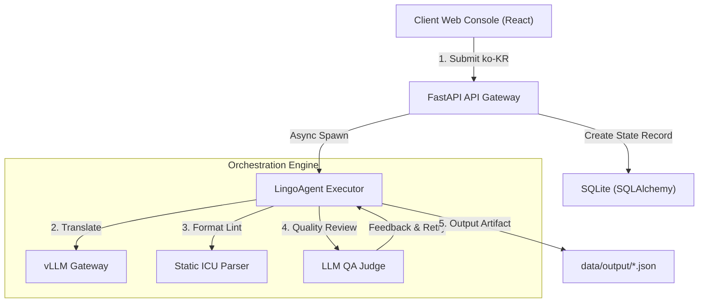
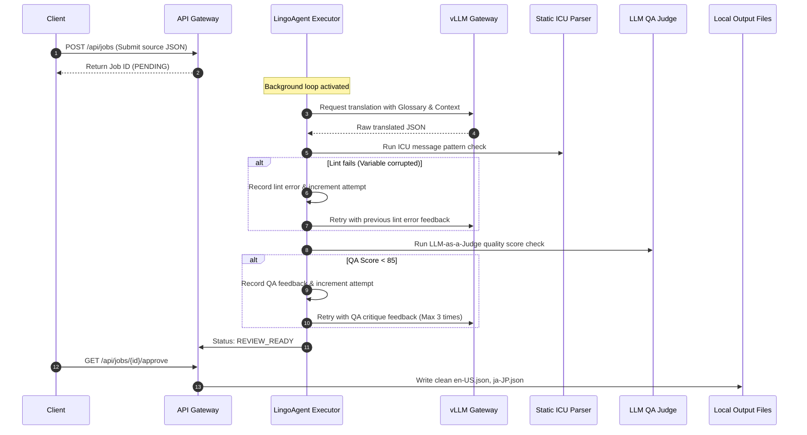

# LingoAgent

개발자가 한국어(`ko-KR`) 로캘 파일만 직접 관리하면 AI 에이전트가 다국어 번역, ICU 포맷 검증 및 품질 평가를 수행하는 국제화(i18n) 자동화 오케스트레이터입니다.

## 📌 Status & Repository
- **상태**: `Experimental`
- **저장소 주소**: [GitHub (devcy0922/lingo-agent)](https://github.com/devcy0922/lingo-agent)
- **라이선스**: MIT
- **주요 언어**: Python (FastAPI), TypeScript (React)

---

## 1. Problem
글로벌 서비스를 릴리즈할 때 다국어 리소스 JSON 관리는 매우 고통스럽습니다. 사람이 매번 번역 사이트를 통해 복사-붙여넣기를 반복해야 하며, 번역 도중 `{username}` 같은 ICU 메시지 포맷 변수가 깨지거나 누락되어 화면이 터지거나 빈 라벨이 노출되는 장애가 수시로 발생합니다.

## 2. Why I Built It
원본 한국어 파일 수정본을 파이프라인에 업로드하면, 에이전트가 LLM 번역을 수행한 뒤 자체 린터(Linter)로 변수의 훼손 여부를 1차 검사하고, LLM-as-a-Judge 품질 평가를 통해 번역을 반복 검증하여 오류가 발생하지 않는 최종 다국어 파일만을 안전하게 배포하기 위해 구축했습니다.

## 3. Scope
- ko-KR 원본 업로드 및 번역 잡(Job) 상태 머신 관리
- ICU Message Format 변수 무결성 정적 린터 기능
- LLM-as-a-Judge 품질 채점 (85점 컷오프) 및 최대 3회 재번역 오케스트레이션
- 최종 승인 시 로컬 리소스 디렉토리 출력 배포
- 에이전트의 사고 판단 로그(Thought Process) 웹 대시보드 시각화

---

## 4. Architecture



---

## 5. Request Flow



---

## 6. Key Design Decisions
- **Durable Demo 설계**: 데모 시연 도중 외부 LLM Gateway 네트워크가 유실되더라도 동작이 중단되지 않도록, 예외 감지 시 로컬에서 간단한 매핑 규칙에 따라 번역물을 가공해주는 자동 Fallback 룰을 내장했습니다.
- **Thought Timeline 노출**: 인공지능이 왜 변수 유실로 린트에서 기각당했는지, QA 피드백을 통해 어떤 뉘앙스 교정을 지시받았는지를 개발자가 웹 콘솔에서 한눈에 볼 수 있도록 사고 과정을 테이블화하여 저장하고 노출합니다.

## 7. Security Considerations
- 로컬 SQLite 데이터베이스를 사용하여 외부 노출 없이 폐쇄망 내에서 로컬 데이터만 보관하며, 최종 승인되기 전에는 실제 운영 리소스 저장소를 침범하지 않도록 임시 격리 디렉토리에만 번역본을 배포합니다.

## 8. Observability
- 각 언어별 번역 재시도 횟수(attempts), 린터 결과(lint_status), 그리고 LLM 품질 평가 스코어(quality_score)를 정량화해 모니터링 메트릭으로 제공합니다.

## 9. Technology Stack
- **Backend**: FastAPI, SQLAlchemy
- **Database**: SQLite3
- **Frontend**: Vite, React, TypeScript, HSL Vanilla CSS

---

## 10. Running Locally
단일 포트 서빙을 지원하도록 프론트엔드를 빌드한 뒤 백엔드를 가동합니다.

```bash
# 1. 프론트엔드 정적 빌드 생성
pnpm build:frontend

# 2. 백엔드 통합 서버 실행 (Vite 빌드본 SPA 정적 서빙 포함)
pnpm start:backend
```

## 11. Current Limitations
- 에이전트의 린트 기작이 ICU 포맷 파싱에 집중되어 있어, 다국어 교체에 따른 전체 웹 디자인 레이아웃 깨짐(Pixel Overflow)은 눈으로 직접 검사해야 합니다.

## 12. Next Steps
- Playwright 브라우저 렌더링 스크린샷과 Pixel Diff 분석 엔진을 연동하여 레이아웃이 터져 나가는 것까지 자동 감지하는 기능을 추가할 예정입니다.
