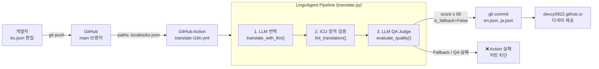
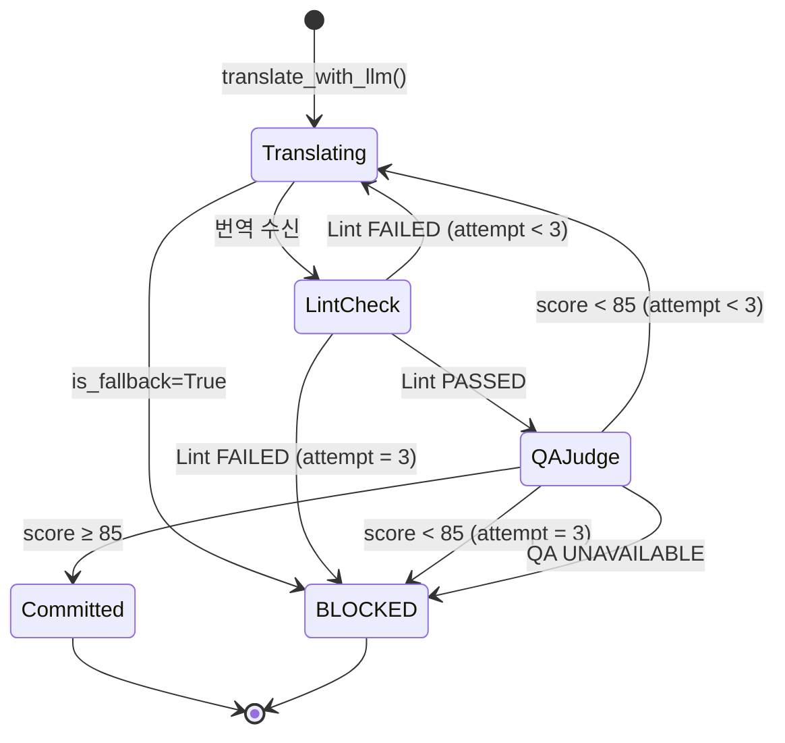

# LingoAgent

한국어(`ko.json`)를 원본으로 LLM 번역 → ICU 검증 → QA → GitHub Action 자동 커밋까지 연결하는 **i18n 번역 배포 게이트**입니다.

> 이 포트폴리오 사이트의 영문(en)·일문(ja) UI 텍스트는 LingoAgent가 번역했습니다.
> `ko.json` 변경 → GitHub Action → 검증 통과 시 `en.json` / `ja.json` 자동 커밋.

## 📌 Status & Repository

- **상태**: `Pipeline` — 이 사이트에 실제 적용 중
- **저장소**: [devcy0922/lingo-agent](https://github.com/devcy0922/lingo-agent)
- **번역 소스**: [docs/public/locales/ko.json](https://github.com/devcy0922/devcy0922.github.io/blob/main/docs/public/locales/ko.json)
- **라이선스**: MIT

---

## 1. Problem

글로벌 서비스의 다국어 리소스 JSON 관리는 반복 작업이 많습니다. 사람이 번역 사이트를 거쳐 복붙하는 과정에서 `{username}` 같은 ICU 메시지 변수가 깨지거나 누락되어 화면 오류가 발생합니다. 그리고 **LLM 번역이 아무리 자연스러워도 정적 검증 없이는 신뢰할 수 없습니다.**

## 2. Architecture



## 3. 신뢰 게이트 — 무엇이 커밋을 막는가

| 조건 | 결과 |
|---|---|
| LLM 장애 → Fallback 번역 감지 (`is_fallback=True`) | `exit(1)` — 커밋 차단 |
| ICU 변수 누락 / 키 불일치 (lint 실패) | 재시도 → 3회 초과 시 `exit(2)` |
| QA 점수 < 85점 | 재시도 → 3회 초과 시 `exit(2)` |
| QA API 자체 장애 | `exit(2)` — 기본 통과 점수 부여 금지 |
| 모든 검증 통과 | `en.json`, `ja.json` 커밋 + 사이트 배포 |

## 4. 상태 전이 (단일 언어 기준)



## 5. GitHub Action 흐름

```yaml
on:
  push:
    paths:
      - "docs/public/locales/ko.json"

steps:
  - Checkout portfolio + lingo-agent (sparse)
  - pip install httpx
  - python translate.py --source ko.json --langs en-US ja-JP --output locales/
  - git commit "chore(i18n): auto-translate [skip ci]"
```

`[skip ci]` 태그로 번역 커밋이 다시 Action을 트리거하는 무한 루프를 방지합니다.

## 6. Key Design Decisions

- **Fallback 완전 차단**: LLM이 꺼져 있으면 번역을 만들지 않습니다. 가짜 번역이 커밋되어 배포되는 것을 `exit(1)`로 막습니다.
- **QA 장애 = 실패**: `evaluate_quality()` 가 응답 불가여도 기본 통과 점수(92점)를 부여하지 않습니다. "검증되지 않은 것은 배포하지 않는다"는 원칙입니다.
- **Audit Trail**: 각 언어별 번역 시도 → Lint 결과 → QA 점수를 GitHub Action 로그에 남겨 재현성을 보장합니다.
- **최소 의존성**: `translate.py`는 `httpx` 하나만 필요합니다. FastAPI/SQLAlchemy 없이 GitHub Actions `ubuntu-latest`에서 바로 실행됩니다.

## 7. Technology Stack

| 컴포넌트 | 기술 |
|---|---|
| 번역 CLI | Python 3.11, httpx |
| 린터 | 정규식 기반 ICU 검사 (plural/select, 중첩 JSON) |
| QA Judge | LLM-as-a-Judge (85점 컷오프) |
| CI/CD | GitHub Actions |
| LLM 경로 | GoVail Gateway → LiteLLM → Private LLM |
| 포트폴리오 사이트 | VitePress, Vue 3 |

## 8. Running Locally

```bash
# 환경변수 설정
export LLM_GATEWAY_URL="https://your-gateway.example.com/v1"
export LLM_API_KEY="your-api-key"
export LLM_MODEL="auto"

# 번역 실행 (dry-run: 파일 저장 없이 검증만)
python translate.py \
  --source docs/public/locales/ko.json \
  --langs en-US ja-JP \
  --output docs/public/locales/ \
  --dry-run
```

## 9. Current Limitations

- ICU `plural/select` 패턴 감지는 정규식 기반으로, 완전한 파서가 아닙니다. 중첩 깊이가 3단계 이상인 복합 패턴은 검출 정확도가 낮을 수 있습니다.
- 마크다운 문서 본문(.md 파일) 번역은 범위에 포함되지 않습니다. UI 문자열(JSON)만 대상입니다.
