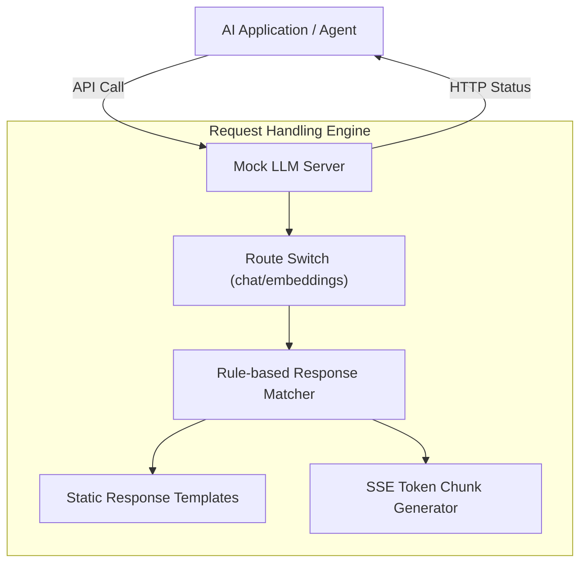
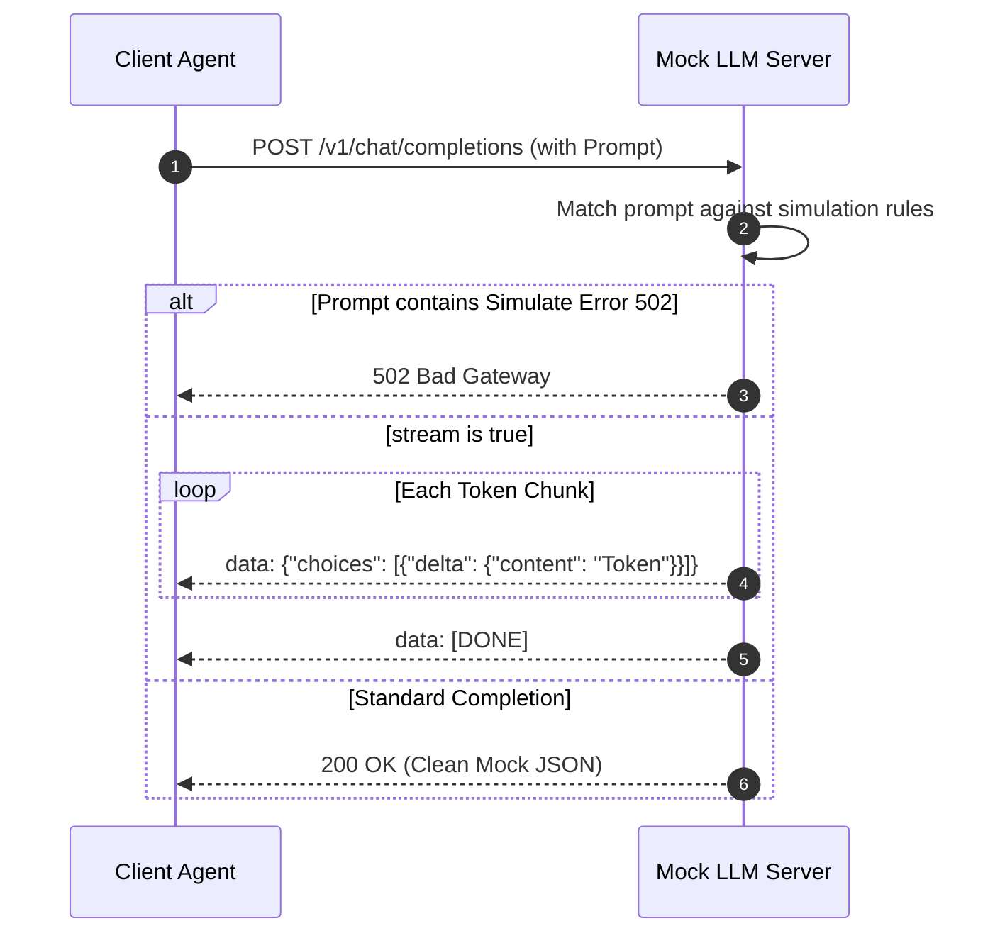

# Mock LLM Server

로컬 개발 환경 및 CI/CD 파이프라인에서 실제 LLM API 호출 없이도 초고속으로 대형 언어 모델의 응답 스펙을 모사(Mocking)해주는 테스트용 에뮬레이터 서버입니다.

## 📌 Status & Repository
- **상태**: `Stable`
- **저장소 공개 범위**: 비공개 구현 저장소
- **라이선스**: MIT
- **주요 언어**: Rust, Go

---

## 1. Problem
AI 에이전트나 Gateway 서비스를 테스트할 때, 실제 외부 LLM API(OpenAI, Claude 등)를 실시간 호출하여 검증하면 다음과 같은 문제가 따릅니다:
1. 호출 시마다 비용이 크게 누적됩니다.
2. 테스트 한 건당 최소 수초의 지연시간이 발생하여 전체 CI 빌드 파이프라인이 심각하게 지연됩니다.
3. API 호출 한도(Rate Limit)나 네트워크 유실 시 테스트 결과가 기각되는 불안정성이 유발됩니다.

## 2. Why I Built It
OpenAI 및 vLLM 규격의 HTTP API 응답 스키마를 100% 모방하되, 실제 거대 연산(추론)을 돌리지 않고 사전에 설계된 템플릿 텍스트 또는 스트리밍 토큰 청크를 즉각 밀어주어, 단 1ms 미만의 지연시간 내에 신뢰할 수 있는 모사 응답을 제공하는 고속 검증 서버를 구축했습니다.

## 3. Scope
- `/v1/chat/completions` 및 `/v1/embeddings` API 스키마 모사
- 스트리밍 응답(`stream: true`)의 Server-Sent Events(SSE) 프로토콜 토큰 전송 시뮬레이션
- 특정 키워드 수신 시 지정된 지연시간(Latency simulation) 또는 의도된 HTTP 오류 코드(429, 502 등) 반환 기능
- Pydantic 규격에 호환되는 더미 토큰 생성

---

## 4. Architecture



---

## 5. Request Flow



---

## 6. Key Design Decisions
- **경량 무의존성 단일 바이너리**: 실제 파이썬 기반 추론 스택(vLLM)을 전혀 올리지 않기 때문에, 수 메가바이트 크기의 가볍고 빠른 단일 바이너리로 구동할 수 있어 CI/CD 컨테이너 내에서 단 10ms 만에 즉시 실행됩니다.
- **룰 기반 예외 상황 주입**: 단순히 더미 텍스트만 주는 것이 아니라, "특정 프롬프트가 들어올 시 10초 딜레이", "특정 헤더 누락 시 401 반환" 등 복잡한 에지 케이스 테스트 시나리오를 구성할 수 있도록 룰 엔진을 도입했습니다.

## 7. Security Considerations
- 로컬 또는 격리된 CI 파이프라인 내부에서만 바인딩되어 외부 트래픽 유입에 무관하며, 내부망 밖으로 실 데이터가 흘러나갈 가능성을 원천적으로 배제합니다.

## 8. Observability
- 매 API 쿼리 및 매칭된 모사 규칙에 대한 로그를 표준 출력으로 명확하게 덤프하여 개발자가 어떤 목업 룰이 매칭되었는지 확인하기 쉽도록 제공합니다.

## 9. Technology Stack
- **Engine**: Rust (Axum / Tokio) 또는 Go (Gin)
- **Format**: JSON, Server-Sent Events

---

## 10. Running Locally
로컬에서 8080 포트로 목업 서버를 즉시 띄울 수 있습니다.

```bash
# 로컬 백엔드 서버 가동 (OpenAI API 모사 포트: 8080)
mock-llm --port 8080
```

## 11. Current Limitations
- 사전에 고정 정의되거나 정해진 단순 규칙 이외의 복잡한 추론 로직(자유도 높은 문맥 응답)은 흉내 낼 수 없어, 고차원 에이전트의 판단 논리 루프 검증에는 어려움이 있습니다.

## 12. Next Steps
- OpenAI Assistant API 스펙 추가 모사 및 다중 대화 세션 컨텍스트 저장 시뮬레이션 지원.
