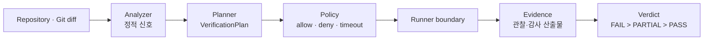

# PinchQ

코드 변경을 눈으로 보고 승인하는 대신, 재현 가능한 check를 실행하고 그 결과를 evidence와 verdict로 남기는 검증 러너입니다.

## 한눈에 보기

- [GitHub 저장소](https://github.com/devcy0922/pinchq)
- Go 기반 CLI
- Go, Node.js, Python, Rust 저장소 분석
- Command, HTTP, PTY/CLI, Browser/Playwright runner
- `FAIL > PARTIAL > PASS` 우선순위와 실행 근거 보존

## 설계 기준

Planner는 무엇을 확인할지 제안할 수 있지만, 실행 권한은 runner에만 둡니다. 모델 보조 planner를 붙이더라도 최종 결과는 typed plan과 실제 실행 evidence를 통해 계산합니다.

도메인 URL, selector, 인증 상태와 배포 환경은 core에 넣지 않고 domain profile의 가장자리로 밀어냈습니다. 덕분에 검증 엔진은 특정 제품의 라우팅 지식 없이도 같은 계약을 실행할 수 있습니다.

## 실패를 다루는 방식

실행하지 않은 check는 PASS가 될 수 없습니다. 재현된 제품 실패는 `FAIL`, 실행 환경이 부족해 완료하지 못한 경우는 `PARTIAL`로 구분합니다. Scanner가 아무것도 찾지 못한 것과 Scanner 자체가 실패한 것도 별도의 provenance로 남깁니다.
