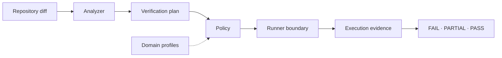
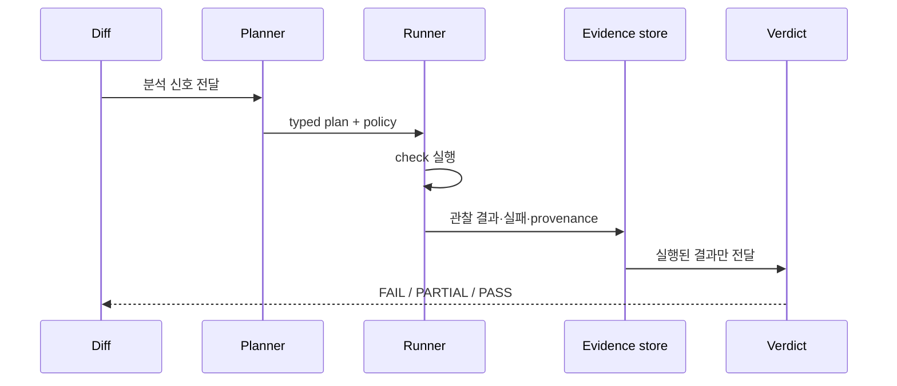

# PinchQ

코드 변경을 눈으로 보고 승인하는 대신, 재현 가능한 check를 실행하고 그 결과를 evidence와 verdict로 남기는 검증 러너입니다. 계획이 그럴듯한지보다 실제 runner가 무엇을 실행했고 무엇을 관찰했는지를 기준으로 판단합니다.

## 한눈에 보기

- **성격**: Verification / Reliability Engineering
- **핵심 기술**: Go, typed verification plan, Command·HTTP·PTY runner, Playwright
- **Source**: [github.com/devcy0922/pinchq ↗](https://github.com/devcy0922/pinchq)
- **현재 범위**: Go·Node.js·Python·Rust 저장소 분석과 실행 결과의 PASS·PARTIAL·FAIL 판정

## 문제

변경 계획이나 정적 분석 결과만으로는 코드가 실제 환경에서 동작했는지 알 수 없습니다. 특히 검증을 실행하지 못한 상태와 제품 자체의 실패를 같은 “통과하지 않음”으로 처리하면 다음 사람이 원인을 다시 조사해야 합니다.

PinchQ는 planner가 제안한 check와 runner가 실제로 실행한 check를 분리하고, 실행 결과와 provenance를 verdict의 입력으로 사용합니다.

## Architecture

<DiagramFrame caption="planner는 검증 계획을 만들고, 실행 권한과 판정은 runner·evidence 계층에 둡니다.">

</DiagramFrame>

다이어그램의 `Evidence`는 실행 로그와 관찰 결과를 뜻합니다. 정적 신호나 planner output만으로는 최종 verdict를 만들지 않습니다.

## 책임 경계

### Owns

- 저장소 변경에서 확인할 항목을 표현하는 typed verification plan
- command, HTTP, PTY/CLI, browser 실행 경계
- 실행 결과, 실패 원인과 provenance를 포함한 evidence
- `FAIL > PARTIAL > PASS` 우선순위에 따른 verdict

### Does not own

- 대상 제품의 비즈니스 정확성
- planner가 제안한 check의 무조건적인 실행 승인
- 도메인별 인증 상태, URL과 selector를 core에 내장하는 일

## 핵심 흐름

실행 환경이 부족해 완료하지 못한 경우는 `PARTIAL`로 남기고, 재현된 제품 실패는 `FAIL`로 구분합니다. 실행하지 않은 check는 `PASS`가 될 수 없습니다.

## 설계 결정

- **planner와 executor 분리**: 모델 보조 planner가 있어도 실행 권한은 runner에만 두어 제안과 사실을 구분했습니다.
- **deterministic verification**: 결과를 자연어 요약이 아니라 typed plan과 관찰 가능한 evidence로 계산합니다.
- **실패 전파**: runner 자체 실패와 대상 제품 실패를 서로 다른 provenance로 남겨, 판정이 원인을 덮지 않게 했습니다.
- **profile을 가장자리로 이동**: URL, selector, 인증 상태와 배포 환경은 core가 아니라 domain profile이 맡도록 했습니다.

## 검증된 범위 / Evidence

- Go·Node.js·Python·Rust 저장소를 대상으로 하는 analyzer 범위가 공개되어 있습니다.
- Command, HTTP, PTY/CLI, browser/Playwright runner 경계를 분리합니다.
- 실행하지 않은 check를 PASS로 처리하지 않고 `FAIL`, `PARTIAL`, `PASS`를 구분합니다.
- 자세한 구현과 실행 방법은 [소스 저장소](https://github.com/devcy0922/pinchq)에서 확인할 수 있습니다.

## 현재 한계

- browser 검증의 인증·selector와 같은 도메인 지식은 profile에 제공되어야 합니다.
- 환경이 준비되지 않은 check는 성공으로 추정하지 않고 `PARTIAL`로 남습니다.
- 이 페이지는 공개 저장소에서 확인 가능한 runner와 verdict 범위만 설명하며, 모든 제품·배포 환경을 자동 검증한다고 주장하지 않습니다.
