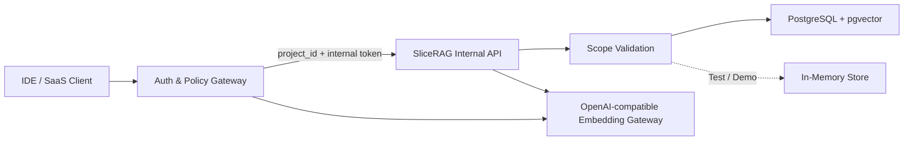
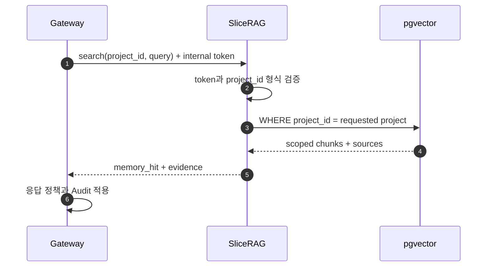

# SliceRAG

Gateway가 확정한 `project_id` 범위 안에서만 문서를 저장·검색하는 Tenant-isolated RAG Data Plane MVP입니다.

## 📌 Status & Repository
- **상태**: `MVP`
- **저장소 주소**: [GitHub (devcy0922/slicerag)](https://github.com/devcy0922/slicerag)
- **라이선스**: Apache 2.0
- **주요 언어**: Python

---

## 1. Problem
여러 프로젝트가 하나의 Vector Store를 공유하면 검색 품질보다 먼저 다른 프로젝트의 문서가 결과에 섞이지 않는 Scope Invariant를 보장해야 합니다. 외부 인증과 내부 검색 책임이 섞이면 RAG 서비스가 사용자 권한까지 중복 구현하게 되고 보안 경계도 불분명해집니다.

## 2. Why I Built It
외부 인증과 정책은 Gateway가 담당하고 SliceRAG는 내부 Token과 `project_id`를 검증한 뒤 동일 Namespace 안에서만 Ingest, Search, Document 조회를 수행하도록 책임을 분리했습니다.

## 3. Scope
- Gateway 전용 `/internal/*` API와 Shared Internal Token 검증
- `project_id`별 Document, Chunk, Search Namespace
- PostgreSQL + pgvector 또는 In-Memory Store 전환
- Hash Embedding과 Gateway 경유 OpenAI-compatible Embedding
- Chunk와 Source 근거를 함께 반환하는 Search Contract
- 교차 프로젝트 조회와 예약 식별자 차단 테스트

---

## 4. Architecture



## 5. Data Flow



## 6. Key Design Decisions
- **Gateway가 Identity를 확정**: SliceRAG는 외부 API Key나 사용자 목록을 다루지 않고 Gateway가 전달한 Project Scope만 검증합니다.
- **저장소 계층에서도 Scope 강제**: In-Memory와 PostgreSQL 구현 모두 Search와 Document 조회에 `project_id` 조건을 적용합니다.
- **열거 API 비노출**: Project 목록이나 Cross-project 검색 Endpoint를 제공하지 않고 `all` 같은 예약 식별자를 API와 Migration에서 거부합니다.

## 7. Security Considerations
- 내부 API는 `X-SliceRAG-Internal-Token` 없이는 실행되지 않습니다.
- 다른 Project의 Document ID를 직접 입력해도 `project_id`가 일치하지 않으면 조회되지 않습니다.
- Embedding Provider는 SliceRAG가 직접 외부로 호출하지 않고 Gateway 정책 경계를 경유하도록 구성할 수 있습니다.

## 8. Observability
- `/health`를 통해 Liveness를 확인합니다.
- Search 결과에 `project_id`, `memory_hit`, Chunk와 Source ID를 반환해 상위 Gateway가 Audit Metadata를 남길 수 있습니다.
- 현재 독립 Prometheus Dashboard는 제공하지 않으며 Gateway Audit과 서비스 로그를 주요 추적 경로로 사용합니다.

## 9. Technology Stack
- **API**: Python, FastAPI, Pydantic
- **Store**: PostgreSQL, pgvector, In-Memory
- **Quality Gate**: Ruff, Mypy, Pytest
- **Packaging**: Docker Compose

## 10. Running Locally

```bash
cp .env.example .env
docker compose up --build
```

Compose는 내부 서비스를 Loopback에 바인딩하며 외부 Client는 SliceRAG가 아니라 Gateway에 연결해야 합니다.

## 11. Current Limitations
- 외부 사용자 인증, 권한 관리와 Billing은 범위에 포함하지 않습니다.
- 현재 Chunking은 공개 API Contract와 격리 검증에 필요한 범위이며 PDF Layout 분석이나 Temporal Pipeline을 구현했다고 주장하지 않습니다.
- 운영 규모의 Backpressure와 Queue Orchestration은 아직 제공하지 않습니다.

## 12. Next Steps
- Tenant별 Ingest/Search Metric과 Storage Quota 추가
- PostgreSQL Row Level Security 적용 가능성 검증
- 대규모 Ingestion Queue와 Deduplication 설계
