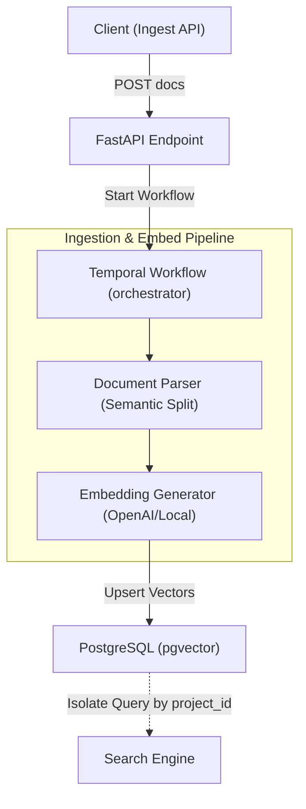
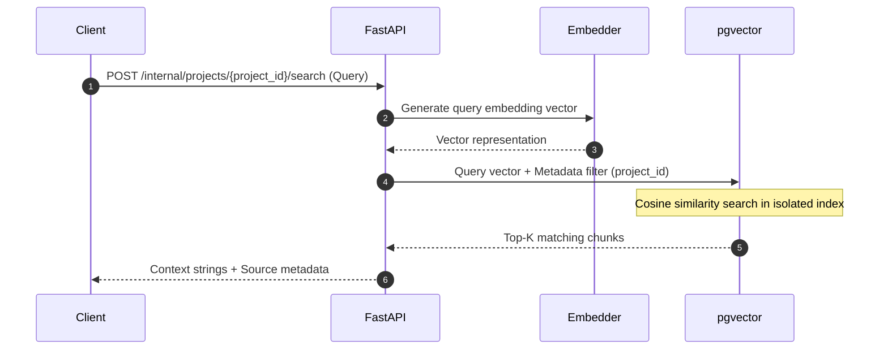

# SliceRAG

대규모 문서의 동적 청킹 최적화 및 멀티테넌트 범위 격리 검색을 위한 RAG Retrieval 파이프라인 엔진입니다.

## 📌 Status & Repository
- **상태**: `Stable`
- **저장소 주소**: [GitHub (devcy0922/slicerag)](https://github.com/devcy0922/slicerag)
- **라이선스**: Apache 2.0
- **주요 언어**: Python

---

## 1. Problem
RAG(Retrieval-Augmented Generation) 시스템 구축 시, 수백 페이지에 달하는 문서들을 단순 길이 기준으로 청킹(Chunking)하면 의미적 맥락이 찢어져 LLM 답변의 품질이 대폭 하락합니다. 또한, 여러 서비스 테넌트가 동일한 인프라를 사용할 경우 테넌트 간의 데이터 격리가 보장되지 않으면 보안 침해 사고가 발생할 수 있습니다.

## 2. Why I Built It
문서의 레이아웃(헤더, 리스트 등)과 문맥 단락을 파악해 의미를 보존하며 최적으로 쪼개는 동적 슬라이싱 모듈을 구현하고, 각 청크를 `project_id` 네임스페이스로 엄격하게 분리하여 PostgreSQL `pgvector`를 통해 격리된 고속 탐색을 수행하기 위해 만들었습니다.

## 3. Scope
- PDF, Markdown 문서 파싱 및 문맥 단위 동적 청킹
- project_id 기반의 메타데이터 필터링을 결합한 격리 유사도 벡터 검색
- DB 연결이 불가능한 로컬 테스트 환경을 위한 In-Memory 벡터 스토어(`memory`) 제공
- 대규모 비동기 수집 파이프라인 제어를 위한 Temporal 오케스트레이션 연동

---

## 4. Architecture



---

## 5. Data Flow



---

## 6. Key Design Decisions
- **메타데이터 수준의 강제 필터링**: 단순히 유사도만 비교하는 것 대신, SQL 쿼리 레벨에서 `WHERE project_id = :project_id`를 강제하여 다른 테넌트의 청크가 검색 대상에 섞여 들어올 확률을 0%로 만들었습니다.
- **인메모리 폴백 엔진**: 데이터베이스 연동이 안 된 경량 CLI 데모 시연을 위해, 로컬 메모리 상에서 해시 기반 벡터 거리를 계산해주는 스토어 엔진을 내장했습니다.

## 7. Security Considerations
- 비식별화 규정에 의거, 업로드 시점에 개인정보 유출이 감지되면 데이터 마스킹 후 임베딩하고 로그에 원문 텍스트 내용을 직접 출력하지 않습니다.

## 8. Observability
- 임베딩 소요 시간, 데이터베이스 트랜잭션 지연, 청크 생성 총량을 모니터링하기 위한 Prometheus 커스텀 수집 메트릭을 출력합니다.

## 9. Technology Stack
- **Framework**: Python (FastAPI), Temporal
- **Database**: PostgreSQL (pgvector)
- **Embedding**: OpenAI Embedding API, HuggingFace SentenceTransformers

---

## 10. Running Locally
로컬 실행 시 임베딩 스토어 방식을 선택하여 가볍게 가동할 수 있습니다.

```bash
# 로컬 인메모리 스토어로 FastAPI 구동
export SLICERAG_STORE="memory"
export SLICERAG_EMBEDDING_PROVIDER="hash"
pnpm --filter slicerag dev  # 또는 python -m uvicorn src.main:app
```

## 11. Current Limitations
- 실시간으로 대규모의 문서를 처리할 때 Temporal 워크플로우 큐 지연이 발생할 수 있어, 백프레셔(Backpressure) 제어 최적화가 요구됩니다.

## 12. Next Steps
- 중복 문서 및 유사 청크를 병합 처리하는 Deduplication 알고리즘 도입.
