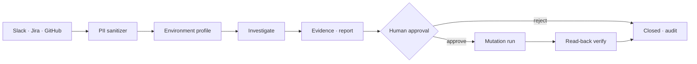
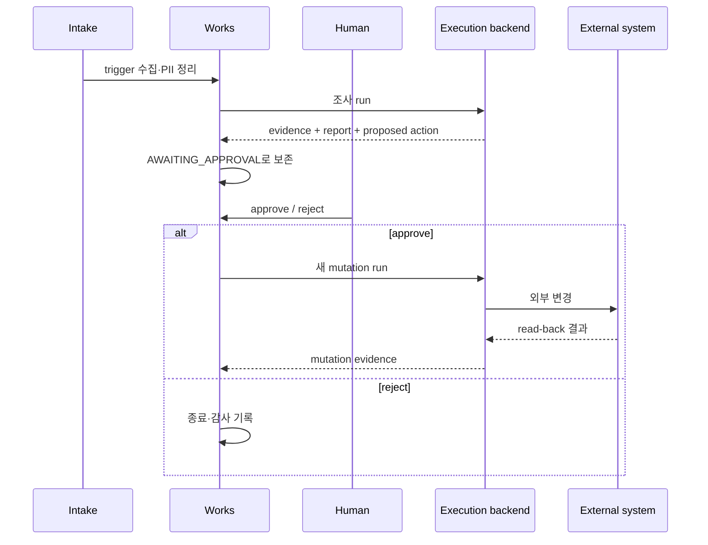

# Works Daily Agents

장애, 문의, 신규 개발 요청을 조사하고 근거와 실행 계획을 만든 뒤, 사람이 승인한 작업만 외부 시스템에 반영하는 Local-first 업무 운영 도구입니다. 제안과 변경을 한 번의 실행으로 묶지 않는 것이 중심 설계입니다.

## 한눈에 보기

- **성격**: Agentic Workflow / Human-in-the-loop Automation
- **핵심 기술**: Python, PostgreSQL, Docker Compose, MCP capability
- **Source**: [github.com/devcy0922/works-daily-agents ↗](https://github.com/devcy0922/works-daily-agents)
- **현재 범위**: 업무 수집, 조사, evidence·report 작성, 승인과 별도 mutation run

## 문제

업무 요청을 바로 자동 실행하면 조사 중 얻은 정보와 외부 시스템 변경이 섞입니다. 승인 대기 중 worker process를 붙잡아 두는 방식도 재시작과 retry 경계를 불분명하게 만듭니다.

그래서 조사 결과는 `Case`와 `Evidence`로 보존하고, 사람이 승인한 뒤 완전히 새로운 mutation run을 시작하는 구조를 택했습니다.

## Architecture

<DiagramFrame caption="조사·제안과 외부 변경을 분리하고, 승인 대기 상태를 프로세스 밖에 보존합니다.">

</DiagramFrame>

Works는 업무 상태와 근거를 보존하고, 외부 capability 실행은 MCP와 실행 backend의 경계에 둡니다. 모델 라우팅과 공용 데이터 저장소는 이 프로젝트의 내부 책임으로 묶지 않습니다.

## 책임 경계

### Owns

- Workspace와 environment profile revision
- Case, Evidence, Policy, Approval과 Audit
- 조사 결과에서 제안된 action과 mutation run의 연결
- 승인 전후의 상태 전이와 read-back 결과

### Does not own

- 승인 전 외부 시스템 mutation
- 모델 provider routing
- queue·retry·crash recovery를 포함한 실행 backend 자체
- MCP capability가 연결하는 외부 시스템의 내부 상태

## 핵심 흐름

승인 대기 중에는 조사 프로세스를 계속 유지하지 않습니다. 승인 결과가 도착하면 새 실행이 시작되므로 조사 retry와 mutation retry를 구분할 수 있습니다.

## 설계 결정

- **evidence와 mutation 분리**: 사람이 판단할 자료를 먼저 확정하고, 승인된 action만 별도 실행합니다.
- **상태를 DB에 보존**: 승인 대기 상태를 process memory에 두지 않아 재시작 뒤에도 같은 Case를 이어볼 수 있게 했습니다.
- **권한을 profile로 구분**: readonly/readwrite/admin 실행 권한을 profile로 나누고 PII masking을 먼저 적용합니다.
- **read-back을 결과의 일부로 취급**: 외부 API 호출이 성공했다는 응답만으로 끝내지 않고, 변경을 다시 읽어 evidence로 남깁니다.

## 검증된 범위 / Evidence

- trigger 수집, 승인 후 Slack/Jira 등록과 고위험 작업 반려 시나리오를 확인하는 구조가 있습니다.
- 보관·복원과 PR lifecycle에도 승인 게이트를 둡니다.
- 조사 실행과 승인 후 mutation 실행이 서로 다른 Run으로 분리되어 있습니다.
- 자세한 구현과 실행 방법은 [소스 저장소](https://github.com/devcy0922/works-daily-agents)에서 확인할 수 있습니다.

## 현재 한계

- 실행 가능한 외부 시스템과 capability는 연결된 profile과 MCP 구현 범위에 따라 달라집니다.
- Local-first 구성은 분산 실행 환경 전체를 자동으로 제공하지 않습니다.
- 승인 이후의 외부 상태가 바뀌는 경우에도 read-back과 재시도 정책은 capability별로 검증해야 합니다.
