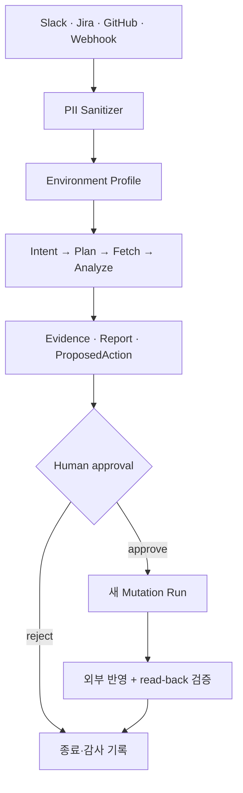

# Works Daily Agents

장애, 문의, 신규 개발 요청을 조사하고 근거와 실행 계획을 만든 뒤, 사람이 승인한 작업만 외부 시스템에 반영하는 Local-first 업무 운영 도구입니다.

## 한눈에 보기

- [GitHub 저장소](https://github.com/devcy0922/works-daily-agents)
- Python, Docker Compose, PostgreSQL
- DB·로그·RAG 연결을 환경 profile로 분리
- readonly/readwrite/admin 실행 권한과 Zero-Trust PII masking
- 조사 실행과 승인 후 mutation 실행을 서로 다른 Run으로 분리

## 중요한 경계

Works가 소유하는 것은 Workspace, Profile revision, Case, Evidence, Policy, Approval, Audit입니다. 실행 backend는 queue·retry·crash recovery를 맡고, MCP는 외부 capability를 실행합니다. 모델 라우팅은 GoVail에, 검색과 업무 이력 조회는 Works에 둡니다.

조사가 끝난 뒤 프로세스를 계속 붙잡고 승인 입력을 기다리지 않습니다. Case를 `AWAITING_APPROVAL`로 보존하고, 승인이 들어오면 완전히 새로운 mutation 실행을 만듭니다.

## 확인한 것

실제 검증 시나리오에서 트리거 수집, 승인 후 Slack/Jira 등록, 고위험 작업 반려, 보관·복원, PR lifecycle과 승인 게이트를 각각 확인하는 구조를 갖췄습니다. 자동화의 목표는 무인 실행이 아니라 사람이 1분 안에 판단할 수 있는 근거를 만드는 것입니다.
