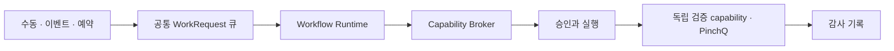
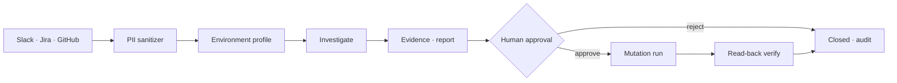
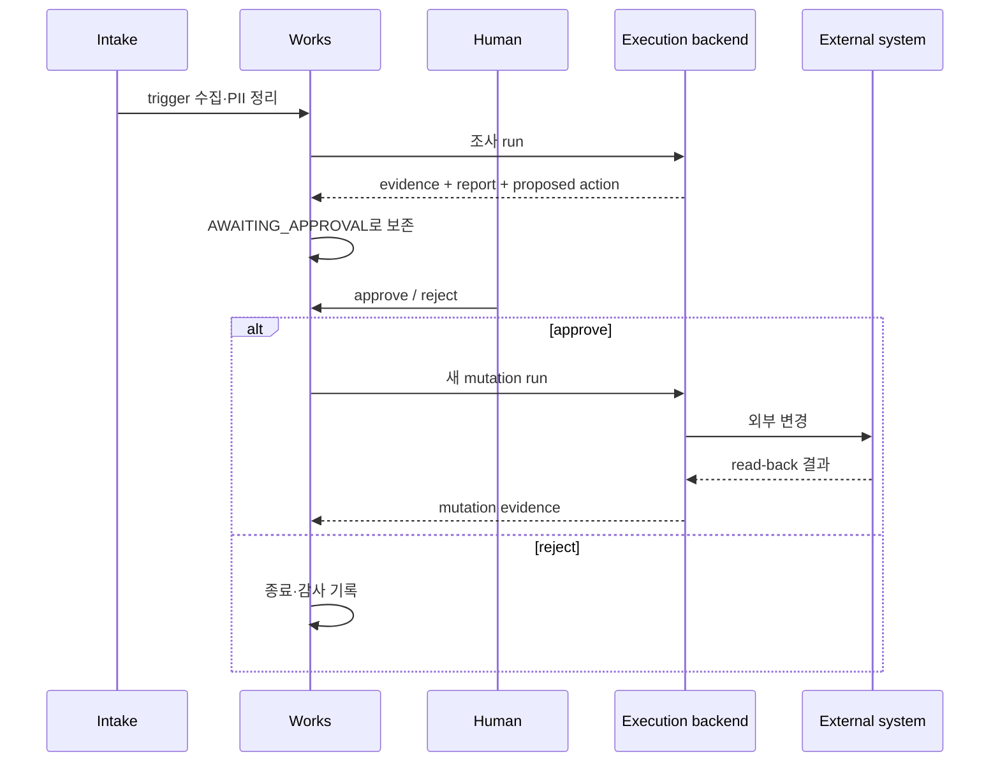

# Works Daily Agents

장애, 문의, 신규 개발 요청을 조사하고 근거와 실행 계획을 만든 뒤, 사람이 승인한 작업만 외부 시스템에 반영하는 Local-first 업무 운영 도구입니다. 제안과 변경을 한 번의 실행으로 묶지 않는 것이 중심 설계입니다.

## 한눈에 보기

::: info v2 전환
현재 저장소는 기존 구현을 `v1/`에 보존하고 `v2/`에서 새 코어 런타임을 개발합니다. 예약·수동·이벤트 요청을 공통 큐로 수집하고 Workflow Runtime과 Capability Broker를 통해 외부 도구를 연결합니다. PinchQ는 독립 검증 capability이며 코어에 내부 구현을 결합하지 않습니다. 아래 승인·조사 경계는 설계 원칙이며, 모든 v1 연동이 v2로 이전 완료됐다는 의미는 아닙니다.
:::

[승인 흐름 직접 실행하기](/playground#approval) — 원본 백엔드와 분리된 공개용 브라우저 시뮬레이션입니다.

- **성격**: Agentic Workflow / Human-in-the-loop Automation
- **핵심 기술**: Python, PostgreSQL, Docker Compose, MCP capability
- **공개 범위**: 설계 사례 공개 · 원본 저장소 접근 없이 아래 내용을 확인할 수 있습니다.
- **현재 범위**: 업무 수집, 조사, evidence·report 작성, 승인과 별도 mutation run

## 문제

업무 요청을 바로 자동 실행하면 조사 중 얻은 정보와 외부 시스템 변경이 섞입니다. 승인 대기 중 worker process를 붙잡아 두는 방식도 재시작과 retry 경계를 불분명하게 만듭니다.

그래서 조사 결과는 `Case`와 `Evidence`로 보존하고, 사람이 승인한 뒤 완전히 새로운 mutation run을 시작하는 구조를 택했습니다.

## v2 실행 구조

```mermaid
flowchart LR
    Event[수동 · 이벤트 · 예약] --> Queue[공통 WorkRequest 큐]
    Queue --> Runtime[Workflow Runtime]
    Runtime --> Broker[Capability Broker]
    Broker --> Approval[승인과 실행]
    Approval --> Verify[독립 검증 capability · PinchQ]
    Verify --> Audit[감사 기록]
```

외부 도구는 코어에 직접 import하지 않고 확장 어댑터와 capability 계약으로 연결합니다. 예약 실행도 동일한 입력 계약을 따릅니다.

## 조사·승인 경계 (v1 설계 사례)

<DiagramFrame caption="조사·제안과 외부 변경을 분리하고, 승인 대기 상태를 프로세스 밖에 보존합니다.">

```mermaid
flowchart LR
    Trigger[Slack · Jira · GitHub] --> Sanitize[PII sanitizer]
    Sanitize --> Profile[Environment profile]
    Profile --> Investigate[Investigate]
    Investigate --> Report[Evidence · report]
    Report --> Approval{Human approval}
    Approval -->|approve| Mutation[Mutation run]
    Approval -->|reject| Audit[Closed · audit]
    Mutation --> Verify[Read-back verify]
    Verify --> Audit
```

</DiagramFrame>

Works는 업무 상태와 근거를 보존하고, 외부 capability 실행은 MCP와 실행 backend의 경계에 둡니다. 모델 라우팅과 공용 데이터 저장소는 이 프로젝트의 내부 책임으로 묶지 않습니다.

## 책임 경계

### Owns

- Workspace와 environment profile revision
- Case, Evidence, Policy, Approval과 Audit
- 조사 결과에서 제안된 action과 mutation run의 연결
- 승인 전후의 상태 전이와 read-back 결과

### Does not own

- 승인 전 외부 시스템 mutation
- 모델 provider routing
- queue·retry·crash recovery를 포함한 실행 backend 자체
- MCP capability가 연결하는 외부 시스템의 내부 상태

## 핵심 흐름

```mermaid
sequenceDiagram
    participant I as Intake
    participant W as Works
    participant H as Human
    participant B as Execution backend
    participant X as External system
    I->>W: trigger 수집·PII 정리
    W->>B: 조사 run
    B-->>W: evidence + report + proposed action
    W->>W: AWAITING_APPROVAL로 보존
    H->>W: approve / reject
    alt approve
        W->>B: 새 mutation run
        B->>X: 외부 변경
        X-->>B: read-back 결과
        B-->>W: mutation evidence
    else reject
        W->>W: 종료·감사 기록
    end
```

승인 대기 중에는 조사 프로세스를 계속 유지하지 않습니다. 승인 결과가 도착하면 새 실행이 시작되므로 조사 retry와 mutation retry를 구분할 수 있습니다.

## 설계 결정

- **evidence와 mutation 분리**: 사람이 판단할 자료를 먼저 확정하고, 승인된 action만 별도 실행합니다.
- **상태를 DB에 보존**: 승인 대기 상태를 process memory에 두지 않아 재시작 뒤에도 같은 Case를 이어볼 수 있게 했습니다.
- **권한을 profile로 구분**: readonly/readwrite/admin 실행 권한을 profile로 나누고 PII masking을 먼저 적용합니다.
- **read-back을 결과의 일부로 취급**: 외부 API 호출이 성공했다는 응답만으로 끝내지 않고, 변경을 다시 읽어 evidence로 남깁니다.

## 검증된 범위 / Evidence

- trigger 수집, 승인 후 Slack/Jira 등록과 고위험 작업 반려 시나리오를 확인하는 구조가 있습니다.
- 보관·복원과 PR lifecycle에도 승인 게이트를 둡니다.
- 조사 실행과 승인 후 mutation 실행이 서로 다른 Run으로 분리되어 있습니다.
- 공개 데모에서 [실행 경계 확인하기](/playground#approval). 원본 서비스 전체의 실행 결과를 대신하지 않습니다.

## 현재 한계

- 실행 가능한 외부 시스템과 capability는 연결된 profile과 MCP 구현 범위에 따라 달라집니다.
- Local-first 구성은 분산 실행 환경 전체를 자동으로 제공하지 않습니다.
- 승인 이후의 외부 상태가 바뀌는 경우에도 read-back과 재시도 정책은 capability별로 검증해야 합니다.
